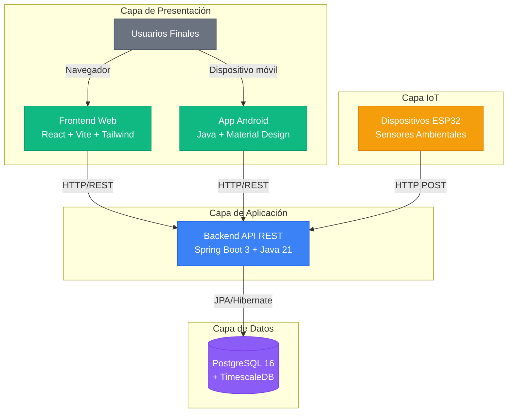

# Proyecto Árboles - Especificación Técnica

---

## 1. Descripción General del Proyecto

Sistema de monitorización y gestión de árboles plantados en centros educativos mediante sensores IoT. El proyecto permite recopilar datos ambientales (temperatura, humedad, CO2) a través de dispositivos ESP32 y visualizarlos mediante aplicaciones web y móvil.

### 1.1 Objetivos

- Monitorizar el estado de los árboles mediante sensores IoT
- Almacenar histórico de datos ambientales con series temporales
- Generar alertas cuando los valores estén fuera de rango configurado
- Proporcionar interfaces web y móvil para consulta y gestión
- Facilitar el seguimiento educativo del crecimiento de los árboles

### 1.2 Alcance del Sistema

**Backend API REST**:
- Gestión completa de centros educativos y árboles
- CRUD de todas las entidades del sistema
- Validaciones de datos en múltiples capas
- Endpoints RESTful con respuestas JSON
- Autenticación y autorización por roles

**Frontend Web**:
- Interfaz responsive para gestión de datos
- Dashboard con visualización de árboles y centros
- Formularios con validaciones client-side
- Consumo de API REST del backend

**Aplicación Móvil Android**:
- CRUD completo de árboles desde dispositivos móviles
- Conexión con backend API
- Interfaz nativa Android optimizada

**Base de Datos**:
- PostgreSQL con extensión TimescaleDB
- Modelo relacional normalizado
- Soporte para series temporales (lecturas de sensores)

**IoT (Planificado)**:
- Firmware ESP32 con sensores ambientales
- Comunicación WiFi con backend
- Recopilación de datos en tiempo real

---

## 2. Arquitectura del Sistema

### 2.1 Visión General

**Capas del Sistema**:
- **Capa de Presentación**: Interfaces de usuario (Web + Android)
- **Capa de Aplicación**: Lógica de negocio (API REST)
- **Capa de Datos**: Almacenamiento persistente (PostgreSQL + TimescaleDB)
- **Capa IoT**: Dispositivos de monitorización (ESP32 - Planificado)

### 2.2 Backend (API REST)

**Tecnología**: Spring Boot 3.5.7 + Java 21

**URL Producción**: https://proyecto-arboles-backend.onrender.com

**Características**:
- Arquitectura en capas (Controller → Service → Repository)
- ORM con JPA/Hibernate
- Validaciones Bean Validation y lógica de negocio
- Manejo centralizado de excepciones
- CORS configurado para frontend y móvil
- Despliegue en Render con PostgreSQL cloud

**Endpoints principales**:

**Centros Educativos** (`/api/centros`):
- `GET /api/centros` - Listar todos
- `GET /api/centros/{id}` - Obtener por ID
- `POST /api/centros` - Crear nuevo
- `PUT /api/centros/{id}` - Actualizar
- `DELETE /api/centros/{id}` - Eliminar
- `GET /api/centros/{id}/arboles` - Árboles de un centro

**Árboles** (`/api/arboles`):
- `GET /api/arboles` - Listar todos
- `GET /api/arboles/{id}` - Obtener por ID
- `POST /api/arboles` - Crear nuevo
- `PUT /api/arboles/{id}` - Actualizar
- `DELETE /api/arboles/{id}` - Eliminar
- `GET /api/arboles/centro/{centroId}` - Filtrar por centro
- `GET /api/arboles/especie/{especie}` - Filtrar por especie
- `GET /api/arboles/search?nombre={nombre}` - Búsqueda por nombre

**Usuarios** (`/api/usuarios`):
- `GET /api/usuarios` - Listar todos
- `GET /api/usuarios/{id}` - Obtener por ID
- `POST /api/usuarios` - Crear nuevo
- `PUT /api/usuarios/{id}` - Actualizar
- `DELETE /api/usuarios/{id}` - Eliminar

**Asignación Usuario-Centro** (`/api/usuario-centro`):
- `GET /api/usuario-centro/usuario/{usuarioId}` - Centros de un usuario
- `GET /api/usuario-centro/centro/{centroId}` - Coordinadores de un centro
- `POST /api/usuario-centro` - Asignar coordinador a centro
- `DELETE /api/usuario-centro/{id}` - Desasignar coordinador

**Autenticación** (`/api/auth`):
- `POST /api/auth/login` - Login con email y password (valida contra BD)
- `POST /api/auth/register` - Registro de nuevo usuario (rol COORDINADOR por defecto)

**Dispositivos ESP32** (`/api/dispositivos`):
- CRUD completo de dispositivos IoT
- Asociación con árboles

### 2.3 Frontend Web

**Tecnología**: React 18 + Vite + Tailwind CSS

**URL Producción**: https://vocational-training-final-project.vercel.app

**Características**:
- Single Page Application (SPA)
- Diseño responsive mobile-first
- Componentes reutilizables
- Gestión de estado con React Hooks
- Routing con React Router
- Cliente HTTP con Axios
- Despliegue automático en Vercel

**Funcionalidades**:
- Sistema de autenticación (Login/Register)
- Dashboard principal con estadísticas
- CRUD completo de árboles con formularios validados
- CRUD completo de centros educativos
- Filtrado y búsqueda de árboles
- Visualización de detalles con datos de sensores

### 2.4 Aplicación Android

**Tecnología**: Java + Android SDK (API 24+)

**Características**:
- Arquitectura MVVM
- RecyclerView para listas de árboles
- Formularios nativos para CRUD
- Consumo de API REST con Retrofit/Volley
- Almacenamiento local con SharedPreferences
- Soporte para Material Design

**Actividades principales**:
- MainActivity: Lista de árboles
- ArbolDetailActivity: Detalles de árbol
- AddEditArbolActivity: Crear/editar árbol
- CentrosActivity: Gestión de centros

### 2.5 Base de Datos

**Motor**: PostgreSQL 16 + TimescaleDB 2.23.1

**Características**:
- Modelo relacional normalizado (3FN)
- Extensión TimescaleDB para series temporales
- Índices optimizados para consultas frecuentes
- Foreign keys con integridad referencial
- Triggers y constraints para validaciones

**Entidades principales**:
- Usuario (gestión de accesos)
- CentroEducativo (centros donde se plantan árboles)
- Arbol (árboles monitorizados)
- DispositivoESP32 (sensores IoT)
- Lectura (datos de sensores - hypertable)
- Alerta (notificaciones de umbrales)
- UsuarioCentro (relación N:M)

Para ver el modelo de datos completo, consulta [04. MODELO_DATOS.md](./04.%20MODELO_DATOS.md)

### 2.6 IoT (ESP32)

**Hardware**: ESP32 DevKit

**Sensores previstos**:
- DHT22 - Temperatura y humedad ambiente
- Sensor capacitivo - Humedad del suelo
- MQ-135 - Calidad del aire (CO2)
- Opcional: Sensor de diámetro del tronco

**Comunicación**:
- WiFi 2.4GHz
- Protocolo HTTP REST POST al backend
- Frecuencia configurable de lecturas

**Componentes hardware**: Ver [Componentes para ESP32/Componentes.png](./Componentes%20para%20ESP32/Componentes.png)

---

## 3. Requisitos del Sistema

### 3.1 Requisitos Funcionales

#### RF-01: Gestión de Centros Educativos
- El sistema debe permitir crear, leer, actualizar y eliminar centros educativos
- Cada centro debe tener: nombre único, dirección, coordenadas GPS, responsable
- El sistema debe validar que no existan centros duplicados por nombre

#### RF-02: Gestión de Árboles
- El sistema debe permitir CRUD completo de árboles
- Cada árbol debe asociarse obligatoriamente a un centro educativo
- El sistema debe almacenar: nombre, especie, fecha de plantación, ubicación específica
- El sistema debe permitir configurar umbrales de alerta por árbol
- El sistema debe validar que la fecha de plantación no sea futura

#### RF-03: Gestión de Dispositivos IoT
- El sistema debe registrar dispositivos ESP32 con MAC address única
- El sistema debe permitir asociar un dispositivo a un árbol (relación 1:1)
- El sistema debe registrar la última conexión de cada dispositivo

#### RF-04: Monitorización de Datos Ambientales
- El sistema debe almacenar lecturas de sensores con timestamp
- El sistema debe registrar: temperatura, humedad ambiente, humedad suelo, CO2
- El sistema debe optimizar el almacenamiento con TimescaleDB (hypertables)

#### RF-05: Sistema de Alertas
- El sistema debe generar alertas cuando los valores excedan umbrales configurados
- El sistema debe clasificar alertas por tipo y estado
- El sistema debe mantener histórico de alertas

#### RF-06: Autenticación y Autorización
- El sistema tiene 2 roles: ADMIN (acceso total) y COORDINADOR (gestiona centros asignados)
- El acceso público (sin cuenta) permite lectura de todo el contenido
- Solo se requiere login para operaciones de escritura (crear, editar, eliminar)
- El sistema debe controlar acceso según rol del usuario
- El sistema debe gestionar sesiones de usuario

#### RF-07: Visualización Web
- El sistema web debe mostrar dashboard con estadísticas
- El sistema debe permitir filtrar árboles por centro
- El sistema debe mostrar gráficas de datos de sensores

#### RF-08: Aplicación Móvil
- La app Android debe permitir CRUD de árboles
- La app debe funcionar en dispositivos con API 24+ (Android 7.0)
- La app debe sincronizar datos con el backend en tiempo real

### 3.2 Requisitos No Funcionales

#### RNF-01: Usabilidad
- La interfaz web debe ser responsive (mobile, tablet, desktop)
- El tiempo de aprendizaje para usuarios básicos < 30 minutos
- Los mensajes de error deben ser claros y orientar al usuario
- La app Android debe seguir Material Design guidelines

#### RNF-02: Mantenibilidad
- El código debe seguir principios SOLID
- El código debe tener cobertura de tests > 70% (ideal)
- El código debe estar documentado con JavaDoc
- El sistema debe usar control de versiones (Git)
- El sistema debe tener documentación técnica completa

#### RNF-03: Portabilidad
- El backend debe funcionar en Linux, Windows, MacOS
- El frontend debe funcionar en Chrome, Firefox, Safari, Edge
- La app Android debe funcionar en dispositivos de diferentes fabricantes

#### RNF-04: Interoperabilidad
- El backend debe exponer API REST con JSON
- El sistema debe seguir convenciones RESTful (HTTP methods, status codes)
- El sistema debe usar estándares de la industria (JWT, OpenAPI)

### 3.3 Restricciones Técnicas

- **Lenguaje Backend**: Java 21
- **Framework Backend**: Spring Boot
- **Base de Datos**: PostgreSQL
- **Lenguaje Frontend**: JavaScript/React
- **Mobile**: Android nativo en Java
- **Control de versiones**: Git + GitHub

### 3.4 Dependencias Externas

- **Render**: Hosting backend y base de datos (free tier)
- **Vercel**: Hosting frontend (free tier)
- **GitHub**: Repositorio y CI/CD
- **Maven Central**: Dependencias Java
- **npm**: Dependencias JavaScript

---

## 4. Requisitos Académicos

Este proyecto integra múltiples asignaturas del ciclo DAM:

### 4.1 [PGV] Programación de Servicios y Procesos

**Requisitos cubiertos**:
- API REST con Spring Boot
- Endpoints HTTP (GET, POST, PUT, DELETE)
- Manejo de peticiones concurrentes
- Comunicación cliente-servidor
- JSON como formato de intercambio de datos

**Evidencia**: Controladores REST con `@RestController`, endpoints documentados

### 4.2 [DAD] Desarrollo de Aplicaciones Web

**Requisitos cubiertos**:
- Frontend React con arquitectura de componentes
- SPA (Single Page Application)
- Consumo de API REST con Axios
- Routing con React Router
- Diseño responsive con Tailwind CSS
- Despliegue en Vercel

**Evidencia**: Aplicación web completa en https://vocational-training-final-project.vercel.app

### 4.3 [AED] Acceso a Datos

**Requisitos cubiertos**:
- Modelo Entidad-Relación (E/R)
- Diagrama UML de clases
- Modelo Relacional con normalización
- ORM con JPA/Hibernate
- Múltiples entidades mapeadas con relaciones (@ManyToOne, @OneToMany, @OneToOne)
- Repositorios Spring Data JPA
- Validaciones Bean Validation
- Transacciones con `@Transactional`

**Evidencia**:
- [04. MODELO_DATOS.md](./04.%20MODELO_DATOS.md) - Documentación completa
- Entidades JPA en `backend/src/main/java/com/example/gardenmonitor/model/`

### 4.4 [PGL] Programación Multimedia y Dispositivos Móviles

**Requisitos cubiertos**:
- Aplicación Android nativa en Java
- Actividades con CRUD completo
- RecyclerView para listas
- Consumo de API REST desde Android
- Diseño Material Design
- Gestión del ciclo de vida de Activities

**Evidencia**: Código en `android/` con 4 actividades funcionales

---

## 5. Stack Tecnológico

### 5.1 Backend

| Tecnología | Versión | Propósito |
|------------|---------|-----------|
| Java | 21 LTS | Lenguaje de programación |
| Spring Boot | 3.5.7 | Framework backend |
| Spring Data JPA | 3.5.7 | ORM y repositorios |
| Hibernate | 6.6.x | Implementación JPA |
| PostgreSQL Driver | 42.7.x | Conector JDBC |
| Maven | 3.9+ | Gestión de dependencias |

### 5.2 Frontend

| Tecnología | Versión | Propósito |
|------------|---------|-----------|
| React | 18.x | Biblioteca UI |
| Vite | 5.x | Build tool y dev server |
| React Router | 6.x | Routing SPA |
| Axios | 1.x | Cliente HTTP |
| Tailwind CSS | 3.x | Framework CSS |

### 5.3 Base de Datos

| Tecnología | Versión | Propósito |
|------------|---------|-----------|
| PostgreSQL | 16 | Base de datos relacional |
| TimescaleDB | 2.23.1 | Extensión para series temporales |

### 5.4 Mobile

| Tecnología | Versión | Propósito |
|------------|---------|-----------|
| Android SDK | API 24+ (7.0) | Plataforma móvil |
| Java | 8+ | Lenguaje |
| Retrofit/Volley | - | Cliente HTTP |
| Material Design | 3.x | Componentes UI |

### 5.5 IoT (Planificado)

| Tecnología | Versión | Propósito |
|------------|---------|-----------|
| Arduino IDE | 2.x | IDE para ESP32 |
| ESP32 | - | Microcontrolador WiFi |
| Sensores DHT22, MQ-135 | - | Sensores ambientales |

### 5.6 DevOps y Herramientas

| Tecnología | Propósito |
|------------|-----------|
| Git + GitHub | Control de versiones |
| Vercel | Despliegue frontend |
| Render | Despliegue backend + BD |
| GitHub Actions | CI/CD |
| Postman | Testing de API |
| DBeaver | Cliente PostgreSQL |

---

## 6. Despliegue en Producción

### 6.1 Frontend (Vercel)

- **URL**: https://vocational-training-final-project.vercel.app
- **Despliegue**: Automático desde rama `main`
- **Build**: `npm run build`
- **Variables de entorno**: `VITE_API_URL` apunta a backend en Render

### 6.2 Backend (Render)

- **URL**: https://proyecto-arboles-backend.onrender.com
- **Despliegue**: Automático desde rama `main`
- **Build**: Maven
- **Variables de entorno**:
  - `SPRING_PROFILES_ACTIVE=prod`
  - `DATABASE_URL` (configurado por Render)
- **Base de datos**: PostgreSQL 16 managed by Render

### 6.3 Cold Start (Limitación Render Free Tier)

El backend en Render free tier entra en suspensión tras 15 minutos de inactividad.

**Primera petición tras inactividad**: 30-60 segundos para despertar el servicio.

**Solución**: Esperar y recargar la página.

---

## 7. Seguridad

### 7.1 Backend

- **Validaciones**: Bean Validation + lógica de negocio
- **SQL Injection**: Prevenido por JPA/Hibernate (prepared statements)
- **CORS**: Configurado solo para orígenes permitidos
- **Secrets**: Variables de entorno (nunca en código)
- **Conexión BD**: Credenciales en `application-local.properties` (no commiteado)

### 7.2 Frontend

- **Autenticación**: Login y registro contra API real (`/api/auth`), sesión en localStorage
- **XSS**: React escapa automáticamente el contenido
- **HTTPS**: Forzado por Vercel

### 7.3 Consideraciones Futuras

- Implementar JWT (tokens + BCrypt para passwords)
- Rate limiting en API
- Encriptación de datos sensibles
- Auditoría de accesos

---

## 8. Documentación del Proyecto

### 8.1 Documentos Principales

- [00. INDICE.md](./00.%20INDICE.md) - Índice completo de documentación
- [01. GIT_WORKFLOW.md](./01.%20GIT_WORKFLOW.md) - Flujo de trabajo Git
- [02. HOJA_DE_RUTA.md](./02.%20HOJA_DE_RUTA.md) - Planificación del proyecto
- [03. ESPECIFICACION_TECNICA.md](./03.%20ESPECIFICACION_TECNICA.md) - Este documento
- [04. MODELO_DATOS.md](./04.%20MODELO_DATOS.md) - Modelo E/R, UML y Relacional
- [04b. CONFIGURACION_POSTGRESQL.md](./04b.%20CONFIGURACION_POSTGRESQL.md) - Guía PostgreSQL

### 8.2 Manuales de Usuario

- [MANUAL_DE_INSTALACION.md](./MANUAL_DE_INSTALACION.md) - Instalación completa del sistema
- [MANUAL_DE_USUARIO.md](./MANUAL_DE_USUARIO.md) - Guía de uso web y móvil
- [MANUAL_DE_INSTALACION_ANDROID.md](./MANUAL_DE_INSTALACION_ANDROID.md) - Instalación app Android
- [MANUAL_DE_USUARIO_ANDROID.md](./MANUAL_DE_USUARIO_ANDROID.md) - Guía uso app Android

### 8.3 README por Componente

- [Backend README](../backend/README.md) - API REST con Spring Boot
- [Frontend README](../frontend/README.md) - Aplicación web con React
- [Android README](../android/README.md) - Aplicación móvil Android
- [ESP32 README](../esp32/README.md) - Firmware para dispositivos IoT

### 8.4 Scripts y Archivos de Configuración

- [`backend/create_database.sql`](../backend/create_database.sql) - Script SQL para crear todas las tablas del proyecto
- [`backend/drop_tables.sql`](../backend/drop_tables.sql) - Script SQL para eliminar todas las tablas (útil para resetear BD)
- [`backend/src/main/resources/README_CONFIG.md`](../backend/src/main/resources/README_CONFIG.md) - Guía de configuración segura de Spring Boot
- [`docs/install-timescaledb.sh`](./install-timescaledb.sh) - Script para instalar TimescaleDB en Linux
- [`docs/Componentes para ESP32/Componentes.png`](./Componentes%20para%20ESP32/Componentes.png) - Lista de componentes hardware y precios

---

## Información del Proyecto

**Nombre**: Proyecto Árboles - Sistema de Monitorización de Árboles

**Institución**: IES El Rincón

**Curso**: Desarrollo de Aplicaciones Multiplataforma (DAM) 2025-2026

**Repositorio**: [github.com/riordi80/vocational-training-final-project](https://github.com/riordi80/vocational-training-final-project)

**Última actualización**: 2026-02-14

### Colaboradores

 

---

**Proyecto Final DAM 2025-2026** | Desarrollado con Spring Boot, React, Android y ESP32
