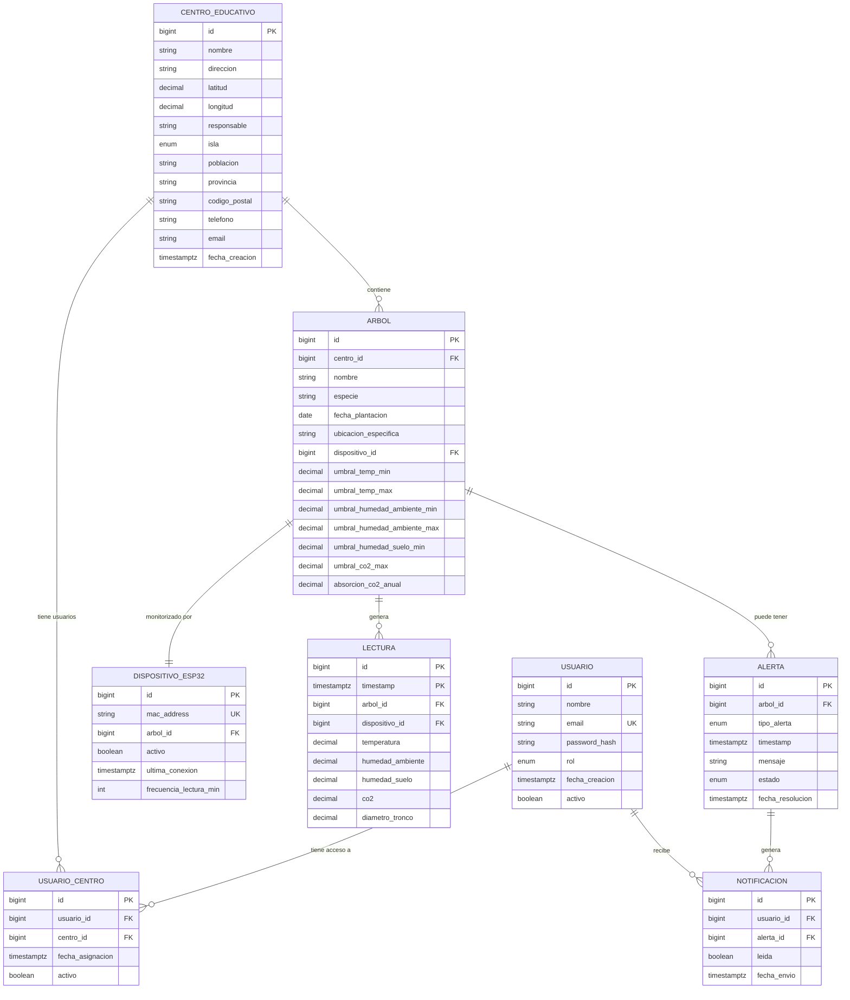

# Modelo de Datos - Proyecto Árboles (Garden Monitor)

**Fecha de creación**: 2025-11-15
**Versión**: 1.0
**Requisito**: AED - Acceso a Datos

---

## Índice

1. [Resumen de Entidades](#resumen-de-entidades)
2. [Diagrama Entidad-Relación (E/R)](#diagrama-entidad-relación-er)
3. [Diagrama UML de Clases](#diagrama-uml-de-clases)
4. [Modelo Relacional Detallado](#modelo-relacional-detallado)
5. [Scripts SQL de Creación](#scripts-sql-de-creación)
6. [Índices y Optimizaciones](#índices-y-optimizaciones)

---

## Resumen de Entidades

El sistema gestiona 8 entidades principales:

| # | Entidad | Descripción | Tipo |
|---|---------|-------------|------|
| 1 | **Usuario** | Usuarios del sistema (Admin, Coordinador) | Tabla principal |
| 2 | **Rol** | Roles de usuario | Enum |
| 2b | **Isla** | Islas Canarias (Gran Canaria, Tenerife, Lanzarote, Fuerteventura, La Palma, La Gomera, El Hierro) | Enum |
| 3 | **CentroEducativo** | Centros educativos donde se plantan árboles | Tabla principal |
| 4 | **Arbol** | Árboles monitorizados | Tabla principal |
| 5 | **DispositivoESP32** | Dispositivos IoT que recopilan datos | Tabla principal |
| 6 | **Lectura** | Lecturas de sensores (serie temporal) | Hypertable (TimescaleDB) |
| 7 | **Alerta** | Alertas generadas por umbrales | Tabla principal |
| 8 | **UsuarioCentro** | Relación N:M entre Usuario y Centro | Tabla intermedia |

### Relaciones principales:

- **1:N** - Un CentroEducativo tiene muchos Arboles
- **1:1** - Un Arbol tiene un DispositivoESP32
- **1:N** - Un Arbol genera muchas Lecturas
- **1:N** - Un Arbol puede tener muchas Alertas
- **N:M** - Usuarios ↔ CentrosEducativos (a través de UsuarioCentro)

---

## Diagrama Entidad-Relación (E/R)



---

## Diagrama UML de Clases

```mermaid
classDiagram
    class Usuario {
        -Long id
        -String nombre
        -String email
        -String passwordHash
        -Rol rol
        -LocalDateTime fechaCreacion
        -Boolean activo
        -Set~UsuarioCentro~ centros
        -Set~Notificacion~ notificaciones
        +getId() Long
        +getNombre() String
        +getEmail() String
        +getRol() Rol
        +isActivo() Boolean
    }

    class Rol {
        <<enumeration>>
        ADMIN
        COORDINADOR
    }

    class Isla {
        <<enumeration>>
        GRAN_CANARIA
        TENERIFE
        LANZAROTE
        FUERTEVENTURA
        LA_PALMA
        LA_GOMERA
        EL_HIERRO
    }

    class CentroEducativo {
        -Long id
        -String nombre
        -String direccion
        -BigDecimal latitud
        -BigDecimal longitud
        -String responsable
        -Isla isla
        -String poblacion
        -String provincia
        -String codigoPostal
        -String telefono
        -String email
        -LocalDateTime fechaCreacion
        -Set~Arbol~ arboles
        -Set~UsuarioCentro~ usuarios
        +getId() Long
        +getNombre() String
        +getArboles() Set~Arbol~
    }

    class Arbol {
        -Long id
        -CentroEducativo centro
        -String nombre
        -String especie
        -LocalDate fechaPlantacion
        -String ubicacionEspecifica
        -DispositivoESP32 dispositivo
        -BigDecimal umbralTempMin
        -BigDecimal umbralTempMax
        -BigDecimal umbralHumedadAmbienteMin
        -BigDecimal umbralHumedadAmbienteMax
        -BigDecimal umbralHumedadSueloMin
        -BigDecimal umbralCo2Max
        -BigDecimal absorcionCo2Anual
        -Set~Lectura~ lecturas
        -Set~Alerta~ alertas
        +getId() Long
        +getEspecie() String
        +getCentro() CentroEducativo
        +getUltimaLectura() Lectura
    }

    class DispositivoESP32 {
        -Long id
        -String macAddress
        -Arbol arbol
        -Boolean activo
        -LocalDateTime ultimaConexion
        -Integer frecuenciaLecturaMin
        -Set~Lectura~ lecturas
        +getId() Long
        +getMacAddress() String
        +isActivo() Boolean
    }

    class Lectura {
        -Long id
        -LocalDateTime timestamp
        -Arbol arbol
        -DispositivoESP32 dispositivo
        -BigDecimal temperatura
        -BigDecimal humedadAmbiente
        -BigDecimal humedadSuelo
        -BigDecimal co2
        -BigDecimal diametroTronco
        +getId() Long
        +getTimestamp() LocalDateTime
        +getTemperatura() BigDecimal
        +getHumedadAmbiente() BigDecimal
        +getHumedadSuelo() BigDecimal
        +getCo2() BigDecimal
        +getDiametroTronco() BigDecimal
    }

    class Alerta {
        -Long id
        -Arbol arbol
        -TipoAlerta tipo
        -LocalDateTime timestamp
        -String mensaje
        -EstadoAlerta estado
        -LocalDateTime fechaResolucion
        -Set~Notificacion~ notificaciones
        +getId() Long
        +getTipo() TipoAlerta
        +isActiva() Boolean
        +resolver() void
    }

    class TipoAlerta {
        <<enumeration>>
        TEMPERATURA_ALTA
        TEMPERATURA_BAJA
        HUMEDAD_AMBIENTE_BAJA
        HUMEDAD_AMBIENTE_ALTA
        HUMEDAD_SUELO_BAJA
        CO2_ALTO
        DISPOSITIVO_DESCONECTADO
    }

    class EstadoAlerta {
        <<enumeration>>
        ACTIVA
        RESUELTA
        IGNORADA
    }

    class UsuarioCentro {
        -Long id
        -Usuario usuario
        -CentroEducativo centro
        -LocalDateTime fechaAsignacion
        -Boolean activo
        +getId() Long
        +getUsuario() Usuario
        +getCentro() CentroEducativo
    }

    class Notificacion {
        -Long id
        -Usuario usuario
        -Alerta alerta
        -Boolean leida
        -LocalDateTime fechaEnvio
        +getId() Long
        +isLeida() Boolean
        +marcarComoLeida() void
    }

    %% Relaciones
    Usuario "1" --> "*" UsuarioCentro : tiene
    Usuario "1" --> "*" Notificacion : recibe
    Usuario --> Rol : tiene

    CentroEducativo --> Isla : tiene
    CentroEducativo "1" --> "*" Arbol : contiene
    CentroEducativo "1" --> "*" UsuarioCentro : tiene

    Arbol "*" --> "1" CentroEducativo : pertenece a
    Arbol "1" --> "1" DispositivoESP32 : monitorizado por
    Arbol "1" --> "*" Lectura : genera
    Arbol "1" --> "*" Alerta : tiene

    DispositivoESP32 "1" --> "*" Lectura : envía


    Alerta "*" --> "1" Arbol : pertenece a
    Alerta --> TipoAlerta : tiene
    Alerta --> EstadoAlerta : tiene
    Alerta "1" --> "*" Notificacion : genera

    UsuarioCentro "*" --> "1" Usuario : pertenece a
    UsuarioCentro "*" --> "1" CentroEducativo : pertenece a
    Notificacion "*" --> "1" Usuario : destinada a
    Notificacion "*" --> "1" Alerta : relacionada con
```



---

## Modelo Relacional Detallado

### 1. Tabla: `usuario`

**Descripción**: Almacena los usuarios del sistema.

| Campo | Tipo | Restricciones | Descripción |
|-------|------|---------------|-------------|
| `id` | BIGSERIAL | PRIMARY KEY | Identificador único |
| `nombre` | VARCHAR(100) | NOT NULL | Nombre completo del usuario |
| `email` | VARCHAR(150) | NOT NULL, UNIQUE | Email (usado para login) |
| `password_hash` | VARCHAR(255) | NOT NULL | Contraseña hasheada (BCrypt) |
| `rol` | VARCHAR(20) | NOT NULL, CHECK | Rol: ADMIN, COORDINADOR |
| `fecha_creacion` | TIMESTAMPTZ | NOT NULL, DEFAULT NOW() | Fecha de registro |
| `activo` | BOOLEAN | NOT NULL, DEFAULT TRUE | Usuario activo/inactivo |

**Índices**:
- PRIMARY KEY en `id`
- UNIQUE INDEX en `email`
- INDEX en `rol`
- INDEX en `activo`

---

### 2. Tabla: `centro_educativo`

**Descripción**: Centros educativos donde se encuentran los árboles.

| Campo | Tipo | Restricciones | Descripción |
|-------|------|---------------|-------------|
| `id` | BIGSERIAL | PRIMARY KEY | Identificador único |
| `nombre` | VARCHAR(200) | NOT NULL | Nombre del centro |
| `direccion` | VARCHAR(300) | NOT NULL | Dirección completa |
| `latitud` | DECIMAL(10, 8) | NULL | Coordenada GPS |
| `longitud` | DECIMAL(11, 8) | NULL | Coordenada GPS |
| `responsable` | VARCHAR(100) | NULL | Nombre del responsable |
| `isla` | VARCHAR(20) | NULL, CHECK | Isla canaria (enum Isla) |
| `poblacion` | VARCHAR(100) | NULL | Población/municipio |
| `provincia` | VARCHAR(100) | NULL | Provincia |
| `codigo_postal` | VARCHAR(10) | NULL | Código postal (String para conservar ceros) |
| `telefono` | VARCHAR(20) | NULL | Teléfono de contacto |
| `email` | VARCHAR(150) | NULL | Correo electrónico de contacto |
| `fecha_creacion` | TIMESTAMPTZ | NOT NULL, DEFAULT NOW() | Fecha de creación |

**Índices**:
- PRIMARY KEY en `id`
- INDEX en `nombre`

---

### 3. Tabla: `arbol`

**Descripción**: Árboles monitorizados en los centros educativos.

| Campo | Tipo | Restricciones | Descripción |
|-------|------|---------------|-------------|
| `id` | BIGSERIAL | PRIMARY KEY | Identificador único |
| `centro_id` | BIGINT | NOT NULL, FOREIGN KEY | Referencia a centro_educativo |
| `nombre` | VARCHAR(100) | NOT NULL | Identificador del árbol |
| `especie` | VARCHAR(150) | NOT NULL | Especie del árbol |
| `fecha_plantacion` | DATE | NOT NULL | Fecha de plantación |
| `ubicacion_especifica` | VARCHAR(200) | NULL | Ubicación dentro del centro |
| `dispositivo_id` | BIGINT | NULL, FOREIGN KEY UNIQUE | Referencia a dispositivo_esp32 |
| `umbral_temp_min` | DECIMAL(5, 2) | DEFAULT 5.00 | Temperatura mínima aceptable (°C) |
| `umbral_temp_max` | DECIMAL(5, 2) | DEFAULT 40.00 | Temperatura máxima aceptable (°C) |
| `umbral_humedad_ambiente_min` | DECIMAL(5, 2) | DEFAULT 30.00 | Humedad ambiental mínima (%) |
| `umbral_humedad_ambiente_max` | DECIMAL(5, 2) | DEFAULT 90.00 | Humedad ambiental máxima (%) |
| `umbral_humedad_suelo_min` | DECIMAL(5, 2) | DEFAULT 30.00 | Humedad mínima del suelo (%) |
| `umbral_co2_max` | DECIMAL(7, 2) | DEFAULT 1000.00 | CO2 máximo aceptable (ppm) |
| `absorcion_co2_anual` | DECIMAL(8, 2) | NULL | Absorción CO2 estimada (kg/año) |

**Índices**:
- PRIMARY KEY en `id`
- FOREIGN KEY `centro_id` REFERENCES `centro_educativo(id)` ON DELETE CASCADE
- FOREIGN KEY `dispositivo_id` REFERENCES `dispositivo_esp32(id)` ON DELETE SET NULL
- UNIQUE INDEX en `dispositivo_id`
- INDEX en `centro_id`
- INDEX en `especie`

---

### 4. Tabla: `dispositivo_esp32`

**Descripción**: Dispositivos IoT (ESP32) que recopilan datos de los árboles.

| Campo | Tipo | Restricciones | Descripción |
|-------|------|---------------|-------------|
| `id` | BIGSERIAL | PRIMARY KEY | Identificador único |
| `mac_address` | VARCHAR(17) | NOT NULL, UNIQUE | Dirección MAC del ESP32 |
| `arbol_id` | BIGINT | NULL, FOREIGN KEY | Árbol asociado |
| `activo` | BOOLEAN | NOT NULL, DEFAULT TRUE | Dispositivo activo |
| `ultima_conexion` | TIMESTAMPTZ | NULL | Última vez que envió datos |
| `frecuencia_lectura_min` | INTEGER | DEFAULT 15 | Intervalo de lecturas (minutos) |

**Índices**:
- PRIMARY KEY en `id`
- UNIQUE INDEX en `mac_address`
- FOREIGN KEY `arbol_id` REFERENCES `arbol(id)` ON DELETE SET NULL
- INDEX en `activo`

---

### 5. Tabla (Hypertable): `lectura`

**Descripción**: Lecturas de sensores. Usa TimescaleDB para optimización de series temporales.

| Campo | Tipo | Restricciones | Descripción |
|-------|------|---------------|-------------|
| `id` | BIGSERIAL | NOT NULL | Identificador |
| `timestamp` | TIMESTAMPTZ | NOT NULL | Momento de la lectura |
| `arbol_id` | BIGINT | NOT NULL, FOREIGN KEY | Árbol asociado |
| `dispositivo_id` | BIGINT | NOT NULL, FOREIGN KEY | Dispositivo que envió |
| `temperatura` | DECIMAL(5, 2) | NOT NULL | Temperatura ambiental (°C) |
| `humedad_ambiente` | DECIMAL(5, 2) | NOT NULL | Humedad ambiental (%) |
| `humedad_suelo` | DECIMAL(5, 2) | NOT NULL | Humedad del suelo (%) |
| `co2` | DECIMAL(7, 2) | NULL | CO2 ambiental (ppm) - Opcional |
| `diametro_tronco` | DECIMAL(6, 2) | NULL | Diámetro del tronco (mm) - Opcional |

**Clave Primaria Compuesta**: `(id, timestamp)` - requerida por TimescaleDB para particionar
**TimescaleDB Hypertable**: Particionada por `timestamp`

**Nota JPA**: En la entidad Java, solo `id` es `@Id` con `@GeneratedValue(IDENTITY)`.
Hibernate no soporta `@GeneratedValue` en PKs compuestas (`@IdClass`), por lo que
`timestamp` se mapea como campo regular `@NotNull`. Esto funciona porque `id` (BIGSERIAL)
ya garantiza unicidad y la tabla existe creada por el script SQL (Hibernate no la recrea)

**Índices**:
- PRIMARY KEY en `(id, timestamp)`
- FOREIGN KEY `arbol_id` REFERENCES `arbol(id)` ON DELETE CASCADE
- FOREIGN KEY `dispositivo_id` REFERENCES `dispositivo_esp32(id)` ON DELETE CASCADE
- INDEX en `arbol_id, timestamp DESC`
- INDEX en `dispositivo_id, timestamp DESC`

**Configuración TimescaleDB**:
```sql
SELECT create_hypertable('lectura', 'timestamp');
```

---

### 6. Tabla: `alerta`

**Descripción**: Alertas generadas cuando los valores de sensores superan umbrales.

| Campo | Tipo | Restricciones | Descripción |
|-------|------|---------------|-------------|
| `id` | BIGSERIAL | PRIMARY KEY | Identificador único |
| `arbol_id` | BIGINT | NOT NULL, FOREIGN KEY | Árbol asociado |
| `tipo_alerta` | VARCHAR(50) | NOT NULL, CHECK | Tipo de alerta |
| `timestamp` | TIMESTAMPTZ | NOT NULL, DEFAULT NOW() | Momento de la alerta |
| `mensaje` | TEXT | NOT NULL | Descripción de la alerta |
| `estado` | VARCHAR(20) | NOT NULL, DEFAULT 'ACTIVA' | ACTIVA, RESUELTA, IGNORADA |
| `fecha_resolucion` | TIMESTAMPTZ | NULL | Cuándo se resolvió |

**Tipos de alerta permitidos**:
- `TEMPERATURA_ALTA` - Temperatura por encima del umbral máximo
- `TEMPERATURA_BAJA` - Temperatura por debajo del umbral mínimo
- `HUMEDAD_AMBIENTE_BAJA` - Humedad ambiental por debajo del umbral mínimo
- `HUMEDAD_AMBIENTE_ALTA` - Humedad ambiental por encima del umbral máximo
- `HUMEDAD_SUELO_BAJA` - Humedad del suelo por debajo del umbral mínimo
- `CO2_ALTO` - CO2 por encima del umbral máximo (si tiene sensor)
- `DISPOSITIVO_DESCONECTADO` - El dispositivo ESP32 no envía datos

**Índices**:
- PRIMARY KEY en `id`
- FOREIGN KEY `arbol_id` REFERENCES `arbol(id)` ON DELETE CASCADE
- INDEX en `arbol_id`
- INDEX en `estado`
- INDEX en `timestamp DESC`

---

### 7. Tabla: `usuario_centro` (Relación N:M)

**Descripción**: Tabla intermedia que relaciona usuarios con centros educativos.

| Campo | Tipo | Restricciones | Descripción |
|-------|------|---------------|-------------|
| `id` | BIGSERIAL | PRIMARY KEY | Identificador único |
| `usuario_id` | BIGINT | NOT NULL, FOREIGN KEY | Usuario asignado |
| `centro_id` | BIGINT | NOT NULL, FOREIGN KEY | Centro asignado |
| `fecha_asignacion` | TIMESTAMPTZ | NOT NULL, DEFAULT NOW() | Fecha de asignación |
| `activo` | BOOLEAN | NOT NULL, DEFAULT TRUE | Asignación activa |

> **Nota**: La existencia de una fila en esta tabla indica que el usuario (COORDINADOR) gestiona ese centro. No se necesita columna de rol porque solo los coordinadores se asignan a centros.

**Índices**:
- PRIMARY KEY en `id`
- FOREIGN KEY `usuario_id` REFERENCES `usuario(id)` ON DELETE CASCADE
- FOREIGN KEY `centro_id` REFERENCES `centro_educativo(id)` ON DELETE CASCADE
- UNIQUE INDEX en `(usuario_id, centro_id)` (evita duplicados)
- INDEX en `usuario_id`
- INDEX en `centro_id`

---

### 8. Tabla: `notificacion`

**Descripción**: Notificaciones enviadas a usuarios sobre alertas.

| Campo | Tipo | Restricciones | Descripción |
|-------|------|---------------|-------------|
| `id` | BIGSERIAL | PRIMARY KEY | Identificador único |
| `usuario_id` | BIGINT | NOT NULL, FOREIGN KEY | Usuario destinatario |
| `alerta_id` | BIGINT | NOT NULL, FOREIGN KEY | Alerta relacionada |
| `leida` | BOOLEAN | NOT NULL, DEFAULT FALSE | Si fue leída |
| `fecha_envio` | TIMESTAMPTZ | NOT NULL, DEFAULT NOW() | Fecha de envío |

**Índices**:
- PRIMARY KEY en `id`
- FOREIGN KEY `usuario_id` REFERENCES `usuario(id)` ON DELETE CASCADE
- FOREIGN KEY `alerta_id` REFERENCES `alerta(id)` ON DELETE CASCADE
- INDEX en `usuario_id, leida`
- INDEX en `fecha_envio DESC`

---

## Scripts SQL de Creación

### Script completo (PostgreSQL + TimescaleDB)

```sql
-- ============================================
-- SCRIPT DE CREACIÓN DE BASE DE DATOS
-- Proyecto Árboles (Garden Monitor)
-- ============================================

-- Crear extensión TimescaleDB
CREATE EXTENSION IF NOT EXISTS timescaledb;

-- ============================================
-- 1. TABLA: usuario
-- ============================================
CREATE TABLE usuario (
    id BIGSERIAL,
    nombre VARCHAR(100) NOT NULL,
    email VARCHAR(150) NOT NULL,
    password_hash VARCHAR(255) NOT NULL,
    rol VARCHAR(20) NOT NULL,
    fecha_creacion TIMESTAMPTZ NOT NULL DEFAULT NOW(),
    activo BOOLEAN NOT NULL DEFAULT TRUE,
    CONSTRAINT pk_usuario PRIMARY KEY (id),
    CONSTRAINT uq_usuario_email UNIQUE (email),
    CONSTRAINT chk_usuario_rol CHECK (rol IN ('ADMIN', 'COORDINADOR'))
);

CREATE INDEX idx_usuario_rol ON usuario(rol);
CREATE INDEX idx_usuario_activo ON usuario(activo);

-- ============================================
-- 2. TABLA: centro_educativo
-- ============================================
CREATE TABLE centro_educativo (
    id BIGSERIAL,
    nombre VARCHAR(200) NOT NULL,
    direccion VARCHAR(300) NOT NULL,
    latitud DECIMAL(10, 8),
    longitud DECIMAL(11, 8),
    responsable VARCHAR(100),
    isla VARCHAR(20),
    poblacion VARCHAR(100),
    provincia VARCHAR(100),
    codigo_postal VARCHAR(10),
    telefono VARCHAR(20),
    email VARCHAR(150),
    fecha_creacion TIMESTAMPTZ NOT NULL DEFAULT NOW(),
    CONSTRAINT pk_centro_educativo PRIMARY KEY (id),
    CONSTRAINT chk_centro_isla CHECK (isla IN ('GRAN_CANARIA','TENERIFE','LANZAROTE','FUERTEVENTURA','LA_PALMA','LA_GOMERA','EL_HIERRO'))
);

CREATE INDEX idx_centro_educativo_nombre ON centro_educativo(nombre);

-- ============================================
-- 3. TABLA: dispositivo_esp32
-- ============================================
CREATE TABLE dispositivo_esp32 (
    id BIGSERIAL,
    mac_address VARCHAR(17) NOT NULL,
    arbol_id BIGINT,
    activo BOOLEAN NOT NULL DEFAULT TRUE,
    ultima_conexion TIMESTAMPTZ,
    frecuencia_lectura_min INTEGER DEFAULT 15,
    CONSTRAINT pk_dispositivo_esp32 PRIMARY KEY (id),
    CONSTRAINT uq_dispositivo_mac_address UNIQUE (mac_address)
);

CREATE INDEX idx_dispositivo_activo ON dispositivo_esp32(activo);

-- ============================================
-- 4. TABLA: arbol
-- ============================================
CREATE TABLE arbol (
    id BIGSERIAL,
    centro_id BIGINT NOT NULL,
    nombre VARCHAR(100) NOT NULL,
    especie VARCHAR(150) NOT NULL,
    fecha_plantacion DATE NOT NULL,
    ubicacion_especifica VARCHAR(200),
    dispositivo_id BIGINT,
    -- Umbrales de temperatura
    umbral_temp_min DECIMAL(5, 2) DEFAULT 5.00,
    umbral_temp_max DECIMAL(5, 2) DEFAULT 40.00,
    -- Umbrales de humedad ambiental
    umbral_humedad_ambiente_min DECIMAL(5, 2) DEFAULT 30.00,
    umbral_humedad_ambiente_max DECIMAL(5, 2) DEFAULT 90.00,
    -- Umbrales de humedad del suelo
    umbral_humedad_suelo_min DECIMAL(5, 2) DEFAULT 30.00,
    -- Umbrales de CO2 (opcional, solo si tiene sensor)
    umbral_co2_max DECIMAL(7, 2) DEFAULT 1000.00,
    -- Absorción de CO2 estimada al año (kg CO2/año)
    absorcion_co2_anual DECIMAL(8, 2),
    CONSTRAINT pk_arbol PRIMARY KEY (id),
    CONSTRAINT fk_arbol_centro FOREIGN KEY (centro_id) REFERENCES centro_educativo(id) ON DELETE CASCADE,
    CONSTRAINT fk_arbol_dispositivo FOREIGN KEY (dispositivo_id) REFERENCES dispositivo_esp32(id) ON DELETE SET NULL,
    CONSTRAINT uq_arbol_dispositivo UNIQUE (dispositivo_id)
);

CREATE INDEX idx_arbol_centro ON arbol(centro_id);
CREATE INDEX idx_arbol_especie ON arbol(especie);

-- Actualizar foreign key en dispositivo_esp32
ALTER TABLE dispositivo_esp32
ADD CONSTRAINT fk_dispositivo_arbol FOREIGN KEY (arbol_id) REFERENCES arbol(id) ON DELETE SET NULL;

-- ============================================
-- 5. TABLA: lectura (HYPERTABLE)
-- ============================================
CREATE TABLE lectura (
    id BIGSERIAL NOT NULL,
    timestamp TIMESTAMPTZ NOT NULL,
    arbol_id BIGINT NOT NULL,
    dispositivo_id BIGINT NOT NULL,
    -- Sensores obligatorios (configuración básica)
    temperatura DECIMAL(5, 2) NOT NULL,
    humedad_ambiente DECIMAL(5, 2) NOT NULL,
    humedad_suelo DECIMAL(5, 2) NOT NULL,
    -- Sensores opcionales (configuración avanzada)
    co2 DECIMAL(7, 2),                          -- NULL si no tiene sensor CO2
    diametro_tronco DECIMAL(6, 2),              -- NULL si no tiene dendómetro
    CONSTRAINT pk_lectura PRIMARY KEY (id, timestamp),
    CONSTRAINT fk_lectura_arbol FOREIGN KEY (arbol_id) REFERENCES arbol(id) ON DELETE CASCADE,
    CONSTRAINT fk_lectura_dispositivo FOREIGN KEY (dispositivo_id) REFERENCES dispositivo_esp32(id) ON DELETE CASCADE,
    -- Validaciones de rangos razonables
    CONSTRAINT chk_temperatura CHECK (temperatura BETWEEN -50.00 AND 80.00),
    CONSTRAINT chk_humedad_ambiente CHECK (humedad_ambiente BETWEEN 0.00 AND 100.00),
    CONSTRAINT chk_humedad_suelo CHECK (humedad_suelo BETWEEN 0.00 AND 100.00),
    CONSTRAINT chk_co2 CHECK (co2 IS NULL OR co2 BETWEEN 0.00 AND 10000.00),
    CONSTRAINT chk_diametro_tronco CHECK (diametro_tronco IS NULL OR diametro_tronco BETWEEN 0.00 AND 5000.00)
);

-- Convertir a hypertable (TimescaleDB)
SELECT create_hypertable('lectura', 'timestamp');

CREATE INDEX idx_lectura_arbol_timestamp ON lectura(arbol_id, timestamp DESC);
CREATE INDEX idx_lectura_dispositivo_timestamp ON lectura(dispositivo_id, timestamp DESC);

-- ============================================
-- 6. TABLA: alerta
-- ============================================
CREATE TABLE alerta (
    id BIGSERIAL,
    arbol_id BIGINT NOT NULL,
    tipo_alerta VARCHAR(50) NOT NULL,
    timestamp TIMESTAMPTZ NOT NULL DEFAULT NOW(),
    mensaje TEXT NOT NULL,
    estado VARCHAR(20) NOT NULL DEFAULT 'ACTIVA',
    fecha_resolucion TIMESTAMPTZ,
    CONSTRAINT pk_alerta PRIMARY KEY (id),
    CONSTRAINT fk_alerta_arbol FOREIGN KEY (arbol_id) REFERENCES arbol(id) ON DELETE CASCADE,
    CONSTRAINT chk_alerta_tipo CHECK (tipo_alerta IN (
        'TEMPERATURA_ALTA',
        'TEMPERATURA_BAJA',
        'HUMEDAD_AMBIENTE_BAJA',
        'HUMEDAD_AMBIENTE_ALTA',
        'HUMEDAD_SUELO_BAJA',
        'CO2_ALTO',
        'DISPOSITIVO_DESCONECTADO'
    )),
    CONSTRAINT chk_alerta_estado CHECK (estado IN ('ACTIVA', 'RESUELTA', 'IGNORADA'))
);

CREATE INDEX idx_alerta_arbol ON alerta(arbol_id);
CREATE INDEX idx_alerta_estado ON alerta(estado);
CREATE INDEX idx_alerta_timestamp ON alerta(timestamp DESC);

-- ============================================
-- 7. TABLA: usuario_centro (N:M)
-- ============================================
CREATE TABLE usuario_centro (
    id BIGSERIAL,
    usuario_id BIGINT NOT NULL,
    centro_id BIGINT NOT NULL,
    fecha_asignacion TIMESTAMPTZ NOT NULL DEFAULT NOW(),
    activo BOOLEAN NOT NULL DEFAULT TRUE,
    CONSTRAINT pk_usuario_centro PRIMARY KEY (id),
    CONSTRAINT fk_usuario_centro_usuario FOREIGN KEY (usuario_id) REFERENCES usuario(id) ON DELETE CASCADE,
    CONSTRAINT fk_usuario_centro_centro FOREIGN KEY (centro_id) REFERENCES centro_educativo(id) ON DELETE CASCADE,
    CONSTRAINT uq_usuario_centro UNIQUE (usuario_id, centro_id)
);

CREATE INDEX idx_usuario_centro_usuario ON usuario_centro(usuario_id);
CREATE INDEX idx_usuario_centro_centro ON usuario_centro(centro_id);

-- ============================================
-- 8. TABLA: notificacion
-- ============================================
CREATE TABLE notificacion (
    id BIGSERIAL,
    usuario_id BIGINT NOT NULL,
    alerta_id BIGINT NOT NULL,
    leida BOOLEAN NOT NULL DEFAULT FALSE,
    fecha_envio TIMESTAMPTZ NOT NULL DEFAULT NOW(),
    CONSTRAINT pk_notificacion PRIMARY KEY (id),
    CONSTRAINT fk_notificacion_usuario FOREIGN KEY (usuario_id) REFERENCES usuario(id) ON DELETE CASCADE,
    CONSTRAINT fk_notificacion_alerta FOREIGN KEY (alerta_id) REFERENCES alerta(id) ON DELETE CASCADE
);

CREATE INDEX idx_notificacion_usuario_leida ON notificacion(usuario_id, leida);
CREATE INDEX idx_notificacion_fecha ON notificacion(fecha_envio DESC);

-- ============================================
-- FIN DEL SCRIPT
-- ============================================
```

---

## Índices y Optimizaciones

### Estrategia de indexación:

1. **Primary Keys**: Todas las tablas tienen índice automático en PK
2. **Foreign Keys**: Índices en todas las FK para JOIN eficientes
3. **Búsquedas frecuentes**: Índices en campos de búsqueda (email, nombre, etc.)
4. **Ordenamiento temporal**: Índices DESC en timestamps para consultas recientes
5. **Filtros comunes**: Índices en campos de estado (activo, leida, etc.)

### TimescaleDB - Optimizaciones para series temporales:

- **Hypertable en `lectura`**: Particiona automáticamente por timestamp
- **Retención automática**: Configurar políticas de retención
- **Compresión**: Comprimir datos antiguos para ahorrar espacio
- **Agregaciones continuas**: Pre-calcular promedios horarios/diarios

### Ejemplo de política de retención:

```sql
-- Eliminar lecturas más antiguas de 2 años
SELECT add_retention_policy('lectura', INTERVAL '2 years');

-- Comprimir datos más antiguos de 7 días
SELECT add_compression_policy('lectura', INTERVAL '7 days');
```

---

## Validaciones a nivel de aplicación (JPA)

Además de las restricciones de base de datos, las entidades JPA incluirán:

- `@NotNull`, `@NotBlank`, `@Size` para validación de campos
- `@Email` para validación de emails
- `@Past` para fechas pasadas (fecha_plantacion)
- `@Min`, `@Max` para rangos numéricos (umbrales)
- `@Pattern` para formatos específicos (MAC address)

---

## Información del Proyecto

**Nombre**: Garden Monitor - Sistema de Monitorización de Árboles

**Institución**: IES El Rincón

**Curso**: Desarrollo de Aplicaciones Multiplataforma (DAM) 2025-2026

**Repositorio**: [github.com/riordi80/vocational-training-final-project](https://github.com/riordi80/vocational-training-final-project)

**Última actualización**: 2026-02-15

### Colaboradores

[](https://github.com/riordi80) [](https://github.com/Enrique36247)

---

**Proyecto Final DAM 2025-2026** | Desarrollado con Spring Boot, React, Android y ESP32
