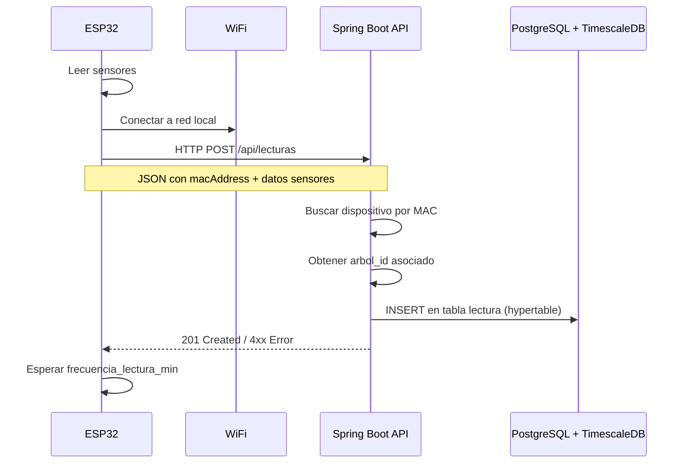

# Roadmap IoT - Integración ESP32 con Backend

> Documento de planificación para la integración de dispositivos ESP32 con el backend Spring Boot.
> Fecha de creación: 2026-02-11

---

## 1. Arquitectura de la Integración

### 1.1 Flujo de datos



### 1.2 Identificación del dispositivo

El ESP32 se identifica ante el backend mediante su **MAC address** (ya modelada como campo UNIQUE en `dispositivo_esp32`). El flujo es:

1. ESP32 obtiene su MAC automáticamente con `WiFi.macAddress()`
2. Envía la MAC en el JSON del POST
3. El backend busca el dispositivo por MAC → obtiene `dispositivo_id` y `arbol_id`
4. Si la MAC no existe en BD → responde 404 (dispositivo no registrado)

### 1.3 Formato del JSON (ESP32 → Backend)

```json
{
  "macAddress": "AA:BB:CC:DD:EE:FF",
  "temperatura": 22.50,
  "humedadAmbiente": 65.00,
  "humedadSuelo": 45.30,
  "co2": null,
  "diametroTronco": null
}
```

**Notas**:
- `macAddress`: Obligatorio. Formato `XX:XX:XX:XX:XX:XX`
- `temperatura`, `humedadAmbiente`, `humedadSuelo`: Obligatorios
- `co2`, `diametroTronco`: Opcionales (null si no hay sensor)
- El `timestamp` lo asigna el backend al recibir la lectura (evita problemas de sincronización de relojes)

### 1.4 Respuestas del Backend

| Código | Significado |
|--------|-------------|
| `201 Created` | Lectura almacenada correctamente |
| `400 Bad Request` | JSON inválido o valores fuera de rango |
| `404 Not Found` | MAC address no registrada en el sistema |
| `422 Unprocessable Entity` | Dispositivo existe pero no tiene árbol asignado |

---

## 2. Estado Actual del Hardware

### 2.1 Componentes conectados

| Componente | Pin ESP32 | Uso actual |
|------------|-----------|------------|
| Sensor de agua (analógico) | GPIO 39 | Detecta presencia de agua (umbral > 1000) |
| LED Rojo | GPIO 4 | Indicador: sin agua |
| LED Amarillo | GPIO 16 | Indicador: transición |
| LED Verde | GPIO 5 | Indicador: con agua |
| Servo (SG90) | GPIO 25 | Movimiento según estado del agua |

### 2.2 Sensores planificados

| Sensor | Tipo | Mide | Campo en BD | Pin previsto |
|--------|------|------|-------------|--------------|
| DHT22 | Digital | Temperatura + Humedad ambiente | `temperatura`, `humedad_ambiente` | Por definir |
| Sensor capacitivo | Analógico | Humedad del suelo | `humedad_suelo` | Por definir |
| MQ-135 | Analógico | CO2 / calidad del aire | `co2` | Por definir |
| Sensor de agua (actual) | Analógico | Presencia de agua | Se mapeará a `humedad_suelo` (fase inicial) | GPIO 39 |

### 2.3 Mapeo temporal: sensor de agua → humedad_suelo

En la fase inicial, el sensor de agua actual se usará como indicador de humedad del suelo:
- Valor analógico 0-4095 (ADC 12 bits del ESP32)
- Se normalizará a porcentaje 0-100% mediante `map(valorAgua, 0, 4095, 0, 100)`
- Los valores de `temperatura` y `humedadAmbiente` se **simularán** con valores aleatorios realistas

---

## 3. Decisiones Técnicas

### 3.1 El backend resuelve la identidad

El ESP32 solo envía su MAC address. El backend se encarga de:
- Buscar el `DispositivoEsp32` por MAC
- Obtener el `Arbol` asociado
- Actualizar `ultimaConexion` del dispositivo
- Insertar la `Lectura` con las FK correctas

**Razón**: Simplifica el firmware del ESP32 y centraliza la lógica.

### 3.2 WiFi credentials como placeholders

Las credenciales WiFi NUNCA se hardcodean en el repositorio:
```cpp
const char* WIFI_SSID = "TU_SSID";        // Cambiar antes de compilar
const char* WIFI_PASSWORD = "TU_PASSWORD";  // Cambiar antes de compilar
```

### 3.3 URL del backend configurable

```cpp
const char* BACKEND_URL = "http://localhost:8080/api/lecturas";  // Local
// const char* BACKEND_URL = "https://proyecto-arboles-backend.onrender.com/api/lecturas";  // Producción
```

### 3.4 Frecuencia de envío

- Default: 15 minutos (consistente con `frecuencia_lectura_min` en BD)
- Para desarrollo/testing: 30 segundos
- Configurable como constante en el sketch

---

## 4. Roadmap de Implementación

### Paso 1 - Backend: Entidad Lectura y endpoint POST

Crear los componentes Java que faltan para recibir lecturas del ESP32.

**Archivos creados**:
- [x] `backend/src/.../model/Lectura.java` - Entidad JPA mapeando hypertable
- [x] `backend/src/.../repository/LecturaRepository.java` - Repositorio Spring Data
- [x] `backend/src/.../controller/LecturaController.java` - Controller con `POST /api/lecturas`
- [x] `backend/src/.../dto/LecturaRequest.java` - DTO para el JSON del ESP32

**Nota sobre PK compuesta**: La BD tiene PK `(id, timestamp)` por requisito de TimescaleDB,
pero JPA usa solo `@Id` en `id` (BIGSERIAL, único). Hibernate no soporta `@GeneratedValue`
en PKs compuestas (`@IdClass`), por lo que `timestamp` es un campo regular en JPA.

**Lógica del endpoint `POST /api/lecturas`**:
1. Recibir `LecturaRequest` (JSON del ESP32)
2. Buscar `DispositivoEsp32` por `macAddress`
3. Verificar que el dispositivo tiene un `Arbol` asignado
4. Crear entidad `Lectura` con timestamp actual + datos + FK
5. Actualizar `ultimaConexion` del dispositivo
6. Guardar y devolver 201

**Referencia SQL** (tabla `lectura` en `create_database.sql:98-125`):
- PK compuesta: `(id, timestamp)` - hypertable TimescaleDB
- FK: `arbol_id` → arbol, `dispositivo_id` → dispositivo_esp32
- Validaciones: temperatura [-50, 80], humedades [0, 100], co2 [0, 10000]

---

### Paso 2 - ESP32: WiFi + HTTP POST

Modificar el sketch para conectar a WiFi y enviar datos al backend.

**Archivos modificados**:
- [x] `esp32/sketch_feb11a/sketch_feb11a.ino` - Añadido WiFi y HTTP POST

**Librerías necesarias**:
- `WiFi.h` (incluida en ESP32 Arduino Core)
- `HTTPClient.h` (incluida en ESP32 Arduino Core)
- `ArduinoJson.h` (instalar desde Library Manager)

**Funcionalidad a añadir**:
1. Conexión WiFi en `setup()` con reintentos
2. Función `enviarLectura()` que:
   - Lee sensor de agua → normaliza a % humedad_suelo
   - Genera valores simulados de temperatura y humedad_ambiente
   - Construye JSON con `ArduinoJson`
   - Envía HTTP POST al backend
   - Maneja respuesta (log en Serial)
3. LED indicador de estado WiFi (reusar LEDs existentes)
4. Llamar a `enviarLectura()` cada X segundos en `loop()`

**Estructura del sketch modificado**:
```
setup():
  - Inicializar pines (LEDs, sensor, servo) [existente]
  - Conectar WiFi [nuevo]
  - Log MAC address [nuevo]

loop():
  - Leer sensor de agua [existente]
  - Controlar LEDs y servo [existente]
  - Si ha pasado el intervalo → enviarLectura() [nuevo]
```

---

### Paso 3 - Validación del flujo completo

- [ ] Registrar un `DispositivoEsp32` en BD con la MAC real del ESP32
- [ ] Crear un `Arbol` de prueba asociado al dispositivo
- [ ] Compilar y subir sketch al ESP32
- [ ] Verificar en Serial Monitor: conexión WiFi + envío HTTP
- [ ] Verificar en BD: `SELECT * FROM lectura ORDER BY timestamp DESC LIMIT 5;`
- [ ] Verificar `ultima_conexion` actualizada en `dispositivo_esp32`

---

### Paso 4 - Sensores reales (futuro)

- [ ] Conectar DHT22 → leer temperatura y humedad ambiente reales
- [ ] Conectar sensor capacitivo → sustituir sensor de agua para humedad_suelo
- [ ] Conectar MQ-135 → lectura de CO2 (opcional)
- [ ] Eliminar simulación de valores del sketch
- [ ] Calibrar sensores y ajustar mapeo de valores

---

### Paso 5 - Robustez (futuro)

- [ ] Reintentos con backoff exponencial si falla el POST
- [ ] Buffer local (almacenar lecturas en memoria si no hay WiFi)
- [ ] Reconexión automática WiFi si se pierde
- [ ] LED de estado de conexión dedicado
- [ ] Watchdog timer para evitar bloqueos
- [ ] Deep sleep entre lecturas para ahorro de batería

---

## 5. Archivos de Referencia

| Archivo | Contenido relevante |
|---------|---------------------|
| `backend/create_database.sql` (líneas 96-125) | Esquema tabla `lectura` (hypertable) |
| `backend/src/.../model/DispositivoEsp32.java` | Entidad dispositivo con MAC address |
| `backend/src/.../model/Arbol.java` | Entidad árbol con umbrales de alerta |
| `docs/04. MODELO_DATOS.md` | Modelo completo con relaciones |
| `docs/03. ESPECIFICACION_TECNICA.md` (sección 2.6) | Especificación IoT planificada |
| `esp32/sketch_feb11a/sketch_feb11a.ino` | Sketch actual (sensor agua + LEDs + servo) |
