# Proyecto Árboles — Sistema de Monitorización de Árboles en Centros Educativos

---

**Ricardo Ortiz Díaz · Enrique Pérez González**

IES El Rincón

Ciclo Formativo de Grado Superior — Desarrollo de Aplicaciones Multiplataforma

2º Curso · 2025-2026

---

## Índice

1. [Introducción](#1-introducción)
2. [Diagramas y Modelo de Datos](#2-diagramas-y-modelo-de-datos)
   - [2.1 Resumen de entidades](#21-resumen-de-entidades)
   - [2.2 Diagrama Entidad-Relación (E/R)](#22-diagrama-entidad-relación-er)
     - [2.2.1 Identificación de entidades](#221-identificación-de-entidades)
     - [2.2.2 Identificación de relaciones](#222-identificación-de-relaciones)
     - [2.2.3 Diagrama E/R](#223-diagrama-er)
   - [2.3 Diagrama UML de Clases](#23-diagrama-uml-de-clases)
   - [2.4 Modelo Relacional Detallado](#24-modelo-relacional-detallado)
     - [Relaciones del modelo relacional](#relaciones-del-modelo-relacional)
   - [2.5 Justificación del diseño](#25-justificación-del-diseño)
   - [2.6 Script de creación](#26-script-de-creación)
   - [2.7 Actualización de la documentación](#27-actualización-de-la-documentación)
3. [Requisitos de Usuario](#3-requisitos-de-usuario)
   - [3.1 Requisitos Funcionales](#31-requisitos-funcionales)
   - [3.2 Requisitos No Funcionales](#32-requisitos-no-funcionales)
4. [Casos de Uso](#4-casos-de-uso)
   - [4.1 Actores del sistema](#41-actores-del-sistema)
   - [4.2 Tabla de casos de uso](#42-tabla-de-casos-de-uso)
   - [4.3 Detalle de caso de uso crítico — CU-10: Enviar lectura (ESP32)](#43-detalle-de-caso-de-uso-crítico--cu-10-enviar-lectura-esp32)
5. [Funcionamiento del Sistema y Especificaciones Técnicas](#5-funcionamiento-del-sistema-y-especificaciones-técnicas)
   - [5.1 Arquitectura general](#51-arquitectura-general)
   - [5.2 Backend — API REST (Spring Boot)](#52-backend--api-rest-spring-boot)
   - [5.3 Frontend — React](#53-frontend--react)
   - [5.4 Android](#54-android)
   - [5.5 Seguridad](#55-seguridad)
   - [5.6 Despliegue en producción](#56-despliegue-en-producción)
   - [5.7 ESP32 — Firmware IoT](#57-esp32--firmware-iot)
6. [Interfaces](#6-interfaces)
   - [6.1 Diseño inicial — Mockups y prototipado](#61-diseño-inicial--mockups-y-prototipado)
   - [6.2 Usabilidad y Accesibilidad](#62-usabilidad-y-accesibilidad)
7. [Manuales](#7-manuales)
   - [7.1 Manual de instalación para desarrolladores](#71-manual-de-instalación-para-desarrolladores)
   - [7.2 Manual de instalación para técnicos](#72-manual-de-instalación-para-técnicos)
   - [7.3 Manual de usuario — Aplicación Web](#73-manual-de-usuario--aplicación-web)
     - [Antes de empezar](#antes-de-empezar)
     - [Inicio de sesión y registro](#inicio-de-sesión-y-registro)
     - [Navegación principal](#navegación-principal)
     - [Dashboard (Inicio)](#dashboard-inicio)
     - [Gestión de árboles](#gestión-de-árboles)
     - [Gestión de centros educativos](#gestión-de-centros-educativos)
     - [Gestión de dispositivos IoT](#gestión-de-dispositivos-iot)
     - [Histórico de lecturas](#histórico-de-lecturas)
     - [Gestión de usuarios (solo ADMIN)](#gestión-de-usuarios-solo-admin)
     - [Permisos por rol](#permisos-por-rol)
     - [Validaciones y mensajes frecuentes](#validaciones-y-mensajes-frecuentes)
     - [Resolución de problemas](#resolución-de-problemas)
   - [7.4 Manual de usuario — Aplicación Android](#74-manual-de-usuario--aplicación-android)
     - [Antes de empezar](#antes-de-empezar-1)
     - [Inicio de sesión y registro](#inicio-de-sesión-y-registro-1)
     - [Navegación principal](#navegación-principal-1)
     - [Pantalla Inicio (Dashboard)](#pantalla-inicio-dashboard)
     - [Centros educativos](#centros-educativos)
     - [Detalle de centro](#detalle-de-centro)
     - [Gestión de árboles](#gestión-de-árboles-1)
     - [Gestión de dispositivos ESP32](#gestión-de-dispositivos-esp32)
     - [Histórico de lecturas](#histórico-de-lecturas-1)
     - [Administración de usuarios (solo ADMIN)](#administración-de-usuarios-solo-admin)
     - [Permisos por rol](#permisos-por-rol-1)
     - [Validaciones y mensajes frecuentes](#validaciones-y-mensajes-frecuentes-1)
     - [Resolución de problemas](#resolución-de-problemas-1)
   - [7.5 Ayuda al usuario dentro de la App](#75-ayuda-al-usuario-dentro-de-la-app)
8. [Tests de Prueba — Backend](#8-tests-de-prueba--backend)
   - [8.1 Catálogo de endpoints verificados](#81-catálogo-de-endpoints-verificados)
   - [8.2 Validaciones verificadas](#82-validaciones-verificadas)
9. [Tests de Prueba — Frontend](#9-tests-de-prueba--frontend)
   - [9.1 Infraestructura de testing](#91-infraestructura-de-testing)
   - [9.2 Tests implementados — detalle](#92-tests-implementados--detalle)
   - [9.3 Los 21 tests](#93-los-21-tests)
10. [Pila Tecnológica](#10-pila-tecnológica)
11. [Comparación de Tecnologías](#11-comparación-de-tecnologías)
    - [11.1 Backend: Spring Boot vs alternativas](#111-backend-spring-boot-vs-alternativas)
    - [11.2 Frontend: React vs alternativas](#112-frontend-react-vs-alternativas)
    - [11.3 Base de datos: PostgreSQL + TimescaleDB vs alternativas](#113-base-de-datos-postgresql--timescaledb-vs-alternativas)
    - [11.4 Android nativo vs alternativas multiplataforma](#114-android-nativo-vs-alternativas-multiplataforma)
12. [Repositorios](#12-repositorios)
13. [Planificación](#13-planificación)
    - [13.1 Metodología y herramientas de gestión](#131-metodología-y-herramientas-de-gestión)
    - [13.2 División del trabajo](#132-división-del-trabajo)
    - [13.3 Coordinación con la Fundación Sergio Alonso](#133-coordinación-con-la-fundación-sergio-alonso)
    - [13.4 Línea de tiempo por fases](#134-línea-de-tiempo-por-fases)
    - [13.5 Cambios de requisitos y decisiones de diseño clave](#135-cambios-de-requisitos-y-decisiones-de-diseño-clave)
14. [Conclusiones](#14-conclusiones)
    - [Lo que no esperábamos aprender](#lo-que-no-esperábamos-aprender)
    - [Lo más difícil](#lo-más-difícil)
    - [Lo que cambiaríamos](#lo-que-cambiaríamos)
    - [Satisfacción con el resultado](#satisfacción-con-el-resultado)
    - [Trabajar con una organización real](#trabajar-con-una-organización-real)
    - [Qué tiene pendiente el sistema](#qué-tiene-pendiente-el-sistema)
15. [Enlaces y Referencias](#15-enlaces-y-referencias)
    - [Documentación oficial de tecnologías](#documentación-oficial-de-tecnologías)
    - [Despliegue](#despliegue)
    - [Proyecto](#proyecto)
16. [Anexo — Modelo ERS](#16-anexo--modelo-ers)
    - [ERS-01: Gestión de inventario de árboles](#ers-01-gestión-de-inventario-de-árboles)
    - [ERS-02: Monitorización de sensores IoT](#ers-02-monitorización-de-sensores-iot)
    - [ERS-03: Control de acceso por roles](#ers-03-control-de-acceso-por-roles)

---

## 1. Introducción

**Proyecto Árboles** es una iniciativa impulsada por la Fundación Sergio Alonso, la Fundación Acuorum y la Fundación Foresta que promueve la educación ambiental y la acción climática mediante la plantación de árboles en centros educativos de Canarias. A través de la creación de espacios de sombra en colegios e institutos, el proyecto mejora el bienestar de la comunidad educativa, transforma los entornos escolares y refuerza valores como el respeto por el medioambiente y la sostenibilidad. La iniciativa se complementa con talleres de educación ambiental donde docentes y alumnado descubren el papel de los árboles frente al cambio climático, su capacidad de absorción de CO₂ y las prácticas necesarias para su cuidado y conservación.

Con los árboles ya plantados en varios centros educativos de Canarias, surge la necesidad de digitalizar su seguimiento y monitorización. El presente proyecto, desarrollado como proyecto de fin de ciclo DAM en el IES El Rincón para la Fundación Sergio Alonso, consiste en el diseño e implementación de un sistema completo de gestión y monitorización IoT: una API REST con Spring Boot como capa de servidor, una aplicación web con React para la gestión desde escritorio, una aplicación móvil Android para el acceso en campo, y el firmware para dispositivos ESP32 que, una vez instalados en los centros, recogerán datos ambientales en tiempo real (temperatura, humedad, CO₂ y luz) y los transmitirán automáticamente al sistema.

---

## 2. Diagramas y Modelo de Datos

Esta sección documenta el modelo de datos del sistema Proyecto Árboles. Se presentan dos representaciones complementarias: el **Diagrama Entidad-Relación (E/R)**, que modela el dominio de forma abstracta identificando entidades, atributos y relaciones; y el **Modelo Relacional** junto al **Diagrama UML de Clases**, que refleja la implementación concreta en PostgreSQL y en las entidades JPA de Spring Boot. Para cada uno de los dos modelos se identifican primero las entidades con sus atributos y restricciones, después las relaciones con su cardinalidad y reglas de negocio, y finalmente se presenta el diagrama gráfico. La sección concluye con el script SQL de creación y la justificación de las decisiones de diseño más relevantes.

### 2.1 Resumen de entidades

| # | Entidad | Descripción | Tipo |
|---|---------|-------------|------|
| 1 | **Usuario** | Usuarios del sistema (Admin, Coordinador) | Tabla principal |
| 2 | **CentroEducativo** | Centros educativos donde se plantan árboles | Tabla principal |
| 3 | **Arbol** | Árboles plantados en los centros educativos (inventario) | Tabla principal |
| 4 | **DispositivoESP32** | Dispositivos IoT que recopilan datos ambientales | Tabla principal |
| 5 | **Lectura** | Lecturas de sensores (serie temporal) | Hypertable (TimescaleDB) |
| 6 | **Alerta** | Alertas generadas por umbrales superados | Tabla principal |
| 7 | **UsuarioCentro** | Relación N:M entre Usuario y CentroEducativo | Tabla intermedia |
| 8 | **Notificacion** | Notificaciones enviadas a usuarios sobre alertas | Tabla principal |

**Relaciones principales:**
- **1:N** — Un CentroEducativo tiene muchos Arboles
- **1:N** — Un CentroEducativo tiene muchos DispositivoESP32
- **1:N** — Un DispositivoESP32 genera muchas Lecturas
- **1:N** — Un DispositivoESP32 puede tener muchas Alertas
- **N:M** — Usuarios ↔ CentrosEducativos (a través de UsuarioCentro)

---

### 2.2 Diagrama Entidad-Relación (E/R)

#### 2.2.1 Identificación de entidades

| Entidad | Rol en el dominio | Atributos descriptivos | Restricciones relevantes |
|---------|-------------------|------------------------|--------------------------|
| **Usuario** | Persona que accede al sistema con rol ADMIN o COORDINADOR | `nombre` (100), `email` (150), `password_hash` (255 BCrypt), `rol`, `fecha_creacion`, `activo` | `email` UNIQUE; `rol` ∈ {ADMIN, COORDINADOR}; `activo` DEFAULT TRUE |
| **CentroEducativo** | Centro escolar de Canarias donde se plantan árboles | `nombre` (200), `direccion` (300), `latitud`, `longitud`, `responsable`, `isla`, `poblacion`, `provincia`, `codigo_postal`, `telefono`, `email`, `fecha_creacion` | `isla` ∈ {GRAN_CANARIA, TENERIFE, LANZAROTE, FUERTEVENTURA, LA_PALMA, LA_GOMERA, EL_HIERRO}; coordenadas opcionales |
| **Arbol** | Registro de uno o varios árboles de la misma especie plantados en un centro | `nombre` (100), `especie` (150), `fecha_plantacion`, `ubicacion_especifica` (200), `absorcion_co2_anual` (kg/año, opcional), `cantidad` | FK `centro_id` NOT NULL; `cantidad` ≥ 1 (CHECK) |
| **DispositivoESP32** | Sensor IoT (ESP32) que mide temperatura, humedad, CO₂ y luz en un centro | `mac_address` (17), `activo`, `ultima_conexion`, `frecuencia_lectura_seg`, umbrales de alerta (6 campos) | `mac_address` UNIQUE; FK `centro_id` NOT NULL; frecuencia DEFAULT 30 s |
| **Lectura** | Muestra de sensores registrada por un dispositivo en un instante concreto | `timestamp`, `temperatura` (°C), `humedad_ambiente` (%), `humedad_suelo` (%), `co2` (ppm, opcional), `luz1` y `luz2` (%, opcionales) | PK compuesta `(id, timestamp)` — requerida por TimescaleDB; checks de rango en todos los sensores |
| **Alerta** | Evento generado automáticamente cuando un sensor supera el umbral configurado | `tipo_alerta`, `timestamp`, `mensaje`, `estado`, `fecha_resolucion` (nullable) | `tipo_alerta` ∈ 7 valores; `estado` ∈ {ACTIVA, RESUELTA, IGNORADA} DEFAULT ACTIVA; FK `dispositivo_id` nullable |
| **UsuarioCentro** | Tabla intermedia N:M que asigna coordinadores a centros educativos | `fecha_asignacion`, `activo` | UNIQUE `(usuario_id, centro_id)`; ambas FK con ON DELETE CASCADE |
| **Notificacion** | Aviso generado a un usuario concreto cuando se activa una alerta | `leida` (DEFAULT FALSE), `fecha_envio` | FK `usuario_id` y `alerta_id` NOT NULL con ON DELETE CASCADE |

#### 2.2.2 Identificación de relaciones

| # | Relación | Cardinalidad | Participación | Regla de negocio |
|---|----------|:------------:|---------------|-----------------|
| 1 | **Usuario — UsuarioCentro** | 1 : N | Usuario: parcial · UsuarioCentro: total | Un usuario puede estar asignado a cero o más centros. La entidad UsuarioCentro exige siempre un usuario (FK NOT NULL). Los coordinadores activos deben tener al menos una asignación para poder operar. |
| 2 | **CentroEducativo — UsuarioCentro** | 1 : N | CentroEducativo: parcial · UsuarioCentro: total | Un centro puede tener asignados cero o más coordinadores. La entidad UsuarioCentro exige siempre un centro (FK NOT NULL). Si se elimina el centro, sus asignaciones se borran en cascada. |
| 3 | **CentroEducativo — Arbol** | 1 : N | CentroEducativo: parcial · Arbol: total | Un centro puede tener cero o más árboles; un árbol pertenece a exactamente un centro (FK NOT NULL). Si se elimina el centro, sus árboles se eliminan en cascada. |
| 4 | **CentroEducativo — DispositivoESP32** | 1 : N | CentroEducativo: parcial · DispositivoESP32: total | Un centro puede tener cero o más dispositivos; un dispositivo pertenece a exactamente un centro (FK NOT NULL). Si se elimina el centro, sus dispositivos (y sus lecturas y alertas) se eliminan en cascada. |
| 5 | **DispositivoESP32 — Lectura** | 1 : N | DispositivoESP32: parcial · Lectura: total | Un dispositivo genera cero o más lecturas; cada lectura referencia exactamente un dispositivo (FK NOT NULL). Si se elimina el dispositivo, todas sus lecturas se eliminan en cascada. |
| 6 | **DispositivoESP32 — Alerta** | 1 : N | DispositivoESP32: parcial · Alerta: parcial | Un dispositivo puede haber generado cero o más alertas. La FK `dispositivo_id` es **nullable** de forma intencionada: si el dispositivo se elimina, las alertas históricas se conservan (ON DELETE CASCADE en el SQL elimina solo cuando el dispositivo se borra explícitamente, pero la nullable permite registros sin dispositivo activo). |
| 7 | **Alerta — Notificacion** | 1 : N | Alerta: parcial · Notificacion: total | Una alerta puede generar una notificación por cada coordinador asignado al centro afectado (cero o más). Cada notificación referencia exactamente una alerta (FK NOT NULL). Si se elimina la alerta, sus notificaciones se eliminan en cascada. |
| 8 | **Usuario — Notificacion** | 1 : N | Usuario: parcial · Notificacion: total | Un usuario puede recibir cero o más notificaciones; cada notificación tiene exactamente un destinatario (FK NOT NULL). Si se elimina el usuario, sus notificaciones se eliminan en cascada. |

#### 2.2.3 Diagrama E/R

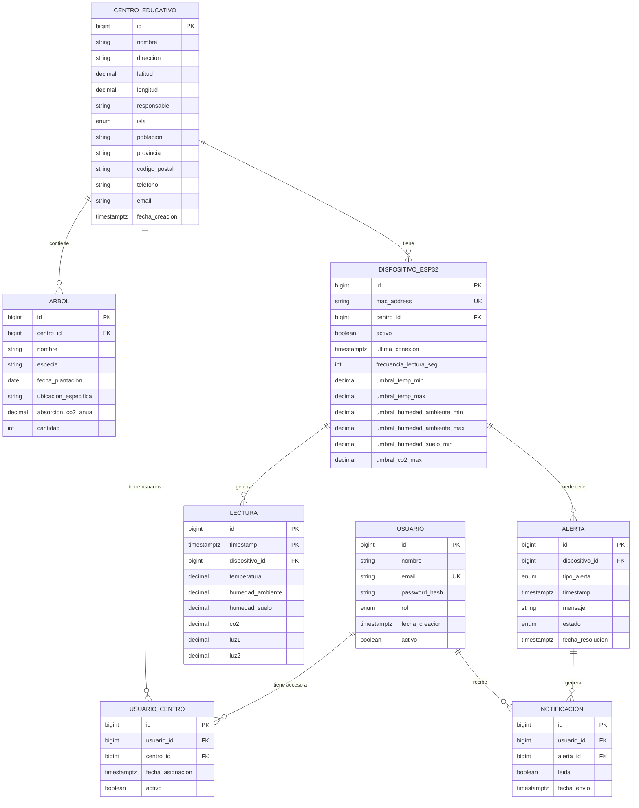
```mermaid
erDiagram
    USUARIO ||--o{ USUARIO_CENTRO : "tiene acceso a"
    CENTRO_EDUCATIVO ||--o{ USUARIO_CENTRO : "tiene usuarios"
    CENTRO_EDUCATIVO ||--o{ ARBOL : "contiene"
    CENTRO_EDUCATIVO ||--o{ DISPOSITIVO_ESP32 : "tiene"
    DISPOSITIVO_ESP32 ||--o{ LECTURA : "genera"
    DISPOSITIVO_ESP32 ||--o{ ALERTA : "puede tener"
    ALERTA ||--o{ NOTIFICACION : "genera"
    USUARIO ||--o{ NOTIFICACION : "recibe"

    USUARIO {
        bigint id PK
        string nombre
        string email UK
        string password_hash
        enum rol
        timestamptz fecha_creacion
        boolean activo
    }

    CENTRO_EDUCATIVO {
        bigint id PK
        string nombre
        string direccion
        decimal latitud
        decimal longitud
        string responsable
        enum isla
        string poblacion
        string provincia
        string codigo_postal
        string telefono
        string email
        timestamptz fecha_creacion
    }

    ARBOL {
        bigint id PK
        bigint centro_id FK
        string nombre
        string especie
        date fecha_plantacion
        string ubicacion_especifica
        decimal absorcion_co2_anual
        int cantidad
    }

    DISPOSITIVO_ESP32 {
        bigint id PK
        string mac_address UK
        bigint centro_id FK
        boolean activo
        timestamptz ultima_conexion
        int frecuencia_lectura_seg
        decimal umbral_temp_min
        decimal umbral_temp_max
        decimal umbral_humedad_ambiente_min
        decimal umbral_humedad_ambiente_max
        decimal umbral_humedad_suelo_min
        decimal umbral_co2_max
    }

    LECTURA {
        bigint id PK
        timestamptz timestamp PK
        bigint dispositivo_id FK
        decimal temperatura
        decimal humedad_ambiente
        decimal humedad_suelo
        decimal co2
        decimal luz1
        decimal luz2
    }

    ALERTA {
        bigint id PK
        bigint dispositivo_id FK
        enum tipo_alerta
        timestamptz timestamp
        string mensaje
        enum estado
        timestamptz fecha_resolucion
    }

    USUARIO_CENTRO {
        bigint id PK
        bigint usuario_id FK
        bigint centro_id FK
        timestamptz fecha_asignacion
        boolean activo
    }

    NOTIFICACION {
        bigint id PK
        bigint usuario_id FK
        bigint alerta_id FK
        boolean leida
        timestamptz fecha_envio
    }
```

---

### 2.3 Diagrama UML de Clases


```mermaid
classDiagram
    class Usuario {
        -Long id
        -String nombre
        -String email
        -String passwordHash
        -Rol rol
        -LocalDateTime fechaCreacion
        -Boolean activo
        -Set~UsuarioCentro~ centros
        -Set~Notificacion~ notificaciones
        +getId() Long
        +getNombre() String
        +getEmail() String
        +getRol() Rol
        +isActivo() Boolean
    }

    class Rol {
        <<enumeration>>
        ADMIN
        COORDINADOR
    }

    class Isla {
        <<enumeration>>
        GRAN_CANARIA
        TENERIFE
        LANZAROTE
        FUERTEVENTURA
        LA_PALMA
        LA_GOMERA
        EL_HIERRO
    }

    class CentroEducativo {
        -Long id
        -String nombre
        -String direccion
        -BigDecimal latitud
        -BigDecimal longitud
        -String responsable
        -Isla isla
        -String poblacion
        -String provincia
        -String codigoPostal
        -String telefono
        -String email
        -LocalDateTime fechaCreacion
        -Set~Arbol~ arboles
        -Set~UsuarioCentro~ usuarios
        +getId() Long
        +getNombre() String
        +getArboles() Set~Arbol~
    }

    class Arbol {
        -Long id
        -CentroEducativo centro
        -String nombre
        -String especie
        -LocalDate fechaPlantacion
        -String ubicacionEspecifica
        -BigDecimal absorcionCo2Anual
        -Integer cantidad
        +getId() Long
        +getEspecie() String
        +getCentro() CentroEducativo
        +getCantidad() Integer
    }

    class DispositivoESP32 {
        -Long id
        -String macAddress
        -CentroEducativo centroEducativo
        -Boolean activo
        -LocalDateTime ultimaConexion
        -Integer frecuenciaLecturaSeg
        -BigDecimal umbralTempMin
        -BigDecimal umbralTempMax
        -BigDecimal umbralHumedadAmbienteMin
        -BigDecimal umbralHumedadAmbienteMax
        -BigDecimal umbralHumedadSueloMin
        -BigDecimal umbralCo2Max
        -Set~Lectura~ lecturas
        -Set~Alerta~ alertas
        +getId() Long
        +getMacAddress() String
        +isActivo() Boolean
    }

    class Lectura {
        -Long id
        -LocalDateTime timestamp
        -DispositivoESP32 dispositivo
        -BigDecimal temperatura
        -BigDecimal humedadAmbiente
        -BigDecimal humedadSuelo
        -BigDecimal co2
        -BigDecimal luz1
        -BigDecimal luz2
        +getId() Long
        +getTimestamp() LocalDateTime
        +getTemperatura() BigDecimal
        +getHumedadAmbiente() BigDecimal
        +getHumedadSuelo() BigDecimal
        +getCo2() BigDecimal
    }

    class Alerta {
        -Long id
        -DispositivoESP32 dispositivo
        -TipoAlerta tipo
        -LocalDateTime timestamp
        -String mensaje
        -EstadoAlerta estado
        -LocalDateTime fechaResolucion
        -Set~Notificacion~ notificaciones
        +getId() Long
        +getTipo() TipoAlerta
        +isActiva() Boolean
        +resolver() void
    }

    class TipoAlerta {
        <<enumeration>>
        TEMPERATURA_ALTA
        TEMPERATURA_BAJA
        HUMEDAD_AMBIENTE_BAJA
        HUMEDAD_AMBIENTE_ALTA
        HUMEDAD_SUELO_BAJA
        CO2_ALTO
        DISPOSITIVO_DESCONECTADO
    }

    class EstadoAlerta {
        <<enumeration>>
        ACTIVA
        RESUELTA
        IGNORADA
    }

    class UsuarioCentro {
        -Long id
        -Usuario usuario
        -CentroEducativo centro
        -LocalDateTime fechaAsignacion
        -Boolean activo
        +getId() Long
        +getUsuario() Usuario
        +getCentro() CentroEducativo
    }

    class Notificacion {
        -Long id
        -Usuario usuario
        -Alerta alerta
        -Boolean leida
        -LocalDateTime fechaEnvio
        +getId() Long
        +isLeida() Boolean
        +marcarComoLeida() void
    }

    %% Relaciones
    Usuario "1" --> "*" UsuarioCentro : tiene
    Usuario "1" --> "*" Notificacion : recibe
    Usuario --> Rol : tiene

    CentroEducativo --> Isla : tiene
    CentroEducativo "1" --> "*" Arbol : contiene
    CentroEducativo "1" --> "*" DispositivoESP32 : tiene
    CentroEducativo "1" --> "*" UsuarioCentro : tiene

    Arbol "*" --> "1" CentroEducativo : pertenece a

    DispositivoESP32 "*" --> "1" CentroEducativo : pertenece a
    DispositivoESP32 "1" --> "*" Lectura : genera
    DispositivoESP32 "1" --> "*" Alerta : tiene

    Alerta "*" --> "1" DispositivoESP32 : pertenece a
    Alerta --> TipoAlerta : tiene
    Alerta --> EstadoAlerta : tiene
    Alerta "1" --> "*" Notificacion : genera

    UsuarioCentro "*" --> "1" Usuario : pertenece a
    UsuarioCentro "*" --> "1" CentroEducativo : pertenece a
    Notificacion "*" --> "1" Usuario : destinada a
    Notificacion "*" --> "1" Alerta : relacionada con
```

---

### 2.4 Modelo Relacional Detallado

#### Tabla: `usuario`

| Campo | Tipo | Restricciones | Descripción |
|-------|------|---------------|-------------|
| `id` | BIGSERIAL | PRIMARY KEY | Identificador único |
| `nombre` | VARCHAR(100) | NOT NULL | Nombre completo del usuario |
| `email` | VARCHAR(150) | NOT NULL, UNIQUE | Email (usado para login) |
| `password_hash` | VARCHAR(255) | NOT NULL | Contraseña hasheada (BCrypt) |
| `rol` | VARCHAR(20) | NOT NULL, CHECK | Rol: ADMIN, COORDINADOR |
| `fecha_creacion` | TIMESTAMPTZ | NOT NULL, DEFAULT NOW() | Fecha de registro |
| `activo` | BOOLEAN | NOT NULL, DEFAULT TRUE | Usuario activo/inactivo |

Índices: PK en `id` · UNIQUE en `email` · INDEX en `rol`, `activo`

#### Tabla: `centro_educativo`

| Campo | Tipo | Restricciones | Descripción |
|-------|------|---------------|-------------|
| `id` | BIGSERIAL | PRIMARY KEY | Identificador único |
| `nombre` | VARCHAR(200) | NOT NULL | Nombre del centro |
| `direccion` | VARCHAR(300) | NOT NULL | Dirección completa |
| `latitud` | DECIMAL(10,8) | NULL | Coordenada GPS |
| `longitud` | DECIMAL(11,8) | NULL | Coordenada GPS |
| `responsable` | VARCHAR(100) | NULL | Nombre del responsable |
| `isla` | VARCHAR(20) | NULL, CHECK | Isla canaria (enum Isla) |
| `poblacion` | VARCHAR(100) | NULL | Población/municipio |
| `provincia` | VARCHAR(100) | NULL | Provincia |
| `codigo_postal` | VARCHAR(10) | NULL | Código postal |
| `telefono` | VARCHAR(20) | NULL | Teléfono de contacto |
| `email` | VARCHAR(150) | NULL | Correo de contacto |
| `fecha_creacion` | TIMESTAMPTZ | NOT NULL, DEFAULT NOW() | Fecha de creación |

Índices: PK en `id` · INDEX en `nombre`

#### Tabla: `arbol`

| Campo | Tipo | Restricciones | Descripción |
|-------|------|---------------|-------------|
| `id` | BIGSERIAL | PRIMARY KEY | Identificador único |
| `centro_id` | BIGINT | NOT NULL, FK → centro_educativo | Centro al que pertenece |
| `nombre` | VARCHAR(100) | NOT NULL | Identificador del árbol |
| `especie` | VARCHAR(150) | NOT NULL | Especie del árbol |
| `fecha_plantacion` | DATE | NOT NULL | Fecha de plantación |
| `ubicacion_especifica` | VARCHAR(200) | NULL | Ubicación dentro del centro |
| `absorcion_co2_anual` | DECIMAL(8,2) | NULL | Absorción CO₂ estimada (kg/año) |
| `cantidad` | INTEGER | NOT NULL, DEFAULT 1, CHECK ≥ 1 | Número de árboles de esta especie |

Índices: PK en `id` · FK `centro_id` (ON DELETE CASCADE) · INDEX en `centro_id`, `especie`

#### Tabla: `dispositivo_esp32`

| Campo | Tipo | Restricciones | Descripción |
|-------|------|---------------|-------------|
| `id` | BIGSERIAL | PRIMARY KEY | Identificador único |
| `mac_address` | VARCHAR(17) | NOT NULL, UNIQUE | Dirección MAC del ESP32 |
| `centro_id` | BIGINT | NOT NULL, FK → centro_educativo | Centro al que pertenece |
| `activo` | BOOLEAN | NOT NULL, DEFAULT TRUE | Dispositivo activo |
| `ultima_conexion` | TIMESTAMPTZ | NULL | Última lectura recibida |
| `frecuencia_lectura_seg` | INTEGER | DEFAULT 30 | Intervalo de lecturas (segundos) |
| `umbral_temp_min` | DECIMAL(5,2) | DEFAULT 5.00 | Temperatura mínima aceptable (°C) |
| `umbral_temp_max` | DECIMAL(5,2) | DEFAULT 40.00 | Temperatura máxima aceptable (°C) |
| `umbral_humedad_ambiente_min` | DECIMAL(5,2) | DEFAULT 30.00 | Humedad ambiental mínima (%) |
| `umbral_humedad_ambiente_max` | DECIMAL(5,2) | DEFAULT 90.00 | Humedad ambiental máxima (%) |
| `umbral_humedad_suelo_min` | DECIMAL(5,2) | DEFAULT 30.00 | Humedad mínima del suelo (%) |
| `umbral_co2_max` | DECIMAL(7,2) | DEFAULT 1000.00 | CO₂ máximo aceptable (ppm) |

Índices: PK en `id` · UNIQUE en `mac_address` · FK `centro_id` (ON DELETE CASCADE) · INDEX en `centro_id`, `activo`

#### Tabla (Hypertable): `lectura`

| Campo | Tipo | Restricciones | Descripción |
|-------|------|---------------|-------------|
| `id` | BIGSERIAL | NOT NULL | Identificador |
| `timestamp` | TIMESTAMPTZ | NOT NULL | Momento de la lectura |
| `dispositivo_id` | BIGINT | NOT NULL, FK → dispositivo_esp32 | Dispositivo origen |
| `temperatura` | DECIMAL(5,2) | NOT NULL | Temperatura ambiental (°C) |
| `humedad_ambiente` | DECIMAL(5,2) | NOT NULL | Humedad ambiental (%) |
| `humedad_suelo` | DECIMAL(5,2) | NOT NULL | Humedad del suelo (%) |
| `co2` | DECIMAL(7,2) | NULL | CO₂ (ppm) — opcional |
| `luz1` | DECIMAL(5,2) | NULL | Nivel de luz LDR 1 (%) — opcional |
| `luz2` | DECIMAL(5,2) | NULL | Nivel de luz LDR 2 (%) — opcional |

**Clave primaria compuesta**: `(id, timestamp)` — requerida por TimescaleDB para el particionado.

> **Nota de implementación JPA**: Hibernate no soporta `@GeneratedValue` en PKs compuestas, por lo que en la entidad Java solo `id` es `@Id`. El campo `timestamp` se mapea como `@NotNull`. Esto funciona porque `id` (BIGSERIAL) garantiza unicidad de forma independiente, y la tabla la crea el script SQL (Hibernate no la recrea).

Índices: PK `(id, timestamp)` · FK `dispositivo_id` (ON DELETE CASCADE) · INDEX en `(dispositivo_id, timestamp DESC)`

#### Tabla: `alerta`

| Campo | Tipo | Restricciones | Descripción |
|-------|------|---------------|-------------|
| `id` | BIGSERIAL | PRIMARY KEY | Identificador único |
| `dispositivo_id` | BIGINT | NOT NULL, FK → dispositivo_esp32 | Dispositivo que generó la alerta |
| `tipo_alerta` | VARCHAR(50) | NOT NULL, CHECK | Tipo de alerta (ver enum) |
| `timestamp` | TIMESTAMPTZ | NOT NULL, DEFAULT NOW() | Momento de la alerta |
| `mensaje` | TEXT | NOT NULL | Descripción de la alerta |
| `estado` | VARCHAR(20) | NOT NULL, DEFAULT 'ACTIVA' | ACTIVA / RESUELTA / IGNORADA |
| `fecha_resolucion` | TIMESTAMPTZ | NULL | Cuándo se resolvió |

Tipos de alerta: `TEMPERATURA_ALTA`, `TEMPERATURA_BAJA`, `HUMEDAD_AMBIENTE_BAJA`, `HUMEDAD_AMBIENTE_ALTA`, `HUMEDAD_SUELO_BAJA`, `CO2_ALTO`, `DISPOSITIVO_DESCONECTADO`

#### Tabla: `usuario_centro` (N:M)

| Campo | Tipo | Restricciones | Descripción |
|-------|------|---------------|-------------|
| `id` | BIGSERIAL | PRIMARY KEY | Identificador único |
| `usuario_id` | BIGINT | NOT NULL, FK → usuario | Usuario asignado |
| `centro_id` | BIGINT | NOT NULL, FK → centro_educativo | Centro asignado |
| `fecha_asignacion` | TIMESTAMPTZ | NOT NULL, DEFAULT NOW() | Fecha de asignación |
| `activo` | BOOLEAN | NOT NULL, DEFAULT TRUE | Asignación activa |

Índices: PK en `id` · UNIQUE en `(usuario_id, centro_id)` · FK con ON DELETE CASCADE en ambas FK

#### Tabla: `notificacion`

| Campo | Tipo | Restricciones | Descripción |
|-------|------|---------------|-------------|
| `id` | BIGSERIAL | PRIMARY KEY | Identificador único |
| `usuario_id` | BIGINT | NOT NULL, FK → usuario | Usuario destinatario |
| `alerta_id` | BIGINT | NOT NULL, FK → alerta | Alerta relacionada |
| `leida` | BOOLEAN | NOT NULL, DEFAULT FALSE | Si fue leída |
| `fecha_envio` | TIMESTAMPTZ | NOT NULL, DEFAULT NOW() | Fecha de envío |

Índices: PK en `id` · FK con ON DELETE CASCADE · INDEX en `(usuario_id, leida)`, `(fecha_envio DESC)`

#### Relaciones del modelo relacional

La siguiente tabla consolida todas las claves foráneas del esquema con su comportamiento ante eliminación. La política general es **ON DELETE CASCADE** en todas las relaciones para garantizar la integridad referencial sin necesidad de eliminaciones manuales en cascada desde la aplicación.

| Tabla | Campo FK | Referencia | Nulabilidad | ON DELETE |
|-------|----------|-----------|:-----------:|:---------:|
| `arbol` | `centro_id` | `centro_educativo(id)` | NOT NULL | CASCADE |
| `dispositivo_esp32` | `centro_id` | `centro_educativo(id)` | NOT NULL | CASCADE |
| `lectura` | `dispositivo_id` | `dispositivo_esp32(id)` | NOT NULL | CASCADE |
| `alerta` | `dispositivo_id` | `dispositivo_esp32(id)` | NULL | CASCADE |
| `usuario_centro` | `usuario_id` | `usuario(id)` | NOT NULL | CASCADE |
| `usuario_centro` | `centro_id` | `centro_educativo(id)` | NOT NULL | CASCADE |
| `notificacion` | `usuario_id` | `usuario(id)` | NOT NULL | CASCADE |
| `notificacion` | `alerta_id` | `alerta(id)` | NOT NULL | CASCADE |

Restricciones adicionales relevantes:
- `usuario_centro(usuario_id, centro_id)` — UNIQUE: no puede existir la misma asignación coordinador-centro duplicada.
- `alerta.dispositivo_id` es el único FK nullable del modelo: decisión de diseño para conservar el histórico de alertas si el dispositivo es dado de baja.
- La PK compuesta `lectura(id, timestamp)` es un requisito de TimescaleDB para el particionado temporal; `id` (BIGSERIAL) garantiza unicidad por sí solo.

---

### 2.5 Justificación del diseño

#### ¿Por qué `CentroEducativo` es el nodo central del modelo?

El centro educativo es la unidad organizativa real del proyecto: los árboles están plantados en un centro, los dispositivos IoT monitorizan un centro, y los coordinadores tienen acceso a centros concretos. Hacer de `CentroEducativo` el eje del modelo refleja directamente la realidad del dominio y simplifica todas las consultas frecuentes (árboles de un centro, dispositivos de un centro, usuarios responsables de un centro).

#### ¿Por qué `Lectura` es una hypertable de TimescaleDB y no una tabla PostgreSQL normal?

Las lecturas son datos de serie temporal: cada dispositivo activo inserta una fila cada 15-30 minutos de forma indefinida. Con varios dispositivos en producción, la tabla crece cientos de miles de filas al año. TimescaleDB particiona automáticamente los datos por rango de tiempo (*chunks*), lo que mantiene el rendimiento de las consultas por rango de fechas constante independientemente del volumen total. Con una tabla PostgreSQL convencional, las consultas de tipo `WHERE timestamp BETWEEN ... AND ...` se degradarían progresivamente a medida que creciera la tabla. Además, TimescaleDB permite aplicar políticas de retención y compresión sin cambios en el esquema.

#### ¿Por qué el ESP32 se identifica por dirección MAC y no por token o API key?

La MAC WiFi del ESP32 está disponible en el firmware sin ninguna configuración adicional (`WiFi.macAddress()`). Si se usara un token o API key, habría que generarlo en el backend, copiarlo manualmente al archivo `config.h` de cada dispositivo y subirlo por USB antes de instalarlo en el centro. Con la MAC, el flujo es: registrar el dispositivo en la aplicación web una sola vez, y el ESP32 envía lecturas automáticamente desde el primer arranque. La MAC también es única por hardware, lo que garantiza que no puede haber dos dispositivos con el mismo identificador.

#### ¿Por qué `Arbol` tiene un campo `cantidad` en lugar de una fila por árbol?

En la práctica, los centros reciben grupos de árboles de la misma especie plantados el mismo día en la misma zona (por ejemplo, cinco pinos en el patio trasero). Representar eso con una fila por árbol generaría registros duplicados en todos sus campos excepto el ID, sin aportar información adicional. El campo `cantidad` agrupa correctamente el inventario por especie y ubicación, y la absorción de CO₂ total se calcula multiplicando `absorcionCo2Anual × cantidad`, que es la cifra que muestra el dashboard.

#### ¿Por qué la relación Usuario ↔ CentroEducativo es N:M?

Dos necesidades reales obligan a N:M en lugar de 1:N:

- Un **coordinador puede gestionar varios centros** (por ejemplo, un responsable de zona que supervisa tres colegios).
- Un **centro puede tener varios coordinadores** asignados (titular y sustituto, o varios docentes responsables).

Una FK simple `centro_id` en `Usuario` no permite ninguno de los dos casos. La tabla intermedia `UsuarioCentro` resuelve ambos y añade `activo` para suspender temporalmente el acceso de un coordinador a un centro sin eliminar la relación, preservando el histórico de asignaciones.

#### ¿Por qué `Alerta` y `Notificacion` son dos entidades separadas?

Una **alerta** representa un evento físico detectado: temperatura fuera de rango, CO₂ elevado, dispositivo desconectado. Es un hecho objetivo registrado contra un dispositivo.

Una **notificación** representa la comunicación de ese evento a un usuario concreto, con su propio estado de lectura (`leida`). La separación permite que una sola alerta genere notificaciones a todos los coordinadores asignados a ese centro sin duplicar los datos de la alerta. También permite que cada usuario marque la notificación como leída de forma independiente, sin afectar a lo que ven los demás coordinadores.

#### ¿Por qué la clave primaria de `Lectura` es compuesta `(id, timestamp)`?

TimescaleDB exige que la columna de particionado temporal forme parte de la clave primaria. Sin `timestamp` en la PK, la extensión no puede crear la hypertable. Sin embargo, JPA/Hibernate no soporta `@GeneratedValue` en PKs compuestas, lo que haría imposible que Hibernate gestionara la inserción automática del `id`.

La solución adoptada es declarar solo `id` como `@Id` en la entidad Java — que funciona porque `BIGSERIAL` garantiza unicidad por sí solo — mientras que el script SQL crea la tabla con PK `(id, timestamp)`. Hibernate no recrea la tabla (el DDL lo gestiona el script `create_database.sql`), por lo que ambas restricciones conviven sin conflicto.

### 2.6 Script de creación

El script SQL completo de creación de todas las tablas, constraints, índices y la configuración de la hypertable TimescaleDB se encuentra en el repositorio: `backend/create_database.sql`.

### 2.7 Actualización de la documentación

Esta documentación del modelo de datos se mantiene sincronizada con el esquema real del sistema. Cualquier cambio en `backend/create_database.sql` (nuevas tablas, campos añadidos o eliminados, cambios en restricciones) debe reflejarse simultáneamente en las secciones 2.2, 2.4 y 2.6 de este documento. Del mismo modo, los cambios en las entidades JPA (`backend/src/main/java/com/example/gardenmonitor/model/`) que afecten al mapeo objeto-relacional deben actualizarse en el diagrama UML de la sección 2.3. El script `create_database.sql` es la fuente de verdad para el esquema; las secciones 2.2 a 2.6 son su reflejo documentado.

---

## 3. Requisitos de Usuario

### 3.1 Requisitos Funcionales

#### RF-01: Gestión de Centros Educativos
- El sistema debe permitir crear, leer, actualizar y eliminar centros educativos
- Cada centro debe tener: nombre único, dirección, coordenadas GPS, responsable, isla
- El sistema debe validar que no existan centros duplicados por nombre

#### RF-02: Gestión de Árboles
- El sistema debe permitir CRUD completo de árboles
- Cada árbol debe asociarse obligatoriamente a un centro educativo
- El sistema debe almacenar: nombre, especie, fecha de plantación, ubicación específica, absorción CO₂ anual y cantidad
- El sistema debe validar que la fecha de plantación no sea futura

#### RF-03: Gestión de Dispositivos IoT
- El sistema debe registrar dispositivos ESP32 con MAC address única
- Cada dispositivo pertenece a un centro educativo (relación N:1)
- El sistema debe permitir configurar umbrales de alerta por dispositivo (temperatura, humedad ambiente, humedad suelo, CO₂)
- El sistema debe registrar la última conexión de cada dispositivo

#### RF-04: Monitorización de Datos Ambientales
- El sistema debe almacenar lecturas de sensores con timestamp
- El sistema debe registrar: temperatura, humedad ambiente, humedad suelo, CO₂, luz1, luz2
- El sistema debe optimizar el almacenamiento con TimescaleDB (hypertable)
- El endpoint de gráfica debe aplicar stride sampling (máx. 400 puntos reales) para optimizar el rendimiento

#### RF-05: Sistema de Alertas y Notificaciones
- El sistema debe generar alertas cuando los valores excedan los umbrales configurados por dispositivo
- El sistema debe clasificar alertas por tipo y estado (ACTIVA, RESUELTA, IGNORADA)
- El sistema debe mantener histórico de alertas y enviar notificaciones a los usuarios del centro

#### RF-06: Autenticación y Autorización
- El sistema tiene 2 roles: ADMIN (acceso total) y COORDINADOR (gestiona centros asignados)
- El acceso público (sin cuenta) permite lectura de contenido
- El login devuelve un token JWT que debe incluirse en las peticiones protegidas
- Las contraseñas se almacenan hasheadas con BCrypt

#### RF-07: Visualización Web y Móvil
- El sistema web debe mostrar gráficas de datos de sensores (Recharts) y mapas de centros (Leaflet)
- La app Android debe mostrar gráficas históricas con selector de período (MPAndroidChart)
- Ambas interfaces deben permitir el CRUD completo de las entidades del sistema

#### RF-08: Aplicación Móvil
- La app Android debe funcionar en dispositivos con API 24+ (Android 7.0)
- Debe soportar orientación portrait (BottomNavigationView) y landscape (NavigationRailView)
- Debe mostrar datos de sensores en tiempo real con polling cada 30 segundos

### 3.2 Requisitos No Funcionales

#### RNF-01: Usabilidad
- La interfaz web debe ser responsive (móvil, tablet, escritorio) con menú hamburguesa en móvil
- Los mensajes de error deben ser claros y orientar al usuario (componentes Alert, validaciones inline)
- Las acciones destructivas deben requerir confirmación mediante modal

#### RNF-02: Mantenibilidad
- El código backend debe estar documentado con JavaDoc
- El frontend cuenta con suite de tests Vitest (21 tests, cobertura ~60%)
- El sistema usa control de versiones Git con feature branches y conventional commits

#### RNF-03: Portabilidad
- El backend debe funcionar en Linux, Windows y macOS
- El frontend debe funcionar en Chrome, Firefox, Safari y Edge
- La app Android debe funcionar en dispositivos de diferentes fabricantes con API 24+

#### RNF-04: Interoperabilidad
- El backend debe exponer una API REST con JSON como formato de intercambio
- El sistema debe seguir convenciones RESTful (verbos HTTP, códigos de estado)
- La autenticación debe usar el estándar JWT (Bearer token en cabecera Authorization)

#### RNF-05: Seguridad
- Las contraseñas deben almacenarse hasheadas con BCrypt (nunca en texto plano)
- Las rutas protegidas deben validar el JWT en cada petición mediante filtro Spring Security
- Las credenciales y secretos no deben incluirse en el repositorio (uso de variables de entorno)

#### RNF-06: Disponibilidad
- El sistema debe estar desplegado y accesible en producción (Vercel + Render)
- El tiempo de respuesta normal debe ser inferior a 3 segundos (excluyendo cold start de Render)

---

## 4. Casos de Uso

### 4.1 Actores del sistema

- **ADMIN**: acceso completo al sistema. Gestiona usuarios, centros, árboles y dispositivos.
- **COORDINADOR**: acceso restringido a los centros que tiene asignados. Puede gestionar árboles y ver lecturas.
- **Público**: puede consultar información de centros y árboles sin autenticarse.
- **ESP32**: dispositivo IoT que envía lecturas periódicas al backend de forma autónoma.

### 4.2 Tabla de casos de uso

| Código | Caso de Uso | Actor principal | Descripción |
|---|---|---|---|
| CU-01 | Iniciar sesión | Todos | El usuario introduce email y contraseña. El sistema valida contra BD y devuelve un JWT. |
| CU-02 | Registrarse | Público | El usuario crea una cuenta nueva con rol COORDINADOR por defecto. |
| CU-03 | Gestionar centros educativos | ADMIN | Crear, editar, consultar y eliminar centros educativos. |
| CU-04 | Gestionar árbol | ADMIN / COORDINADOR | Crear, editar, consultar y eliminar árboles del inventario de un centro. |
| CU-05 | Gestionar dispositivo ESP32 | ADMIN / COORDINADOR | Registrar un dispositivo con su MAC, asignarlo a un centro y configurar sus umbrales de alerta. |
| CU-06 | Ver lecturas en tiempo real | Todos | Consultar la última lectura de sensores de un dispositivo. |
| CU-07 | Ver histórico de lecturas | Todos | Visualizar gráficas de temperatura, humedad, CO₂ y luz filtradas por período. |
| CU-08 | Gestionar usuarios | ADMIN | Crear, editar, activar/desactivar y asignar coordinadores a centros. |
| CU-09 | Asignar coordinador a centro | ADMIN | Vincular un usuario coordinador a uno o varios centros educativos. |
| CU-10 | Enviar lectura (ESP32) | ESP32 | El dispositivo realiza un POST automático con los datos de los sensores, identificándose por MAC address. |
| CU-11 | Cerrar sesión | Usuarios autenticados | El sistema elimina la sesión local y el token JWT almacenado. |

### 4.3 Detalle de caso de uso crítico — CU-10: Enviar lectura (ESP32)

| Campo | Descripción |
|---|---|
| **Actor** | Dispositivo ESP32 |
| **Precondición** | El dispositivo tiene WiFi activo y su MAC está registrada en el sistema |
| **Flujo principal** | 1. El ESP32 lee los sensores (SHT40, ADC, MH-Z19D, LDR). 2. Construye un JSON con los valores. 3. Realiza POST a `/api/lecturas` con la MAC en el cuerpo. 4. El backend busca el dispositivo por MAC, verifica que esté activo y tiene centro asignado. 5. Persiste la lectura en la hypertable de TimescaleDB. |
| **Flujo alternativo** | Si la MAC no está registrada → respuesta 404. Si el dispositivo no tiene centro asignado → respuesta 400. |
| **Postcondición** | La lectura queda almacenada y disponible para consulta inmediata |

---

## 5. Funcionamiento del Sistema y Especificaciones Técnicas

### 5.1 Arquitectura general

El sistema sigue una arquitectura de **4 capas desacopladas** que se comunican a través de una API REST centralizada:

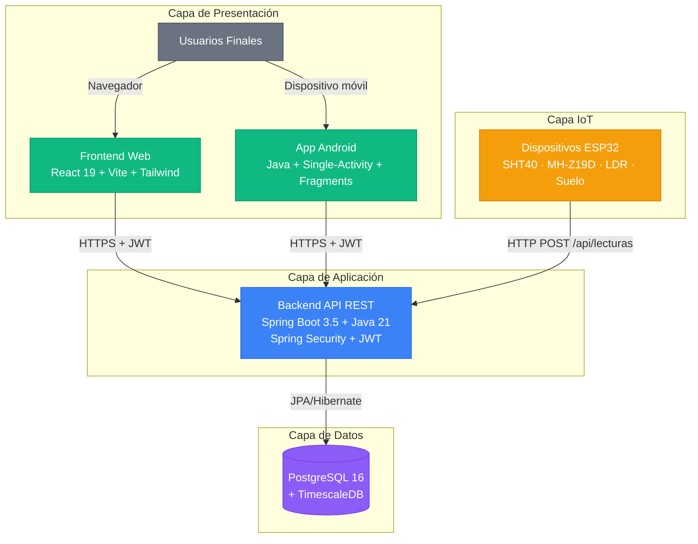
```mermaid
graph TB
    subgraph Capa de Presentación
        USER[Usuarios Finales]
        WEB[Frontend Web<br/>React 19 + Vite + Tailwind]
        ANDROID[App Android<br/>Java + Single-Activity + Fragments]
    end

    subgraph Capa de Aplicación
        API[Backend API REST<br/>Spring Boot 3.5 + Java 21<br/>Spring Security + JWT]
    end

    subgraph Capa de Datos
        DB[(PostgreSQL 16<br/>+ TimescaleDB)]
    end

    subgraph Capa IoT
        ESP32[Dispositivos ESP32<br/>SHT40 · MH-Z19D · LDR · Suelo]
    end

    USER -->|Navegador| WEB
    USER -->|Dispositivo móvil| ANDROID
    WEB -->|HTTPS + JWT| API
    ANDROID -->|HTTPS + JWT| API
    ESP32 -->|HTTP POST /api/lecturas| API
    API -->|JPA/Hibernate| DB

    style WEB fill:#10b981,stroke:#059669,color:#fff
    style ANDROID fill:#10b981,stroke:#059669,color:#fff
    style API fill:#3b82f6,stroke:#2563eb,color:#fff
    style DB fill:#8b5cf6,stroke:#7c3aed,color:#fff
    style ESP32 fill:#f59e0b,stroke:#d97706,color:#fff
    style USER fill:#6b7280,stroke:#4b5563,color:#fff
```

**Capas del sistema:**
- **Capa de Presentación**: interfaces de usuario (React Web + Android)
- **Capa de Aplicación**: lógica de negocio (API REST con Spring Boot)
- **Capa de Datos**: almacenamiento persistente (PostgreSQL + TimescaleDB)
- **Capa IoT**: dispositivos de monitorización (ESP32 — operativo)

### 5.2 Backend — API REST (Spring Boot)

El backend implementa una API REST stateless con Spring Boot. La seguridad se gestiona mediante **Spring Security** con filtro JWT (`JwtAuthFilter`) y **BCrypt** para el almacenamiento de contraseñas.

**Reglas de autorización:**

| Ruta | Acceso |
|---|---|
| `POST /api/auth/**` | Público |
| `GET /api/**` | Público |
| `POST / PUT / DELETE /api/usuarios/**` | Solo ADMIN (rol verificado en JWT) |
| `POST / PUT / DELETE /api/**` | Autenticado (JWT válido) |

**Endpoints principales:**

| Recurso | Operaciones |
|---|---|
| `/api/auth` | login, register |
| `/api/centros` | CRUD completo |
| `/api/arboles` | CRUD completo + filtros por centro/especie |
| `/api/dispositivos` | CRUD completo + PATCH umbrales + GET por centro |
| `/api/lecturas` | POST (ESP32), GET paginado, GET rango, GET gráfica (stride sampling) |
| `/api/alertas` | CRUD completo + filtros por dispositivo/estado |
| `/api/notificaciones` | CRUD completo + filtros por usuario |
| `/api/usuarios` | CRUD completo (solo ADMIN) |
| `/api/usuario-centro` | GET, POST, PUT, DELETE (relación N:M) |

**Stride sampling para gráficas:** el endpoint `/api/lecturas/dispositivo/{id}/grafica?periodo=X` devuelve como máximo 400 puntos de datos reales distribuidos uniformemente a lo largo del período solicitado, sin promedios, para optimizar el rendimiento de las gráficas.

### 5.3 Frontend — React

La aplicación web está desarrollada con React 19 y desplegada en Vercel. Gestiona la autenticación mediante `AuthContext` (localStorage + JWT) y controla el acceso a rutas con `ProtectedRoute`.

**Páginas principales:**

| Ruta | Componente | Acceso |
|---|---|---|
| `/login` | Login | Público |
| `/register` | Register | Público |
| `/dashboard` | Dashboard | Público |
| `/centros` | ListadoCentros | Público |
| `/centros/:id` | DetalleCentro | Público |
| `/arboles/:id` | DetalleArbol | Público |
| `/dispositivos/:id/lecturas` | HistoricoDispositivo | Público |
| `/centros/nuevo` | FormularioCentro | Solo ADMIN |
| `/centros/:id/editar` | FormularioCentro | ADMIN / COORDINADOR |
| `/arboles/nuevo`, `/arboles/:id/editar` | FormularioArbol | ADMIN / COORDINADOR |
| `/dispositivos/nuevo`, `/dispositivos/:id/editar` | FormularioDispositivo | ADMIN / COORDINADOR |
| `/usuarios` y subrutas | Gestión de usuarios | Solo ADMIN |

### 5.4 Android

La aplicación Android sigue la arquitectura **Single-Activity + Fragments** con `MainActivity` como actividad única que gestiona la navegación mediante:

- **Portrait**: `BottomNavigationView` en la parte inferior
- **Landscape**: `NavigationRailView` lateral

La comunicación con la API se realiza mediante **Retrofit 2** con timeout de 60 segundos (configurado para el cold start del tier gratuito de Render). El token JWT se almacena en `SharedPreferences` y se adjunta automáticamente a cada petición mediante un interceptor OkHttp.

**Fragments implementados:** Login, Register, Dashboard, ListarCentros, DetalleCentro, FormularioCentro, ArbolDetalles, CrearArbol, FormularioDispositivo, HistoricoDispositivo, AdminUsuarios, DetalleUsuario, FormularioUsuario.

### 5.5 Seguridad

| Capa | Medida |
|---|---|
| **Contraseñas** | BCrypt (`BCryptPasswordEncoder`) — nunca se almacenan en texto plano |
| **Autenticación** | JWT generado en login, validado en cada petición por `JwtAuthFilter` |
| **Sesión** | Stateless (`SessionCreationPolicy.STATELESS`) — sin estado en servidor |
| **Autorización** | Spring Security: rutas públicas (GET), rutas de escritura (JWT), `/api/usuarios` (rol ADMIN) |
| **CORS** | Configurado solo para orígenes permitidos (localhost + Vercel) |
| **SQL Injection** | Prevenido por JPA/Hibernate (prepared statements) |
| **XSS** | React escapa automáticamente el contenido renderizado |
| **Secretos** | Variables de entorno en Render; `application-local.properties` en .gitignore |

### 5.6 Despliegue en producción

| Componente | Plataforma | URL |
|---|---|---|
| Frontend | Vercel (deploy automático desde `main`) | https://vocational-training-final-project.vercel.app |
| Backend | Render (Docker, deploy automático desde `main`) | https://proyecto-arboles-backend.onrender.com |
| Base de datos | Render PostgreSQL Internal | — (acceso interno desde backend) |

> **Cold Start**: el backend en Render free tier entra en suspensión tras 15 minutos de inactividad. La primera petición tras ese período puede tardar 30-60 segundos en reactivarlo. Es comportamiento normal del plan gratuito.

### 5.7 ESP32 — Firmware IoT

El firmware está desarrollado con el framework Arduino para ESP32. El dispositivo se identifica ante el backend mediante su **dirección MAC WiFi** (no requiere autenticación adicional). El ciclo de trabajo es:

1. Conectar a WiFi (con reintentos automáticos)
2. Leer sensores: SHT40 (I2C), sensor capacitivo de suelo (ADC), MH-Z19D CO₂ (UART), LDR x2 (ADC)
3. Construir payload JSON
4. Enviar `POST /api/lecturas` al backend
5. Esperar el intervalo configurado (`frecuencia_lectura_seg`) y repetir

**Sensores y pines:**

| Sensor | Interfaz | Pin(es) | Magnitud |
|---|---|---|---|
| SHT40 | I2C | SDA=GPIO8, SCL=GPIO9 | Temperatura (°C) y humedad ambiente (%) |
| Capacitivo de suelo | ADC | GPIO4 | Humedad del suelo (0-100%) |
| MH-Z19D (CO₂) | UART | RX=GPIO16, TX=GPIO17 | CO₂ (ppm) |
| LDR 1 | ADC | GPIO5 | Nivel de luz 1 (0-100%) |
| LDR 2 | ADC | GPIO7 | Nivel de luz 2 (0-100%) |

---

## 6. Interfaces

### 6.1 Diseño inicial — Mockups y prototipado

> ⚠️ **PENDIENTE**: insertar capturas de pantalla o enlace a Excalidraw/Figma con los mockups de las pantallas principales.

**Pantallas a documentar (Web):**
1. Login
2. Dashboard
3. Listado de Centros
4. Detalle de Centro (con tabla de dispositivos)
5. Listado de Árboles
6. Detalle de Árbol
7. Histórico de Dispositivo (gráfica + tabla)
8. Formulario de Dispositivo (con umbrales)
9. Gestión de Usuarios (solo ADMIN)

**Pantallas a documentar (Android):**
1. Login / Register
2. Dashboard
3. Listado de Centros
4. Detalle de Centro
5. Detalle de Árbol + sensores en tiempo real
6. Histórico con gráfica MPAndroidChart
7. Crear / Editar árbol

### 6.2 Usabilidad y Accesibilidad

Los siguientes principios de usabilidad fueron aplicados durante el desarrollo:

**1. Consistencia visual**
Todos los componentes de la interfaz web (botones, inputs, alertas, spinners) son componentes React reutilizables con variantes estandarizadas (`primary`, `danger`, `secondary`). Esto garantiza que el mismo tipo de acción siempre tenga la misma apariencia.

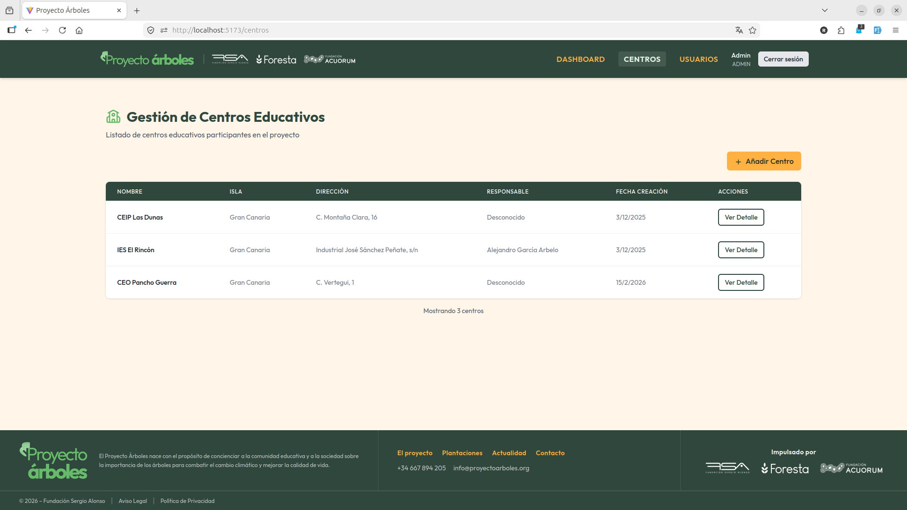

**2. Feedback inmediato al usuario**
Cada acción que implica comunicación con el servidor muestra un spinner de carga y, al completarse, un mensaje de éxito o error mediante el componente `Alert`. Las acciones destructivas (eliminar) requieren confirmación mediante modal.

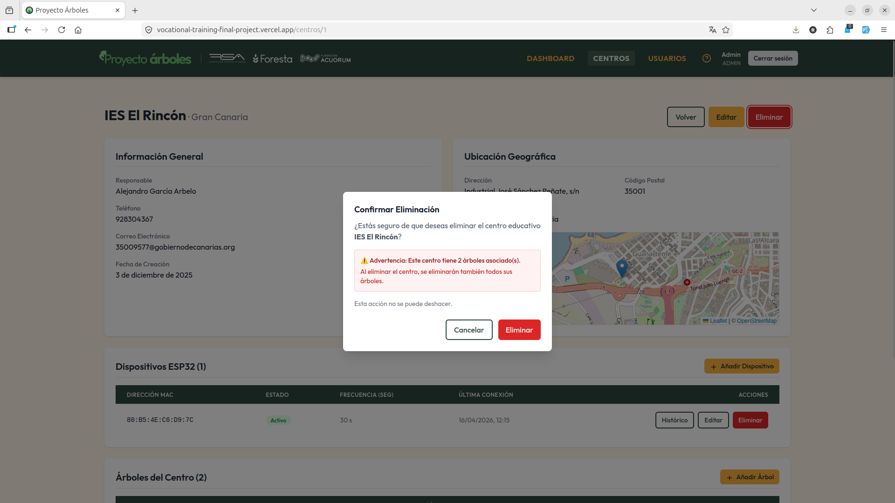

**3. Diseño responsive**
La aplicación web adapta su layout a cualquier tamaño de pantalla. En móvil, las tablas se transforman en cards apiladas y el menú se convierte en un menú hamburguesa. La aplicación Android implementa layouts específicos para portrait y landscape, con `NavigationRailView` lateral en horizontal.

**Web — escritorio vs móvil:**

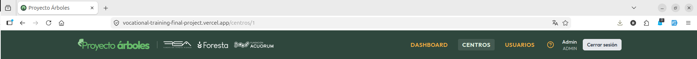

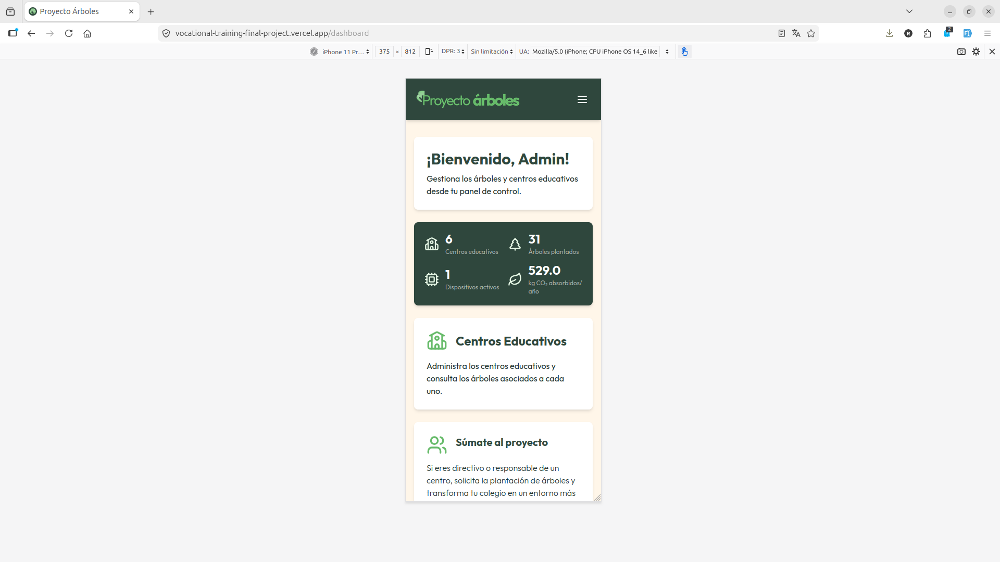

**Android — portrait vs landscape:**

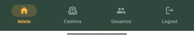


**4. Navegación clara y jerarquía**
La estructura de navegación sigue una jerarquía lógica: Centro → Dispositivos → Histórico de lecturas. El usuario siempre puede volver al nivel anterior mediante el botón "Volver" o la navegación inferior/lateral.

**5. Accesibilidad**
- Contraste de colores suficiente (Tailwind CSS con paleta verde oscuro sobre blanco)
- Labels en todos los campos de formulario
- Mensajes de error descriptivos bajo cada campo inválido
- Roles ARIA en componentes interactivos

---

## 7. Manuales

### 7.1 Manual de instalación para desarrolladores

#### Requisitos previos

| Herramienta | Versión mínima |
|---|---|
| Java | 21 |
| Maven | Incluido vía Maven Wrapper |
| Node.js | 18+ |
| PostgreSQL | 16+ |
| TimescaleDB | Extensión de PostgreSQL |
| Android Studio | Último estable |
| Arduino IDE / PlatformIO | Para ESP32 |

#### Backend

```bash
# 1. Clonar repositorio
git clone https://github.com/riordi80/vocational-training-final-project
cd backend

# 2. Crear base de datos
psql -U postgres -f create_database.sql

# 3. Crear application-local.properties (NO commitear)
# spring.datasource.url=jdbc:postgresql://localhost:5432/proyecto_arboles
# spring.datasource.username=arboles_user
# spring.datasource.password=TU_PASSWORD

# 4. Ejecutar
./mvnw spring-boot:run
# Disponible en: http://localhost:8080
```

#### Frontend

```bash
cd frontend
npm install

# Copiar el archivo de ejemplo y ajustar la URL del backend
cp .env.example .env
# Contenido de .env:
# VITE_API_BASE_URL=http://localhost:8080/api

npm run dev       # Servidor de desarrollo → http://localhost:5173
npm run build     # Build de producción (carpeta dist/)
npm run preview   # Vista previa del build de producción
npm run test      # Suite de tests con Vitest
npm run lint      # Análisis estático con ESLint
```

#### Android

1. Abrir la carpeta `android/` con Android Studio
2. Copiar `app/src/main/res/values/secrets.xml.example` → `secrets.xml`
3. Configurar la URL del backend en `RetrofitClient.java`
4. Ejecutar en emulador o dispositivo físico (SDK 24+)

#### ESP32

1. Abrir `esp32/sketch_feb11a/sketch_feb11a.ino` en Arduino IDE
2. Copiar `config.h.example` → `config.h` y añadir credenciales WiFi y URL del backend
3. Instalar librerías: `ArduinoJson`, `SensirionI2CSht4x`
4. Seleccionar placa ESP32 y subir el firmware

### 7.2 Manual de instalación para técnicos

El sistema completo ya está desplegado en producción y no requiere instalación adicional para usuarios finales:

- **Web**: acceder a [https://vocational-training-final-project.vercel.app](https://vocational-training-final-project.vercel.app) desde cualquier navegador moderno
- **Android**: instalar el APK proporcionado (o publicado en Play Store)
- **ESP32**: el técnico solo necesita configurar el archivo `config.h` con las credenciales WiFi del centro y la URL del backend, y subir el firmware al dispositivo mediante cable USB

Para el despliegue propio de la infraestructura (backend en Render + base de datos), consultar el `backend/README.md` del repositorio.

### 7.3 Manual de usuario — Aplicación Web

> **Versión**: 2026-05-05 · **Plataforma**: Web responsive · **Navegadores**: Chrome, Firefox, Safari, Edge (últimas versiones)

#### Antes de empezar

1. Accede a **[https://vocational-training-final-project.vercel.app](https://vocational-training-final-project.vercel.app)**
2. Necesitas conexión a Internet.
3. El backend puede tardar 30-60 seg en cold start (la primera vez o tras inactividad). Si la página no carga, espera unos segundos y recarga (F5).

#### Inicio de sesión y registro

##### Pantalla de Login

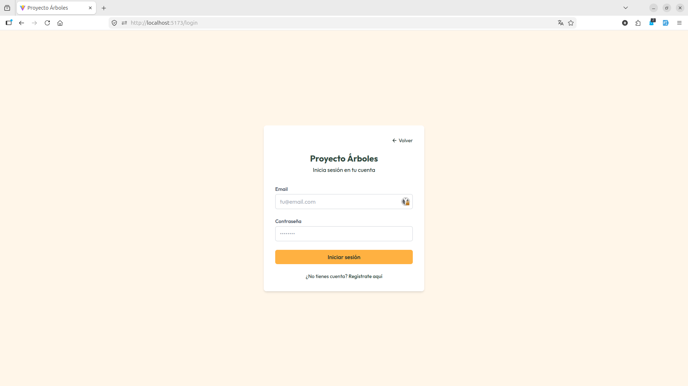

En la pantalla de **Login**:

- Introduce tu **email** registrado y tu **contraseña**.
- Pulsa **"Iniciar Sesión"**.

Mensajes de error comunes:

- `"Usuario o contraseña incorrecta"` → Verifica tus datos
- `"Usuario no activo"` → Contacta al administrador
- `"No se pudo conectar con el servidor..."` → Backend en cold start, espera e intenta de nuevo

Haz clic en **"Registrarse"** si aún no tienes cuenta.

##### Pantalla de Registro

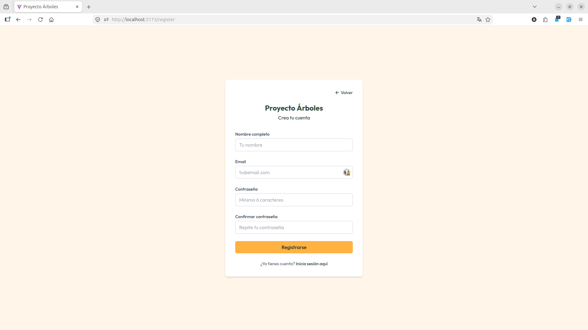

Para crear una nueva cuenta:

1. Haz clic en **"Registrarse"** desde la pantalla de login.
2. Completa el formulario: nombre completo, email, contraseña y confirmación de contraseña.
3. Pulsa **"Registrarse"**. Si el registro es correcto, la app inicia sesión automáticamente.

Validaciones: email con formato válido, contraseñas coincidentes, email no registrado previamente.

Los nuevos usuarios se registran como **COORDINADOR** por defecto.

#### Navegación principal

##### Menú en Desktop


Barra de navegación horizontal en la parte superior con: **Logo** (click va a Dashboard), **Dashboard**, **Centros**, **Usuarios** (solo visible si eres ADMIN) y perfil del usuario (esquina superior derecha) con nombre, rol y opción **"Cerrar Sesión"**.

##### Menú en Móvil/Tablet


En móvil/tablet se usa un **menú hamburguesa (≡)** en la esquina superior izquierda. Al pulsar se expande mostrando las mismas opciones que en desktop.

#### Dashboard (Inicio)

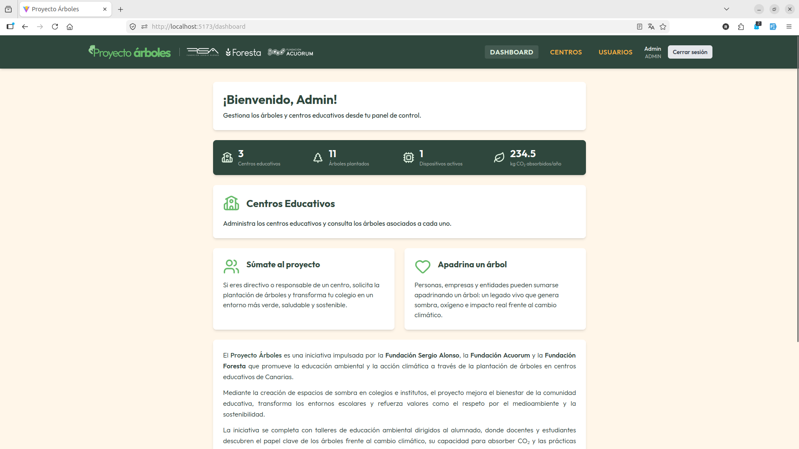

El Dashboard muestra:

- **Zona de bienvenida**: saludo personalizado con tu nombre y mensaje según tu rol.
- **Métricas del sistema** (4 tarjetas): centros educativos, árboles plantados, dispositivos activos y kg CO₂ absorbidos/año.
- **Acceso rápido** a Centros Educativos.
- **Tarjetas externas**: enlaces al formulario de contacto para sumarse al proyecto o apadrinar un árbol.
- **Descripción del proyecto** con información sobre la iniciativa.

#### Gestión de árboles

Los árboles se gestionan desde dentro de cada centro educativo, no tienen sección independiente en el menú.

##### Ver árboles de un centro

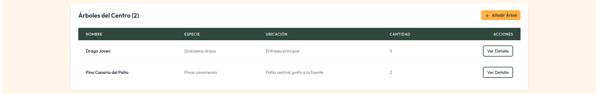

1. Haz clic en **"Centros"** → selecciona un centro → en el detalle verás la **tabla de Árboles del Centro** con nombre, especie, cantidad y acciones.

##### Detalle de un árbol

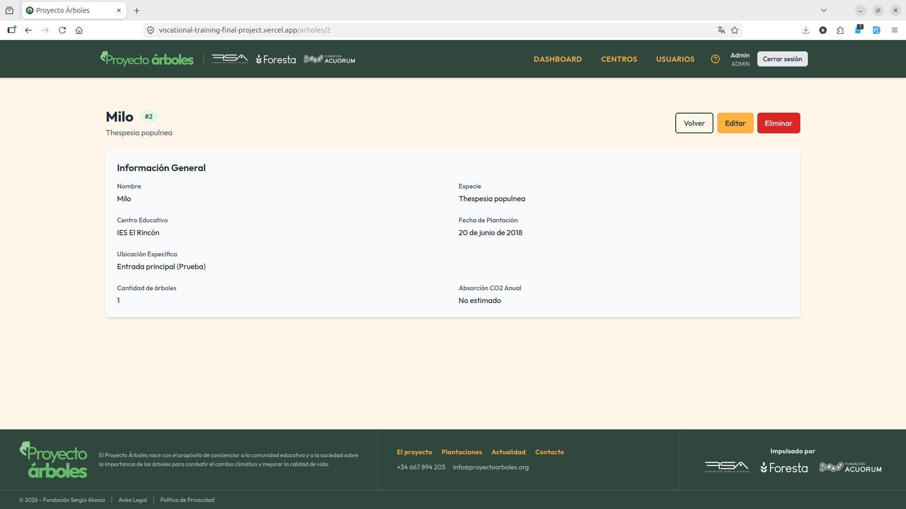

Muestra: nombre, especie, fecha de plantación, centro educativo, ubicación específica, cantidad y absorción CO₂ anual. Botones: **Volver**, **Editar** y **Eliminar** (según permisos).

##### Crear árbol

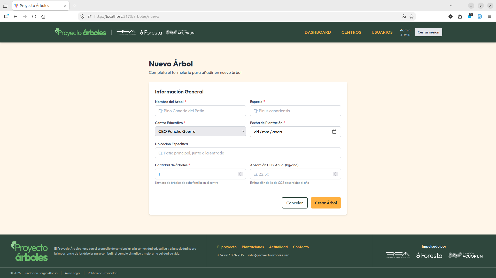

1. En el detalle del centro, pulsa **"+ Añadir Árbol"**.
2. Rellena el formulario:
   - **Obligatorios**: nombre, especie, fecha de plantación (no futura), cantidad (≥ 1), centro educativo (preseleccionado).
   - **Opcionales**: ubicación específica, absorción CO₂ anual (kg/año).
3. Pulsa **"Guardar"**.

##### Editar árbol

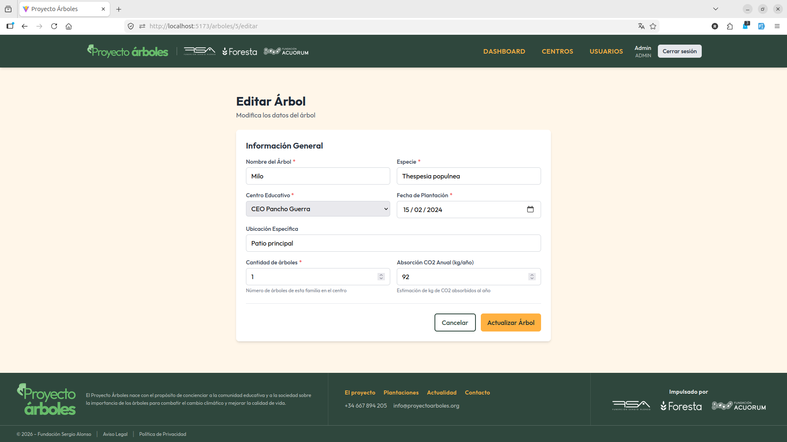

Abre el detalle del árbol → pulsa **"Editar"** → modifica los campos → pulsa **"Guardar"**.

##### Eliminar árbol

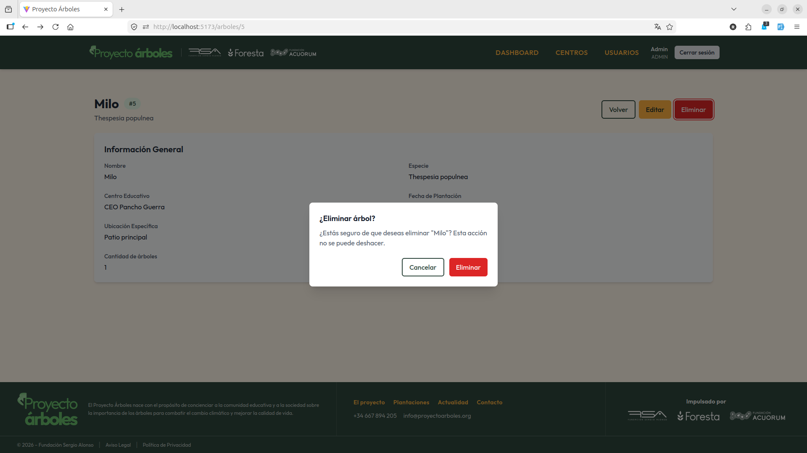

En el detalle del árbol → pulsa **"Eliminar"** → confirma en el modal. La acción es **irreversible**.

#### Gestión de centros educativos

##### Listado de centros


En **Centros** se muestra un listado con nombre, isla, dirección, responsable y fecha de creación. Haz clic en un centro para ver su detalle. Botón **"+ Añadir Centro"** solo visible para ADMIN.

##### Detalle de un centro

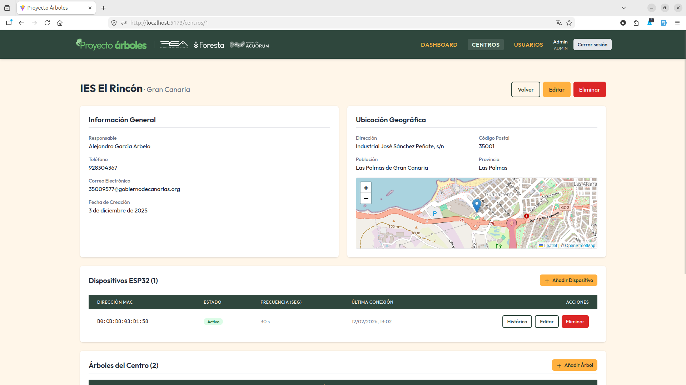

Incluye:

- **Información general**: responsable, teléfono, email, dirección, población, código postal, isla.
- **Mapa interactivo** (Leaflet/OpenStreetMap) con la posición del centro.
- **Tabla de Dispositivos IoT**: MAC, estado, frecuencia, última sincronización y botón **"Ver Histórico"**.
- **Tabla de Árboles**: nombre, especie, ubicación y cantidad.
- Botones según permisos: **Editar**, **Eliminar**, **+ Añadir Dispositivo**, **+ Añadir Árbol**.

##### Crear centro

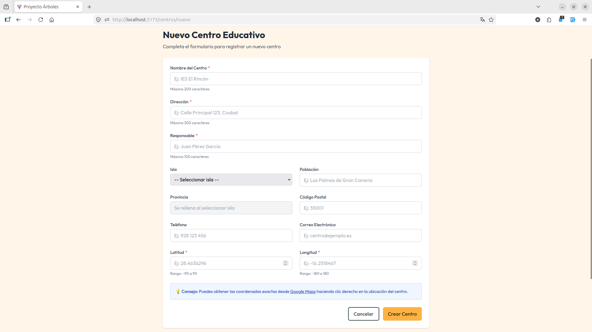

Solo ADMIN. En el listado, pulsa **"+ Añadir Centro"** → completa nombre, dirección, responsable, isla, población, provincia, código postal, teléfono, email y coordenadas (latitud/longitud) → pulsa **"Guardar"**.

##### Editar centro

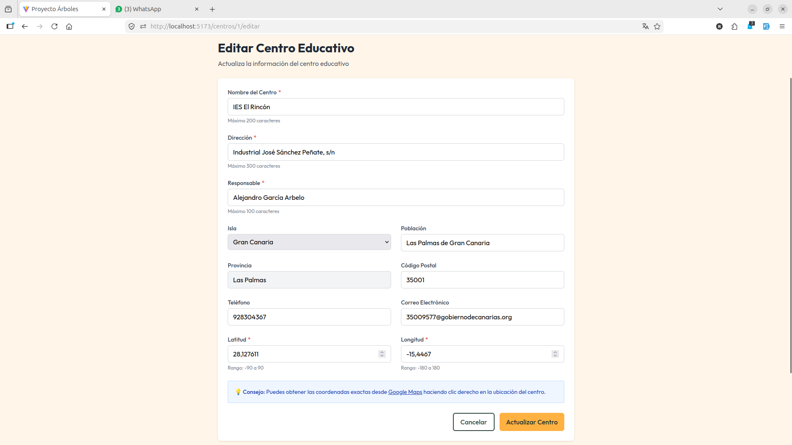

ADMIN o COORDINADOR asignado. En el detalle, pulsa **"Editar"** → modifica los campos → pulsa **"Actualizar Centro"**.

##### Eliminar centro


Solo ADMIN. En el detalle, pulsa **"Eliminar"** → confirma en el modal. Se eliminarán también todos los árboles y dispositivos del centro.

#### Gestión de dispositivos IoT

Los dispositivos ESP32 se gestionan desde el detalle del centro.

##### Ver dispositivos


Tabla con columnas: MAC, Estado (Activo/Inactivo), Frecuencia (segundos) y Última sincronización. Acciones por fila: **Histórico**, **Editar**, **Eliminar**.

##### Crear dispositivo

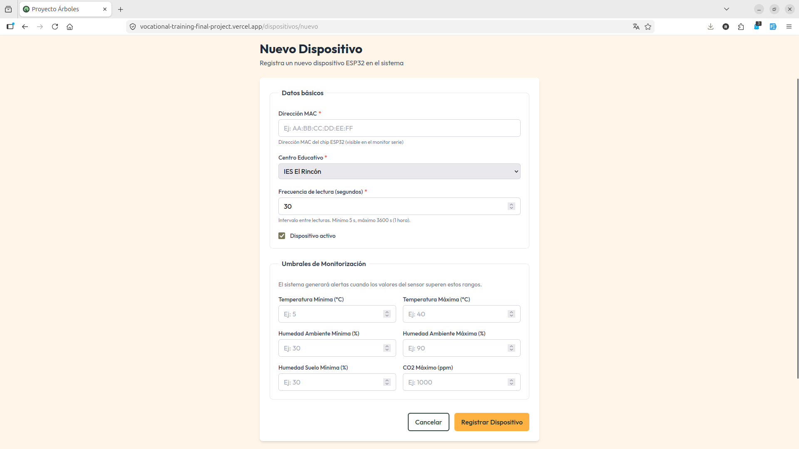

En el detalle del centro, pulsa **"+ Añadir Dispositivo"** → completa:

- **Dirección MAC**: formato `XX:XX:XX:XX:XX:XX`
- **Frecuencia de lectura**: segundos entre lecturas (recomendado 30-60 s)
- **Estado**: Activo/Inactivo
- **Umbrales**: temperatura mín/máx (°C), humedad suelo mín (%), humedad ambiental mín/máx (%), CO₂ máximo (ppm)

Pulsa **"Registrar Dispositivo"**.

##### Editar dispositivo

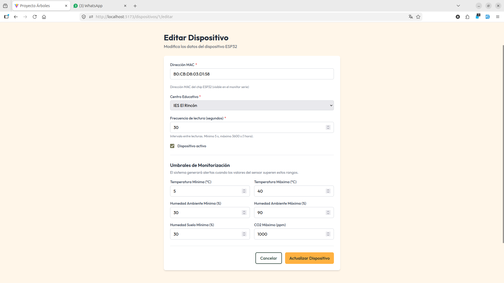

En la tabla, pulsa **"Editar"** → modifica los parámetros → pulsa **"Actualizar Dispositivo"**.

##### Eliminar dispositivo

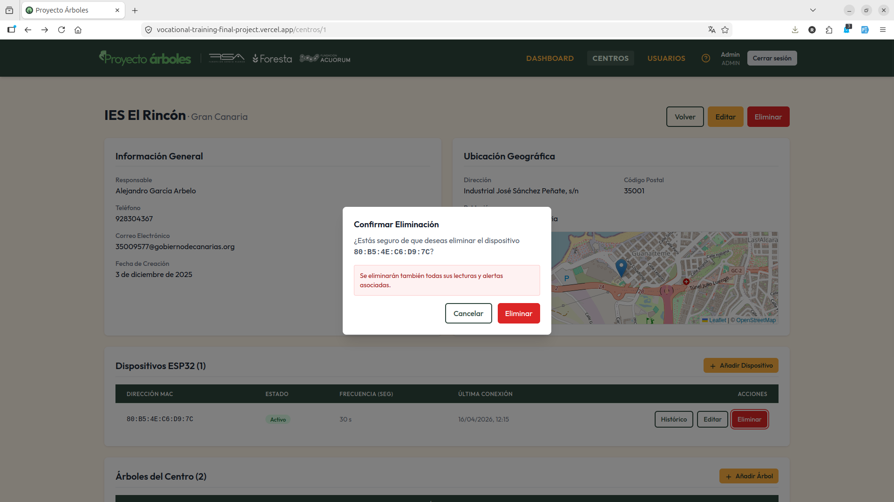

En la tabla, pulsa **"Eliminar"** → confirma en el modal. El dispositivo deja de enviar lecturas.

#### Histórico de lecturas

##### Ver gráficas de sensores

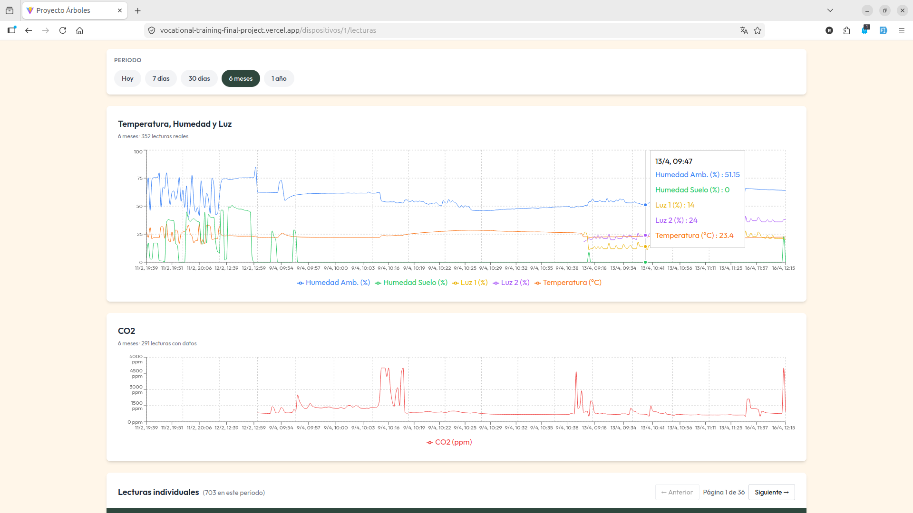

Desde el detalle del centro, pulsa **"Ver Histórico"** junto al dispositivo. Se abre la página con:

- **Selector de período**: Hoy · 7 días · 30 días · 6 meses · 1 año.
- **Gráfica superior**: Temperatura (°C), Humedad Ambiente (%), Humedad Suelo (%), Luz 1 (%) y Luz 2 (%). Máximo 400 puntos distribuidos uniformemente.
- **Gráfica inferior**: CO₂ (ppm) con escala independiente.
- **Tabla de lecturas**: 7 columnas (fecha/hora, temperatura, humedad ambiente, humedad suelo, CO₂, luz 1, luz 2) con paginación.
- Gráficas y tabla se **actualizan automáticamente** según la frecuencia del dispositivo.

##### Filtros y controles

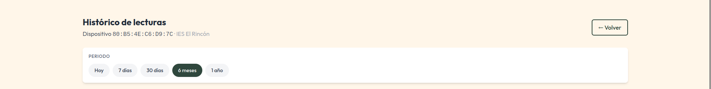

Los botones de período ajustan el rango de datos mostrado en las gráficas y en la tabla. Botón **"Volver"** regresa al detalle del centro.

#### Gestión de usuarios (solo ADMIN)

##### Listado de usuarios

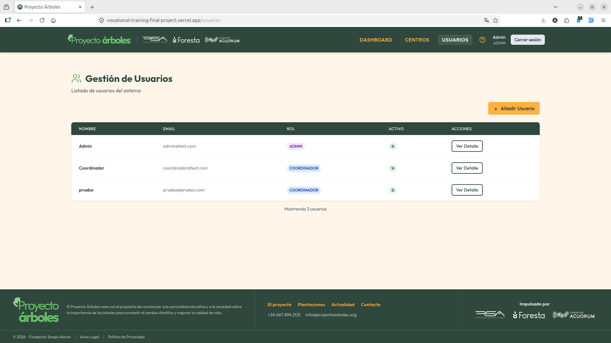

En **Usuarios** (solo visible para ADMIN) se muestra una tabla con nombre, email, rol y estado (Activo/Inactivo). Botón **"+ Añadir Usuario"** para crear nuevos.

##### Detalle de usuario

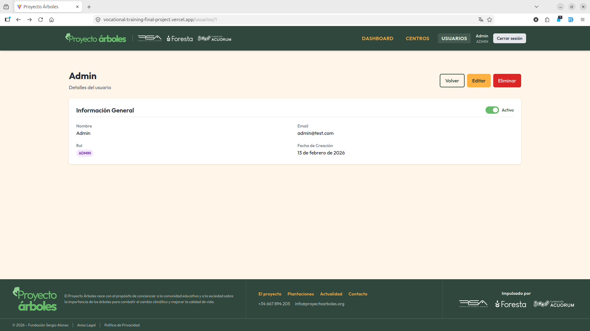

Muestra información personal (nombre, email, rol, fecha de creación, estado) y, si es COORDINADOR, la sección de centros asignados:

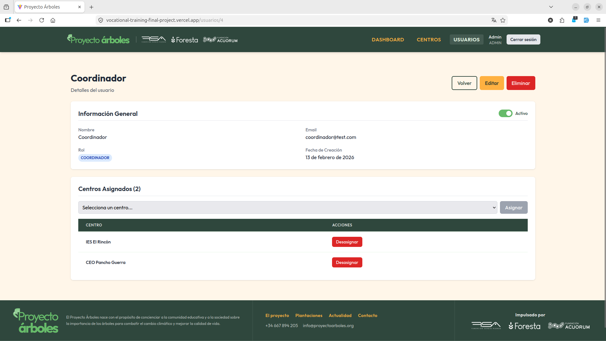

Tabla de centros donde puede gestionar con botón **"Desasignar"** por fila y desplegable para añadir nuevos centros. Botones: **Volver**, **Editar**, **Eliminar** y toggle **Activo/Inactivo**.

##### Crear usuario

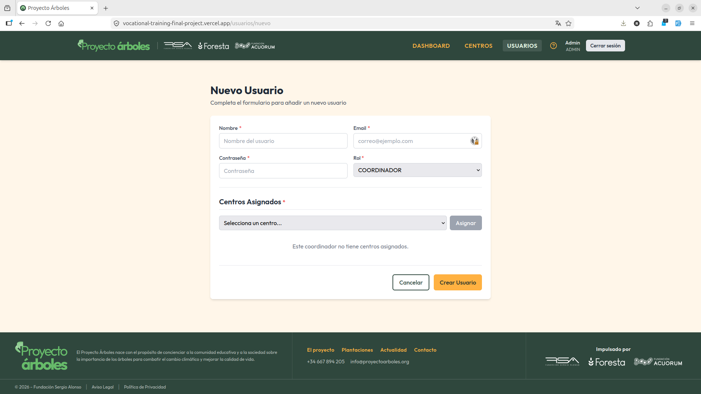

1. En el listado, pulsa **"+ Añadir Usuario"**.
2. Completa nombre, email, contraseña y rol.
3. Si el rol es **COORDINADOR**, aparece la sección de centros asignados (obligatorio asignar al menos uno).
4. Pulsa **"Crear Usuario"**.

##### Editar usuario

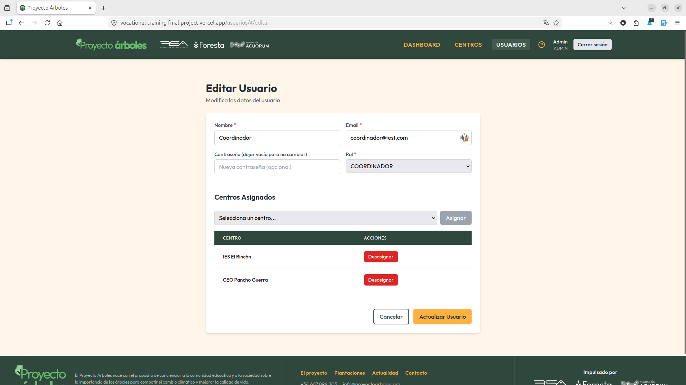

En el detalle, pulsa **"Editar"** → modifica nombre, email, contraseña (dejar vacío para no cambiar), rol y centros asignados (si es COORDINADOR) → pulsa **"Actualizar Usuario"**.

Si cambias COORDINADOR → ADMIN, las asignaciones de centros se eliminan automáticamente.

##### Eliminar usuario

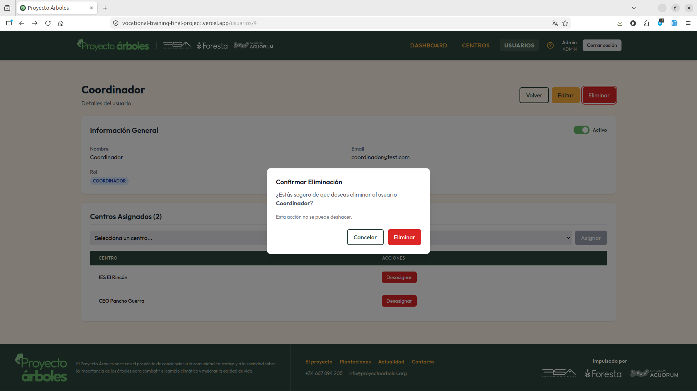

En el detalle, pulsa **"Eliminar"** → confirma en el modal. La eliminación es **permanente**.

##### Desactivar/Activar usuario

En el detalle del usuario, pulsa el toggle **"Activo"** para habilitar o deshabilitar la cuenta. La cuenta permanece pero el usuario no podrá iniciar sesión mientras esté inactiva.

#### Permisos por rol

| Acción | Público | COORDINADOR | ADMIN |
|---|---|---|---|
| Ver Dashboard, Centros y árboles | ✓ | ✓ | ✓ |
| Ver histórico de lecturas | ✓ | ✓ | ✓ |
| Editar centros asignados | — | ✓ | ✓ |
| Crear nuevos centros | — | — | ✓ |
| Eliminar centros | — | — | ✓ |
| Crear/editar/eliminar árboles | — | ✓ (sus centros) | ✓ |
| Crear/editar/eliminar dispositivos | — | ✓ (sus centros) | ✓ |
| Ver sección Usuarios | — | — | ✓ |
| Gestión completa de usuarios | — | — | ✓ |

#### Validaciones y mensajes frecuentes

**Éxito**: `"Árbol creado correctamente"` · `"Centro actualizado correctamente"` · `"Usuario creado correctamente"` · `"Dispositivo registrado correctamente"`

**Error**: `"Por favor completa todos los campos obligatorios"` · `"La fecha de plantación no puede ser futura"` · `"El email ya está registrado"` · `"Email o contraseña incorrecta"` · `"No se pudo conectar con el servidor..."`

**Formatos requeridos**: MAC → `XX:XX:XX:XX:XX:XX` · Email → `ejemplo@dominio.com` · Fecha → no puede ser futura · Cantidad/Frecuencia → número positivo

#### Resolución de problemas

1. **"No se pudo conectar"** → Verifica conexión, espera 30-60 s (cold start en Render) y recarga (F5).
2. **Página en blanco** → Limpia caché (Ctrl+Shift+Supr), verifica que JavaScript está habilitado, prueba otro navegador.
3. **Cambios no aparecen** → Recarga la página (F5).
4. **Sesión cerrada** → El token expiró; inicia sesión de nuevo.
5. **No puedo crear/editar/eliminar** → Verifica tu rol en el Dashboard; contacta al administrador si necesitas más permisos.

### 7.4 Manual de usuario — Aplicación Android

> **Versión**: 2026-05-05 · **Plataforma**: Android 7.0+ (API 24 o superior)

#### Antes de empezar

Para que la app funcione correctamente:

1. Debe estar instalada y compilada con un **Build Variant** válido.
2. El backend debe estar accesible (local o producción).
3. Debes tener conexión a Internet.

Si la app no carga datos, revisa primero la sección de Build Variants del manual de instalación.

#### Inicio de sesión y registro

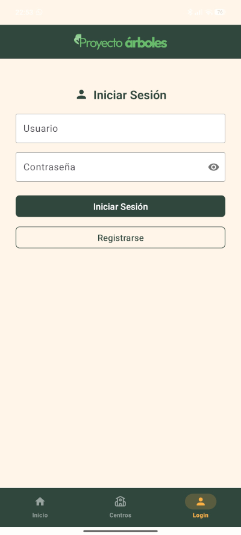

Desde **Login**:

- Introduce **email** y **contraseña**.
- Pulsa **Iniciar Sesión**.
- Si las credenciales son correctas, accedes a Inicio (Dashboard).

Mensajes típicos:

- `Email y contraseña son requeridos`
- `Credenciales incorrectas`
- `Error de conexión. Inténtalo de nuevo.`

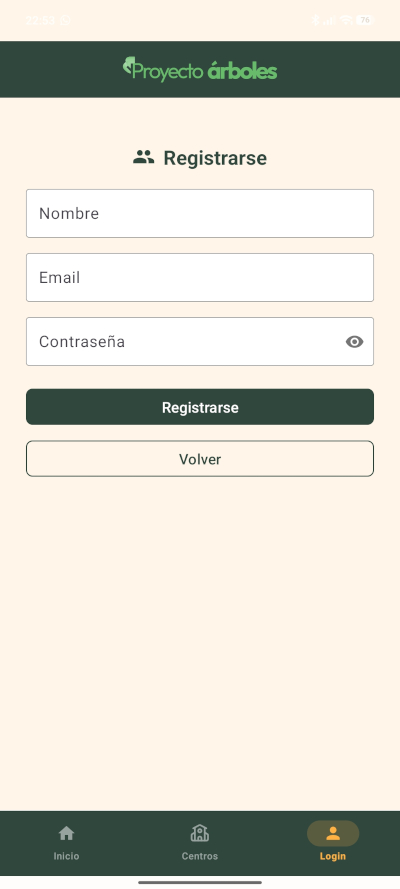

Desde **Registrarse**:

1. Completa nombre, email y contraseña.
2. Pulsa **Registrarse**.
3. Si el registro es correcto, la app inicia sesión automáticamente.

Mensajes típicos:

- `El email ya está registrado` (409)
- `Datos inválidos. Verifica los campos.` (400)

#### Navegación principal


En vertical (portrait) se usa **Bottom Navigation**:

- **Inicio**
- **Centros**
- **Login** (o **Logout** cuando hay sesión)
- **Usuarios** (solo visible para ADMIN)


En horizontal (landscape) la navegación pasa a **Navigation Rail** lateral con las mismas opciones.

#### Pantalla Inicio (Dashboard)

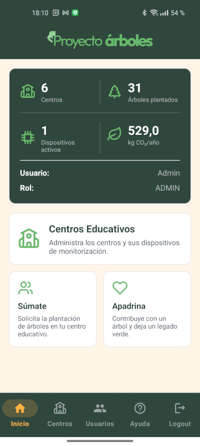

La pantalla Inicio muestra:

- Número de **centros**.
- Total de **árboles plantados** (suma de cantidad).
- Número de **dispositivos activos**.
- **CO₂ total anual** estimado.

Además:

- Si hay sesión activa, se ve **usuario y rol**.
- Botón/tarjeta **Centros Educativos** para ir al listado.
- Tarjetas **Súmate** y **Apadrina** que abren enlace externo en navegador.

#### Centros educativos

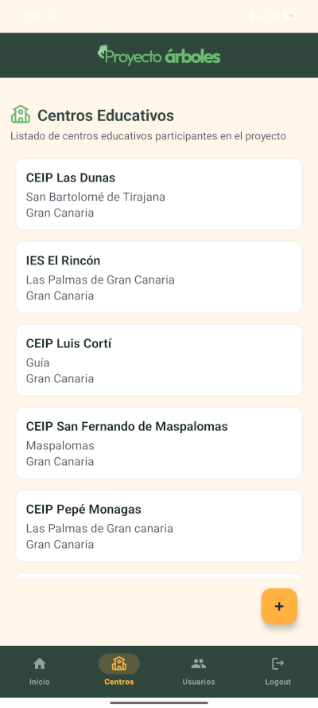

En **Centros** se muestra el listado con nombre, población e isla de cada centro.

Acciones:

- Tocar una tarjeta para abrir el detalle del centro.
- **+ Añadir** (FAB o botón de cabecera según orientación) solo si tienes permisos.

#### Detalle de centro

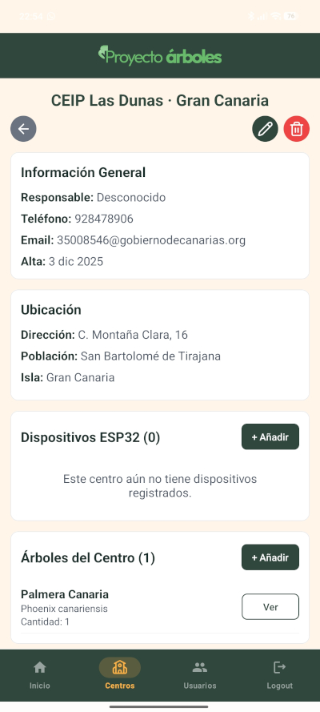

Incluye:

- Información general (responsable, teléfono, email, alta).
- Ubicación (dirección, población, isla).

Botones según rol: **Editar centro**, **Eliminar centro**, **Añadir dispositivo**, **Añadir árbol**.

En la misma pantalla aparecen la lista de dispositivos ESP32 y la lista de árboles del centro.

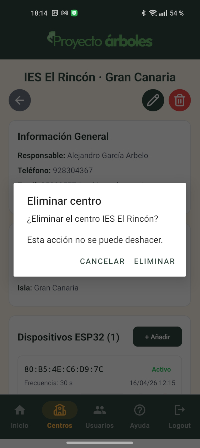

Al eliminar centro se solicita confirmación (acción irreversible).

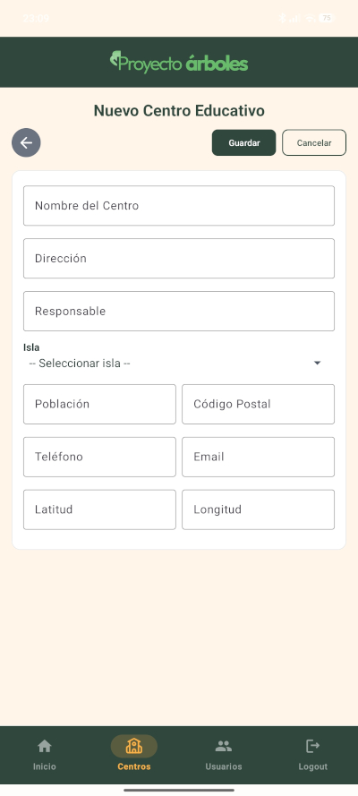

Formulario de centro (crear/editar):

- Requeridos: nombre, dirección, responsable, latitud, longitud.
- Opcionales: población, código postal, teléfono, email, isla.
- Validaciones: latitud `-90..90`, longitud `-180..180`.

#### Gestión de árboles

##### Crear árbol

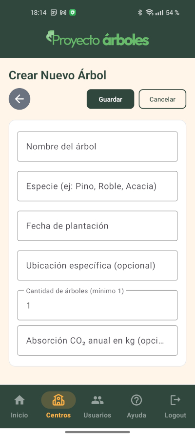

Campos del formulario:

- Nombre y especie (requeridos)
- Fecha de plantación (requerido, con selector de fecha)
- Ubicación (opcional)
- Cantidad (mínimo 1)
- Absorción CO₂ anual (opcional)

##### Ver detalle del árbol

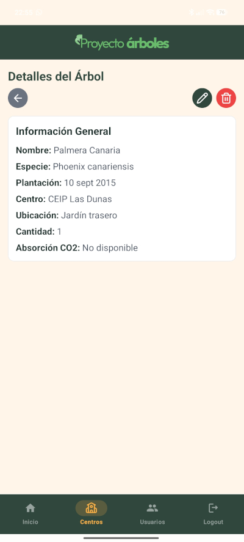

Se muestra nombre, especie, fecha, centro educativo, ubicación, cantidad y absorción CO₂.

##### Editar árbol

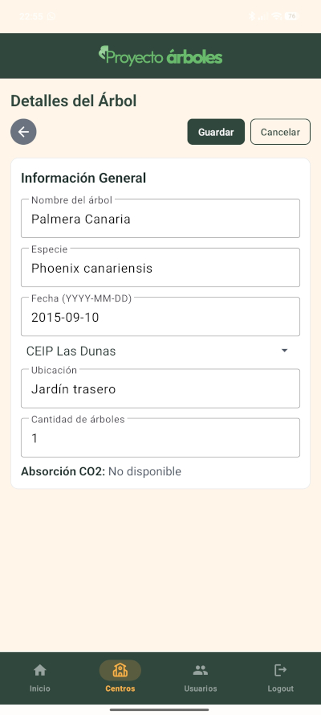

En modo edición se habilitan los campos y el selector de centro. Se guarda con **Guardar** o se descarta con **Cancelar**.

##### Eliminar árbol

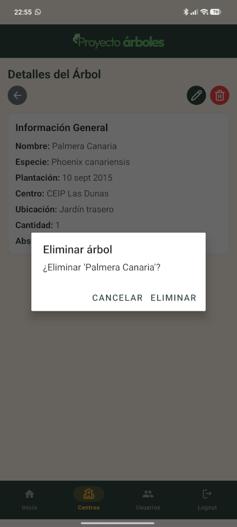

La app solicita confirmación antes de borrar.

#### Gestión de dispositivos ESP32

Los dispositivos se crean/editan desde el detalle del centro.

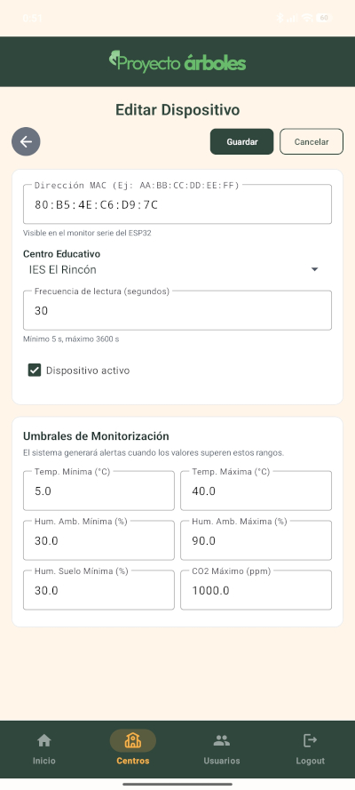

Campos:

- MAC Address (obligatoria, formato `XX:XX:XX:XX:XX:XX`)
- Centro educativo
- Frecuencia de lectura (5 a 3600 segundos)
- Activo (sí/no)
- Umbrales: temperatura, humedad ambiente/suelo y CO₂

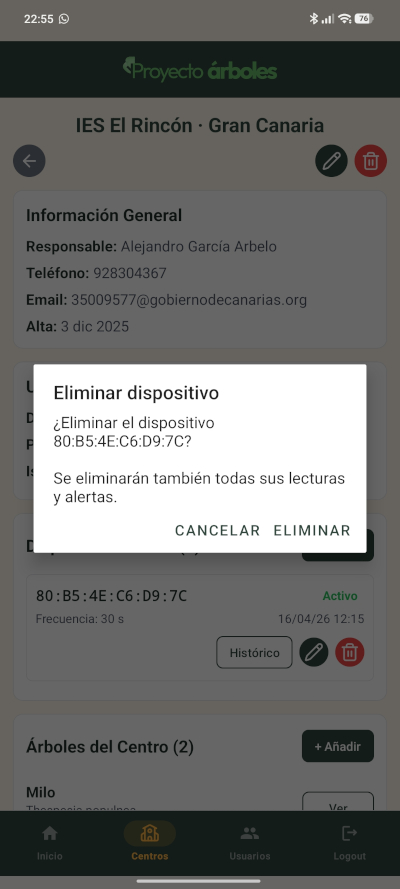

Al eliminar dispositivo se confirma y se avisa que se eliminan lecturas/alertas asociadas.

#### Histórico de lecturas

Se accede desde el botón **Histórico** de cada dispositivo.

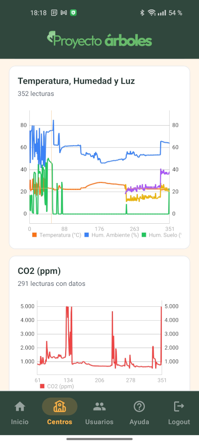

Incluye:

- Selector de periodo: **Hoy**, **7 días**, **30 días**, **6 meses**, **1 año**.
- Gráfica 1: temperatura (°C), humedad ambiente (%), humedad suelo (%) y luz (%).
- Gráfica 2: CO₂ (ppm).

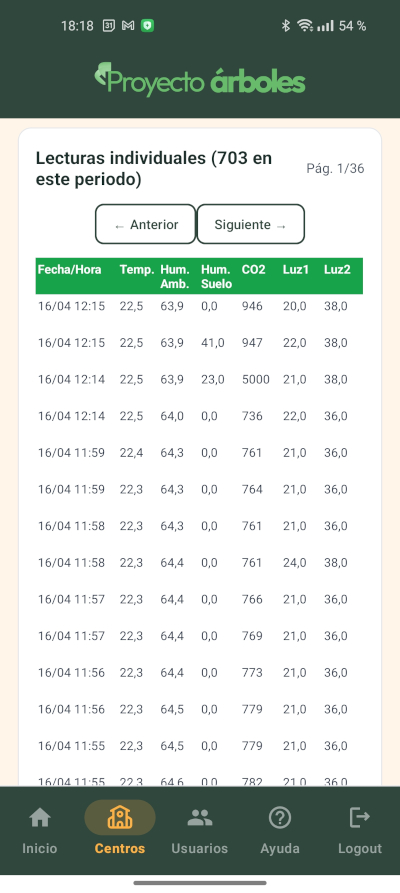

Tabla de lecturas con columnas fecha/hora, temp., hum. ambiente, hum. suelo, CO₂, luz1, luz2 y paginación con botones **Anterior** y **Siguiente**.

#### Administración de usuarios (solo ADMIN)

El menú **Usuarios** solo aparece para usuarios ADMIN.

##### Lista de usuarios

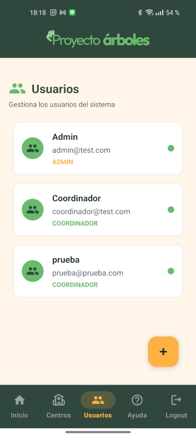

Muestra en cada tarjeta nombre, email, rol (ADMIN o COORDINADOR) e indicador de activo/inactivo.

##### Detalle de usuario

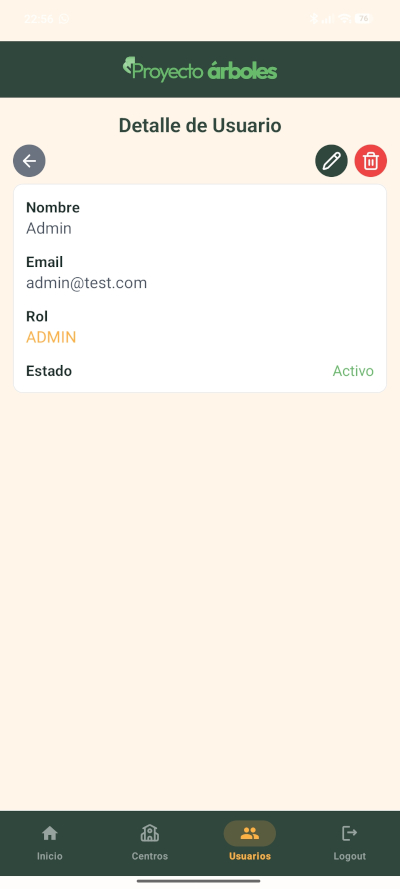

Permite ver datos completos, editar usuario y eliminar usuario (con confirmación).

##### Editar usuario

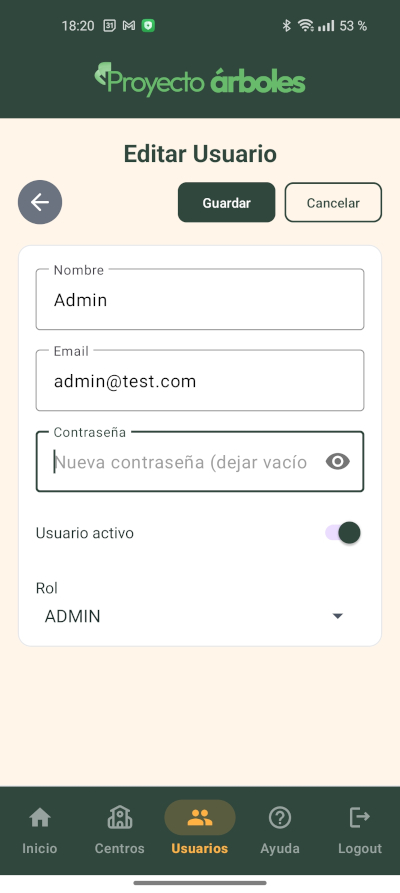

Se modifican nombre, email, rol y activo. La contraseña no se edita en este formulario.

#### Permisos por rol

| Acción | Público | COORDINADOR | ADMIN |
|---|---|---|---|
| Ver Inicio y Centros | ✓ | ✓ | ✓ |
| Consultar detalles y lecturas | ✓ | ✓ | ✓ |
| Editar centro asignado | — | ✓ | ✓ |
| Eliminar centro | — | — | ✓ |
| Crear/editar/eliminar árboles | — | ✓ (sus centros) | ✓ |
| Crear/editar dispositivos | — | ✓ (sus centros) | ✓ |
| Gestión de usuarios | — | — | ✓ |

#### Validaciones y mensajes frecuentes

**Login / Registro**: `Email y contraseña son requeridos` · `Credenciales incorrectas` · `El email ya está registrado`

**Centro**: `El nombre es obligatorio` · `La direccion es obligatoria` · `La latitud debe estar entre -90 y 90` · `La longitud debe estar entre -180 y 180`

**Árbol**: `El nombre es requerido` · `La especie es requerida` · `La fecha de plantación es requerida` · `La cantidad debe ser al menos 1`

**Dispositivo**: `La direccion MAC es obligatoria` · `Formato incorrecto. Usa XX:XX:XX:XX:XX:XX` · `La frecuencia debe estar entre 5 y 3600`

#### Resolución de problemas

1. **No carga datos** — Verifica conexión y backend activo. Si estás en local, revisa el flavor (`localEmulator` o `localDevice`) y la IP.
2. **Tarda en responder en producción** — El backend en Render puede tardar por cold start. Espera y reintenta.
3. **No aparece el menú Usuarios** — Solo se muestra a rol ADMIN.
4. **No puedes editar un centro/árbol** — Revisa si tu rol tiene permisos sobre ese centro.

### 7.5 Ayuda al usuario dentro de la App

> ⚠️ **PENDIENTE**: indicar si se ha implementado alguna pantalla de ayuda o tooltips dentro de la app Android o web.

---

## 8. Tests de Prueba — Backend

Las pruebas del backend se realizaron con **Postman** sobre la API desplegada en Render. Los grupos 1–5 (centros, árboles y relación 1:N) quedaron documentados formalmente el 12-03-2025; el resto de endpoints se verificó iterativamente durante el desarrollo de las fases posteriores.

### 8.1 Catálogo de endpoints verificados

#### Centros educativos — `/api/centros`

| Método | Ruta | Descripción | Resultado |
|---|---|---|---|
| GET | `/api/centros` | Listar todos | ✅ 200 |
| GET | `/api/centros/{id}` | Obtener por ID | ✅ 200 / 404 |
| POST | `/api/centros` | Crear centro | ✅ 200 / 400 / 409 |
| PUT | `/api/centros/{id}` | Actualizar centro | ✅ 200 / 404 |
| DELETE | `/api/centros/{id}` | Eliminar centro | ✅ 200 / 404 |
| GET | `/api/centros/{id}/arboles` | Árboles del centro (1:N) | ✅ 200 |

#### Árboles — `/api/arboles`

| Método | Ruta | Descripción | Resultado |
|---|---|---|---|
| GET | `/api/arboles` | Listar todos | ✅ 200 |
| GET | `/api/arboles/{id}` | Obtener por ID | ✅ 200 / 404 |
| GET | `/api/arboles/centro/{centroId}` | Filtrar por centro | ✅ 200 |
| GET | `/api/arboles/especie/{especie}` | Filtrar por especie | ✅ 200 |
| GET | `/api/arboles/buscar/{nombre}` | Búsqueda por nombre (contains, case-insensitive) | ✅ 200 |
| GET | `/api/arboles/ordenados` | Listado ordenado alfabéticamente | ✅ 200 |
| POST | `/api/arboles` | Crear árbol | ✅ 200 / 400 / 409 |
| PUT | `/api/arboles/{id}` | Actualizar árbol | ✅ 200 / 404 / 409 |
| DELETE | `/api/arboles/{id}` | Eliminar árbol (cascade lecturas/alertas) | ✅ 200 / 404 |

#### Autenticación — `/api/auth`

| Método | Ruta | Descripción | Resultado |
|---|---|---|---|
| POST | `/api/auth/login` | Login con email + contraseña → JWT | ✅ 200 / 401 / 403 |
| POST | `/api/auth/register` | Registro → COORDINADOR + JWT | ✅ 201 / 409 |

#### Usuarios — `/api/usuarios` (solo ADMIN)

| Método | Ruta | Descripción | Resultado |
|---|---|---|---|
| GET | `/api/usuarios` | Listar todos | ✅ 200 |
| GET | `/api/usuarios/{id}` | Obtener por ID | ✅ 200 / 404 |
| GET | `/api/usuarios/email/{email}` | Buscar por email | ✅ 200 |
| GET | `/api/usuarios/activos` | Listar usuarios activos | ✅ 200 |
| GET | `/api/usuarios/inactivos` | Listar usuarios inactivos | ✅ 200 |
| GET | `/api/usuarios/rol/{rol}` | Filtrar por rol (ADMIN / COORDINADOR) | ✅ 200 |
| POST | `/api/usuarios` | Crear usuario | ✅ 200 |
| PUT | `/api/usuarios/{id}` | Actualizar usuario | ✅ 200 / 404 |
| DELETE | `/api/usuarios/{id}` | Eliminar usuario | ✅ 200 / 404 |
| PATCH | `/api/usuarios/{id}/activar` | Activar cuenta | ✅ 200 / 404 |
| PATCH | `/api/usuarios/{id}/desactivar` | Desactivar cuenta | ✅ 200 / 404 |

#### Dispositivos ESP32 — `/api/dispositivos`

| Método | Ruta | Descripción | Resultado |
|---|---|---|---|
| GET | `/api/dispositivos` | Listar todos | ✅ 200 |
| GET | `/api/dispositivos/{id}` | Obtener por ID | ✅ 200 / 404 |
| GET | `/api/dispositivos/activos` | Listar dispositivos activos | ✅ 200 |
| GET | `/api/dispositivos/centro/{centroId}` | Dispositivos de un centro | ✅ 200 |
| POST | `/api/dispositivos` | Registrar dispositivo | ✅ 201 / 409 |
| PUT | `/api/dispositivos/{id}` | Actualizar dispositivo | ✅ 200 / 404 / 409 |
| PATCH | `/api/dispositivos/{id}/umbrales` | Actualizar umbrales parcialmente | ✅ 200 / 404 |
| DELETE | `/api/dispositivos/{id}` | Eliminar dispositivo (cascade lecturas/alertas) | ✅ 200 / 404 |

#### Lecturas IoT — `/api/lecturas`

| Método | Ruta | Descripción | Resultado |
|---|---|---|---|
| POST | `/api/lecturas` | Ingesta desde ESP32 (identificado por MAC) | ✅ 201 |
| GET | `/api/lecturas/dispositivo/{id}` | Lecturas paginadas (más recientes primero) | ✅ 200 |
| GET | `/api/lecturas/dispositivo/{id}/rango` | Lecturas en rango de fechas, paginadas | ✅ 200 |
| GET | `/api/lecturas/dispositivo/{id}/grafica` | Stride sampling (máx. 400 puntos reales) | ✅ 200 |
| DELETE | `/api/lecturas/{id}` | Eliminar lectura individual | ✅ 200 / 404 |

#### Alertas — `/api/alertas`

| Método | Ruta | Descripción | Resultado |
|---|---|---|---|
| GET | `/api/alertas` | Listar todas | ✅ 200 |
| GET | `/api/alertas/{id}` | Obtener por ID | ✅ 200 / 404 |
| GET | `/api/alertas/dispositivo/{id}` | Alertas de un dispositivo | ✅ 200 |
| GET | `/api/alertas/estado/{estado}` | Filtrar por estado | ✅ 200 |
| GET | `/api/alertas/dispositivo/{id}/estado/{estado}` | Filtro combinado dispositivo + estado | ✅ 200 |
| POST | `/api/alertas` | Crear alerta | ✅ 200 |
| PUT | `/api/alertas/{id}` | Actualizar alerta | ✅ 200 / 404 |
| DELETE | `/api/alertas/{id}` | Eliminar alerta | ✅ 200 / 404 |

#### Notificaciones — `/api/notificaciones`

| Método | Ruta | Descripción | Resultado |
|---|---|---|---|
| GET | `/api/notificaciones` | Listar todas | ✅ 200 |
| GET | `/api/notificaciones/{id}` | Obtener por ID | ✅ 200 / 404 |
| GET | `/api/notificaciones/usuario/{id}` | Notificaciones de un usuario | ✅ 200 |
| GET | `/api/notificaciones/usuario/{id}/no-leidas` | Solo las no leídas | ✅ 200 |
| POST | `/api/notificaciones` | Crear notificación | ✅ 200 |
| PUT | `/api/notificaciones/{id}` | Actualizar notificación | ✅ 200 / 404 |
| DELETE | `/api/notificaciones/{id}` | Eliminar notificación | ✅ 200 / 404 |

#### Relación N:M usuario-centro — `/api/usuario-centro`

| Método | Ruta | Descripción | Resultado |
|---|---|---|---|
| GET | `/api/usuario-centro/usuario/{id}` | Centros asignados a un usuario | ✅ 200 |
| GET | `/api/usuario-centro/centro/{id}` | Usuarios asignados a un centro | ✅ 200 |
| POST | `/api/usuario-centro` | Asignar usuario a centro | ✅ 200 |
| PUT | `/api/usuario-centro/{id}` | Modificar asignación | ✅ 200 / 404 |
| DELETE | `/api/usuario-centro/{id}` | Eliminar asignación | ✅ 200 / 404 |

### 8.2 Validaciones verificadas

#### Centros

| Caso de prueba | Entrada | HTTP esperado | HTTP obtenido |
|---|---|---|---|
| Crear centro sin nombre | `nombre: ""` | 400 Bad Request | ✅ 400 |
| Crear centro sin responsable | `responsable: null` | 400 Bad Request | ✅ 400 |
| Crear centro sin coordenadas | `latitud: null, longitud: null` | 400 Bad Request | ✅ 400 |
| Nombre de centro duplicado | `nombre: "IES El Rincón"` (ya existe) | 409 Conflict | ✅ 409 |
| Obtener centro inexistente | `GET /api/centros/9999` | 404 Not Found | ✅ 404 |

#### Árboles

| Caso de prueba | Entrada | HTTP esperado | HTTP obtenido |
|---|---|---|---|
| Crear árbol sin nombre | `nombre: ""` | 400 Bad Request | ✅ 400 |
| Crear árbol sin especie | `especie: ""` | 400 Bad Request | ✅ 400 |
| Fecha de plantación futura | `fechaPlantacion: "2099-01-01"` | 400 Bad Request | ✅ 400 |
| Fecha de plantación nula | `fechaPlantacion: null` | 400 Bad Request | ✅ 400 |
| Cantidad de árboles < 1 | `cantidad: 0` | 400 Bad Request | ✅ 400 |
| Absorción CO₂ negativa | `absorcionCo2Anual: -10` | 400 Bad Request | ✅ 400 |
| Árbol duplicado en el mismo centro | `nombre: "Pino Canario"` en centro 1 (ya existe) | 409 Conflict | ✅ 409 |
| Obtener árbol inexistente | `GET /api/arboles/9999` | 404 Not Found | ✅ 404 |

#### Autenticación

| Caso de prueba | Entrada | HTTP esperado | HTTP obtenido |
|---|---|---|---|
| Login con contraseña incorrecta | `password: "wrongpass"` | 401 Unauthorized | ✅ 401 |
| Login con email no registrado | `email: "noexiste@test.com"` | 401 Unauthorized | ✅ 401 |
| Login con usuario inactivo | usuario con `activo: false` en BD | 403 Forbidden | ✅ 403 |
| Registro con email ya registrado | `email: "admin@arboles.com"` (ya existe) | 409 Conflict | ✅ 409 |

#### Dispositivos ESP32

| Caso de prueba | Entrada | HTTP esperado | HTTP obtenido |
|---|---|---|---|
| MAC con formato inválido | `macAddress: "ZZ:ZZ:ZZ:ZZ:ZZ:ZZ"` | 400 Bad Request | ✅ 400 |
| Crear dispositivo sin campo `activo` | `activo: null` | 400 Bad Request | ✅ 400 |
| MAC duplicada al crear | `macAddress: "A4:CF:12:8F:2D:01"` (ya registrada) | 409 Conflict | ✅ 409 |
| MAC duplicada al editar | cambiar MAC a una ya usada por otro dispositivo | 409 Conflict | ✅ 409 |
| Umbral de temperatura fuera de rango | `umbralTempMax: 60` (máx. permitido 45) | 400 Bad Request | ✅ 400 |
| Umbral de humedad fuera de rango | `umbralHumedadAmbienteMax: 150` (máx. 100) | 400 Bad Request | ✅ 400 |
| Obtener dispositivo inexistente | `GET /api/dispositivos/9999` | 404 Not Found | ✅ 404 |

#### Lecturas IoT

| Caso de prueba | Entrada | HTTP esperado | HTTP obtenido |
|---|---|---|---|
| POST desde MAC no registrada | `macAddress: "AA:BB:CC:DD:EE:FF"` (no existe) | 404 Not Found | ✅ 404 |
| GET gráfica con período inválido | `?periodo=QUINQUENIO` | 400 Bad Request | ✅ 400 |
| GET lecturas de dispositivo inexistente | `GET /api/lecturas/dispositivo/9999` | 404 Not Found | ✅ 404 |
| DELETE lectura inexistente | `DELETE /api/lecturas/9999` | 404 Not Found | ✅ 404 |

#### Alertas

| Caso de prueba | Entrada | HTTP esperado | HTTP obtenido |
|---|---|---|---|
| Crear alerta sin tipo | `tipo: null` | 400 Bad Request | ✅ 400 |
| Crear alerta sin mensaje | `mensaje: ""` | 400 Bad Request | ✅ 400 |
| Crear alerta sin dispositivo | `dispositivoEsp32: null` | 400 Bad Request | ✅ 400 |
| Alertas de dispositivo inexistente | `GET /api/alertas/dispositivo/9999` | 404 Not Found | ✅ 404 |
| Obtener alerta inexistente | `GET /api/alertas/9999` | 404 Not Found | ✅ 404 |

#### Notificaciones

| Caso de prueba | Entrada | HTTP esperado | HTTP obtenido |
|---|---|---|---|
| Crear notificación sin usuarioId ni alertaId | `{}` vacío | 400 Bad Request | ✅ 400 |
| Crear notificación con usuario inexistente | `usuarioId: 9999` | 404 Not Found | ✅ 404 |
| Crear notificación con alerta inexistente | `alertaId: 9999` | 404 Not Found | ✅ 404 |
| Actualizar con campo `leida` inválido | `leida: "quizas"` | 400 Bad Request | ✅ 400 |
| Notificaciones de usuario inexistente | `GET /api/notificaciones/usuario/9999` | 404 Not Found | ✅ 404 |

#### Usuarios

| Caso de prueba | Entrada | HTTP esperado | HTTP obtenido |
|---|---|---|---|
| Crear usuario con email ya registrado | `email: "existente@arboles.com"` | 409 Conflict | ✅ 409 |
| Editar usuario cambiando email a uno ya registrado | email de otro usuario existente | 409 Conflict | ✅ 409 |
| Obtener usuario inexistente | `GET /api/usuarios/9999` | 404 Not Found | ✅ 404 |
| Activar usuario inexistente | `PATCH /api/usuarios/9999/activar` | 404 Not Found | ✅ 404 |

#### Relación N:M usuario-centro

| Caso de prueba | Entrada | HTTP esperado | HTTP obtenido |
|---|---|---|---|
| Asignar sin usuarioId ni centroId | `{}` vacío | 400 Bad Request | ✅ 400 |
| Asignar usuario ADMIN a un centro | usuario con `rol: ADMIN` | 400 Bad Request | ✅ 400 |
| Asignar usuario inexistente | `usuarioId: 9999` | 404 Not Found | ✅ 404 |
| Asignar a centro inexistente | `centroId: 9999` | 404 Not Found | ✅ 404 |
| Asignación duplicada | mismo usuarioId + centroId ya existe | 409 Conflict | ✅ 409 |
| Asignación inexistente al editar | `PUT /api/usuario-centro/9999` | 404 Not Found | ✅ 404 |

#### Seguridad transversal

| Caso de prueba | Entrada | HTTP esperado | HTTP obtenido |
|---|---|---|---|
| POST `/api/centros` sin JWT | Sin cabecera `Authorization` | 403 Forbidden | ✅ 403 |
| `GET /api/usuarios` con rol COORDINADOR | JWT con `rol: COORDINADOR` | 403 Forbidden | ✅ 403 |
| `POST /api/usuarios` con rol COORDINADOR | JWT con `rol: COORDINADOR` | 403 Forbidden | ✅ 403 |
| JWT expirado o manipulado | Token con firma inválida | 403 Forbidden | ✅ 403 |

---

## 9. Tests de Prueba — Frontend

Las pruebas del frontend se realizaron con **Vitest 4.x** y **React Testing Library**, con una cobertura aproximada del 80% sobre las funcionalidades críticas: autenticación, control de acceso por roles, validación de formularios y seguridad de rutas.

### 9.1 Infraestructura de testing

| Paquete | Versión | Uso |
|---|---|---|
| `vitest` | 4.x | Runner de tests y motor de cobertura |
| `@testing-library/react` | 16 | Renderizado y consulta de componentes |
| `@testing-library/user-event` | 14 | Simulación de interacciones de usuario |
| `@testing-library/jest-dom` | 6 | Matchers adicionales (`toBeInTheDocument`, etc.) |
| `@vitest/coverage-v8` | 4.x | Informe de cobertura (statements, branches, functions, lines) |
| `@vitest/ui` | 4.x | Interfaz gráfica interactiva para explorar tests |
| `jsdom` | 27.x | Entorno DOM simulado (sin navegador real) |

```bash
npm test -- run            # Ejecutar todos los tests una vez
npm run test:coverage      # Todos los tests + informe de cobertura en coverage/
npm run test:ui            # Interfaz gráfica interactiva
npm run test:watch         # Modo watch (re-ejecuta al guardar)
npm test -- run -t "texto" # Ejecutar solo los tests cuyo nombre contenga "texto"
```

### 9.2 Tests implementados — detalle

#### `permissions.test.js` — Lógica de permisos (4 tests, lógica pura sin mocks)

| # | Descripción | Qué verifica |
|---|---|---|
| 1 | `isAdminUser` → `true` para ADMIN | Usuario con `rol: 'ADMIN'` es reconocido como administrador |
| 2 | `isAdminUser` → `false` para COORDINADOR | COORDINADOR no tiene privilegios de admin |
| 3 | `isCoordinadorInCenter` → `true` para ADMIN en cualquier centro | ADMIN accede a todos los centros aunque su lista esté vacía |
| 4 | `isCoordinadorInCenter` → `false` si COORDINADOR no está asignado | COORDINADOR sin asignación al centro 2 no puede operar en él |

#### `AuthContext.test.jsx` — Contexto de autenticación (4 tests, `renderHook` + mock de axios)

| # | Descripción | Qué verifica |
|---|---|---|
| 5 | `login('')` lanza error de validación | `login` rechaza con `'Email y contraseña son requeridos'` si el email está vacío |
| 6 | Login exitoso guarda usuario en localStorage | Tras POST exitoso, el objeto usuario queda en `localStorage['user']` serializado como JSON |
| 7 | Respuesta 401 lanza mensaje correcto | HTTP 401 se traduce en `'Usuario o contraseña incorrecta'` (no el error genérico de red) |
| 8 | `logout()` elimina usuario de localStorage | Tras `logout()`, `localStorage.getItem('user')` devuelve `null` |

#### `arbolesService.test.js` — Servicio de árboles (2 tests, mock de axios)

| # | Descripción | Qué verifica |
|---|---|---|
| 9 | `getArboles` llama a `GET /arboles` | La URL es exactamente `/arboles` y la función retorna `response.data` |
| 10 | `deleteArbol` relanza el error original | En fallo de red, el error llega sin transformar al componente llamante |

#### `lecturasService.test.js` — Servicio de lecturas (2 tests, mock de axios)

| # | Descripción | Qué verifica |
|---|---|---|
| 11 | `getUltimaLectura` devuelve `null` cuando `content` está vacío | No retorna `undefined` ni lanza error — devuelve `null` de forma controlada |
| 12 | `getUltimaLectura` devuelve el primer elemento cuando hay datos | Retorna `content[0]` correctamente |

#### `FormularioArbol.test.jsx` — Formulario de árbol (2 tests, interacción UI con mocks)

| # | Descripción | Qué verifica |
|---|---|---|
| 13 | Campos obligatorios vacíos muestran errores | Al enviar sin rellenar, aparecen `'El nombre es obligatorio'` y `'La especie es obligatoria'` |
| 14 | `umbralTempMin` ≥ `umbralTempMax` muestra error | Muestra `'La temperatura mínima debe ser menor que la máxima'` solo si ambos campos tienen valor |

#### `ProtectedRoute.test.jsx` — Seguridad de rutas (1 test, `MemoryRouter` + mock de AuthContext)

| # | Descripción | Qué verifica |
|---|---|---|
| 15 | Usuario anónimo es redirigido a `/login` | Con `user: null`, el componente renderiza la ruta `/login` en lugar del contenido protegido |

#### `Login.test.jsx` — Página de login (6 tests, mock de AuthContext + navegación)

| # | Descripción | Qué verifica |
|---|---|---|
| 16 | Renderiza los campos de email y contraseña | Los inputs están en el DOM y son accesibles por su label |
| 17 | Email vacío muestra error | Sin email, aparece `'El email es requerido'` |
| 18 | Contraseña vacía muestra error | Con email pero sin contraseña, aparece `'La contraseña es requerida'` |
| 19 | Error de API se muestra en pantalla | Si `login()` rechaza, su mensaje de error aparece en el Alert del formulario |
| 20 | Login exitoso navega a `/dashboard` | Tras credenciales correctas, el componente Dashboard se renderiza en lugar del Login |
| 21 | Botón desactivado mientras carga | Durante la llamada a `login()`, el botón muestra `'Iniciando sesión...'` y está `disabled` |

### 9.3 Los 21 tests

#### Tests 1–4 · `permissions.test.js`

```javascript
describe('permissions', () => {
  describe('isAdminUser', () => {
    it('devuelve true cuando el usuario tiene rol ADMIN', () => {
      const user = { rol: ROLES.ADMIN };
      expect(isAdminUser(user)).toBe(true);
    });

    it('devuelve false cuando el usuario tiene rol COORDINADOR', () => {
      const user = { rol: ROLES.COORDINADOR };
      expect(isAdminUser(user)).toBe(false);
    });
  });

  describe('isCoordinadorInCenter', () => {
    it('devuelve true para ADMIN independientemente del centroId', () => {
      const admin = { rol: ROLES.ADMIN, centros: [] };
      expect(isCoordinadorInCenter(admin, 99)).toBe(true);
    });

    it('devuelve false cuando el COORDINADOR no está asignado a ese centro', () => {
      const coordinador = { rol: ROLES.COORDINADOR, centros: [{ centroId: 1 }] };
      expect(isCoordinadorInCenter(coordinador, 2)).toBe(false);
    });
  });
});
```

#### Tests 5–8 · `AuthContext.test.jsx`

```javascript
describe('AuthContext', () => {
  describe('login', () => {
    it('lanza error cuando el email está vacío', async () => {
      const { result } = renderHook(() => useAuth(), { wrapper });
      await expect(result.current.login('', 'password'))
        .rejects.toThrow('Email y contraseña son requeridos');
    });

    it('guarda el usuario en localStorage al iniciar sesión correctamente', async () => {
      const mockUser = { id: 1, email: 'test@test.com', rol: 'ADMIN' };
      api.post.mockResolvedValue({ data: mockUser });
      const { result } = renderHook(() => useAuth(), { wrapper });
      await act(async () => { await result.current.login('test@test.com', '123456'); });
      expect(localStorage.getItem('user')).toBe(JSON.stringify(mockUser));
    });

    it('lanza el mensaje correcto ante una respuesta 401', async () => {
      api.post.mockRejectedValue({ response: { status: 401 } });
      const { result } = renderHook(() => useAuth(), { wrapper });
      await expect(result.current.login('wrong@test.com', 'wrong'))
        .rejects.toThrow('Usuario o contraseña incorrecta');
    });
  });

  describe('logout', () => {
    it('elimina el usuario de localStorage', async () => {
      localStorage.setItem('user', JSON.stringify({ id: 1 }));
      const { result } = renderHook(() => useAuth(), { wrapper });
      act(() => { result.current.logout(); });
      expect(localStorage.getItem('user')).toBeNull();
    });
  });
});
```

#### Tests 9–10 · `arbolesService.test.js`

```javascript
describe('arbolesService', () => {
  it('getArboles llama a GET /arboles y devuelve los datos', async () => {
    const mockArboles = [{ id: 1, nombre: 'Pino' }, { id: 2, nombre: 'Olivo' }];
    api.get.mockResolvedValue({ data: mockArboles });
    const result = await getArboles();
    expect(api.get).toHaveBeenCalledWith('/arboles');
    expect(result).toEqual(mockArboles);
  });

  it('deleteArbol relanza el error original al fallar la API', async () => {
    const apiError = new Error('Network Error');
    api.delete.mockRejectedValue(apiError);
    await expect(deleteArbol(1)).rejects.toThrow('Network Error');
  });
});
```

#### Tests 11–12 · `lecturasService.test.js`

```javascript
describe('lecturasService', () => {
  describe('getUltimaLectura', () => {
    it('devuelve null cuando el array de contenido está vacío', async () => {
      api.get.mockResolvedValue({ data: { content: [], totalElements: 0 } });
      const result = await getUltimaLectura(1);
      expect(result).toBeNull();
    });

    it('devuelve el primer elemento cuando existen lecturas', async () => {
      const lectura = { id: 1, temperatura: 22.5, timestamp: '2026-02-19T10:00:00' };
      api.get.mockResolvedValue({ data: { content: [lectura], totalElements: 1 } });
      const result = await getUltimaLectura(1);
      expect(result).toEqual(lectura);
    });
  });
});
```

#### Tests 13–14 · `FormularioArbol.test.jsx`

```javascript
describe('FormularioArbol', () => {
  it('muestra errores de validación cuando los campos obligatorios están vacíos', async () => {
    const { container } = renderForm();
    fireEvent.submit(container.querySelector('form'));
    expect(await screen.findByText('El nombre es obligatorio')).toBeInTheDocument();
    expect(screen.getByText('La especie es obligatoria')).toBeInTheDocument();
  });

  it('muestra error cuando umbralTempMin no es menor que umbralTempMax', async () => {
    const user = userEvent.setup();
    renderForm();
    await screen.findByRole('option', { name: 'IES Test' });
    await user.type(screen.getByLabelText(/nombre del árbol/i), 'Test Árbol');
    await user.type(screen.getByLabelText(/especie/i), 'Pinus sylvestris');
    fireEvent.change(screen.getByLabelText(/fecha de plantación/i), { target: { value: '2020-01-01' } });
    await user.selectOptions(screen.getByRole('combobox'), '1');
    await user.type(screen.getByLabelText(/temperatura mínima/i), '30');
    await user.type(screen.getByLabelText(/temperatura máxima/i), '10');
    await user.click(screen.getByRole('button', { name: /crear árbol/i }));
    expect(await screen.findByText('La temperatura mínima debe ser menor que la máxima')).toBeInTheDocument();
  });
});
```

#### Test 15 · `ProtectedRoute.test.jsx`

```javascript
describe('ProtectedRoute', () => {
  it('redirige a /login cuando el usuario no está autenticado', () => {
    useAuth.mockReturnValue({ user: null, loading: false });
    render(
      <MemoryRouter initialEntries={['/arboles/nuevo']}>
        <Routes>
          <Route path="/arboles/nuevo" element={
            <ProtectedRoute><p>Protected Content</p></ProtectedRoute>
          } />
          <Route path="/login" element={<p>Login Page</p>} />
        </Routes>
      </MemoryRouter>
    );
    expect(screen.getByText('Login Page')).toBeInTheDocument();
    expect(screen.queryByText('Protected Content')).not.toBeInTheDocument();
  });
});
```

#### Tests 16–21 · `Login.test.jsx`

```javascript
describe('Login', () => {
  it('renderiza los campos de email y contraseña', () => {
    render(<MemoryRouter><Login /></MemoryRouter>);
    expect(screen.getByLabelText('Email')).toBeInTheDocument();
    expect(screen.getByLabelText('Contraseña')).toBeInTheDocument();
  });

  it('muestra error cuando el campo email está vacío', async () => {
    const user = userEvent.setup();
    render(<MemoryRouter><Login /></MemoryRouter>);
    await user.click(screen.getByRole('button', { name: /iniciar sesión/i }));
    expect(await screen.findByText('El email es requerido')).toBeInTheDocument();
  });

  it('muestra error cuando el campo contraseña está vacío', async () => {
    const user = userEvent.setup();
    render(<MemoryRouter><Login /></MemoryRouter>);
    await user.type(screen.getByLabelText('Email'), 'test@test.com');
    await user.click(screen.getByRole('button', { name: /iniciar sesión/i }));
    expect(await screen.findByText('La contraseña es requerida')).toBeInTheDocument();
  });

  it('muestra el mensaje de error cuando hay un error de validación de usuario', async () => {
    const user = userEvent.setup();
    login.mockRejectedValue(new Error('Usuario o contraseña incorrecta'));
    render(<MemoryRouter><Login /></MemoryRouter>);
    await user.type(screen.getByLabelText('Email'), 'wrong@test.com');
    await user.type(screen.getByLabelText('Contraseña'), 'wrongpass');
    await user.click(screen.getByRole('button', { name: /iniciar sesión/i }));
    expect(await screen.findByText('Usuario o contraseña incorrecta')).toBeInTheDocument();
  });

  it('navega a /dashboard al iniciar sesión correctamente', async () => {
    const user = userEvent.setup();
    login.mockResolvedValue();
    render(
      <MemoryRouter initialEntries={['/login']}>
        <Routes>
          <Route path="/login" element={<Login />} />
          <Route path="/dashboard" element={<p>Dashboard</p>} />
        </Routes>
      </MemoryRouter>
    );
    await user.type(screen.getByLabelText('Email'), 'admin@test.com');
    await user.type(screen.getByLabelText('Contraseña'), '123456');
    await user.click(screen.getByRole('button', { name: /iniciar sesión/i }));
    expect(await screen.findByText('Dashboard')).toBeInTheDocument();
  });

  it('deshabilita el botón de envío mientras el login está en curso', async () => {
    const user = userEvent.setup();
    let resolveLogin;
    login.mockImplementation(() => new Promise(resolve => { resolveLogin = resolve; }));
    render(<MemoryRouter><Login /></MemoryRouter>);
    await user.type(screen.getByLabelText('Email'), 'admin@test.com');
    await user.type(screen.getByLabelText('Contraseña'), '123456');
    await user.click(screen.getByRole('button', { name: /iniciar sesión/i }));
    expect(await screen.findByRole('button', { name: /iniciando sesión/i })).toBeDisabled();
    await act(async () => { resolveLogin(); });
  });
});
```

---

## 10. Pila Tecnológica

| Capa | Tecnología | Versión | Función |
|---|---|---|---|
| **Backend** | Spring Boot | 3.5.7 | Framework principal del servidor |
| | Java | 21 | Lenguaje del backend |
| | Spring Security | Incluida | Autenticación y autorización |
| | jjwt | 0.12.6 | Generación y validación de tokens JWT |
| | Spring Data JPA | Incluida | ORM y acceso a datos |
| | Bean Validation | Incluida | Validación de entidades |
| | Maven | Wrapper incluido | Gestión de dependencias y build |
| **Base de datos** | PostgreSQL | 16 | Base de datos relacional |
| | TimescaleDB | 2.23.1 | Extensión para series temporales (lecturas IoT) |
| **Frontend** | React | 19.2.0 | Framework UI |
| | Vite | 6.x | Build tool y servidor de desarrollo |
| | Tailwind CSS | 3.x | Framework CSS utilitario |
| | React Router DOM | 7.x | Navegación entre páginas |
| | Axios | 1.13.2 | Cliente HTTP |
| | Recharts | 3.7.0 | Gráficas de series temporales |
| | Leaflet | 1.9.4 | Mapas interactivos |
| | Vitest | 4.x | Testing |
| **Android** | Android SDK | 24 (min) / 36 (target) | Plataforma móvil |
| | Java | — | Lenguaje nativo Android |
| | Retrofit | 2.9.0 | Cliente HTTP REST |
| | OkHttp | 4.11.0 | Capa HTTP de Retrofit |
| | Gson | 2.10.1 | Serialización JSON |
| | MPAndroidChart | 3.1.0 | Gráficas históricas |
| **IoT** | ESP32 | — | Microcontrolador WiFi |
| | Arduino Framework | — | Entorno de desarrollo para ESP32 |
| | ArduinoJson | — | Serialización JSON en C++ |
| | SensirionI2CSht4x | — | Driver para sensor SHT40 |
| **Despliegue** | Vercel | — | Hosting del frontend (CI/CD desde GitHub) |
| | Render | — | Hosting del backend (Docker) |
| | Docker | — | Contenerización del backend |
| | GitHub Actions | — | Protección de ramas y CI |

---

## 11. Comparación de Tecnologías

### 11.1 Backend: Spring Boot vs alternativas

| Criterio | Spring Boot (Java) | Node.js + Express | Django (Python) |
|---|---|---|---|
| **Tipado** | Estático (Java) — errores en compilación | Dinámico — errores en runtime | Dinámico — errores en runtime |
| **Rendimiento** | Alto (JVM optimizada) | Alto (event loop no bloqueante) | Moderado |
| **ORM** | Spring Data JPA / Hibernate (maduro) | Sequelize / Prisma | Django ORM (muy completo) |
| **Seguridad** | Spring Security (estándar empresarial) | Librerías externas (passport.js) | Django REST Framework |
| **Ecosistema** | Muy maduro, amplio soporte empresarial | Muy grande, más orientado a startups | Maduro, fuerte en Data Science |
| **Curva de aprendizaje** | Alta | Media | Media |
| **Nuestra elección** | ✅ | — | — |

Spring Boot fue la opción más adecuada dado el contexto académico de DAM y su alineación con Java 21. Su sistema de anotaciones (`@RestController`, `@Valid`, `@ManyToOne`) permite desarrollar APIs limpias y mantenibles, y Spring Security ofrece una implementación robusta de JWT y BCrypt sin dependencias adicionales.

### 11.2 Frontend: React vs alternativas

| Criterio | React | Vue 3 | Angular |
|---|---|---|---|
| **Modelo** | Librería UI (componentes) | Framework progresivo | Framework completo |
| **Curva de aprendizaje** | Media | Baja-Media | Alta |
| **Ecosistema** | Muy grande (Meta + comunidad) | Grande | Grande (Google) |
| **Flexibilidad** | Alta — se elige cada herramienta | Alta | Baja — opinionado |
| **Rendimiento** | Alto (Virtual DOM + concurrent) | Alto (sin Virtual DOM) | Alto |
| **Empleo** | Mayor demanda laboral | Segunda posición | Fuerte en grandes empresas |
| **Nuestra elección** | ✅ | — | — |

React es la librería frontend más demandada en el mercado laboral y ofrece el ecosistema más amplio de herramientas (Recharts, Leaflet, Testing Library). Su modelo basado en componentes y hooks facilita la reutilización de código, como demuestran los componentes comunes del proyecto (`Button`, `Input`, `Alert`, `Spinner`).

### 11.3 Base de datos: PostgreSQL + TimescaleDB vs alternativas

| Criterio | PostgreSQL + TimescaleDB | MySQL | MongoDB | InfluxDB |
|---|---|---|---|---|
| **Tipo** | Relacional + series temporales | Relacional | Documental (NoSQL) | Series temporales |
| **Relaciones complejas** | ✅ Excelente (N:M, FK, constraints) | ✅ Bueno | ❌ No nativo | ❌ No aplica |
| **Series temporales** | ✅ TimescaleDB (extensión nativa) | ❌ Sin optimización | ❌ Sin optimización | ✅ Nativo |
| **Validaciones BD** | ✅ CHECK, NOT NULL, UNIQUE | ✅ Bueno | ❌ Flexible por diseño | ❌ Limitado |
| **Integración Spring** | ✅ Driver JDBC maduro | ✅ Muy maduro | ✅ Spring Data MongoDB | ⚠️ Limitada |
| **Nuestra elección** | ✅ | — | — | — |

PostgreSQL con TimescaleDB fue la elección ideal porque el sistema necesita **dos tipos de datos bien diferenciados**: datos relacionales con integridad referencial (centros, árboles, usuarios) y datos de series temporales de alta frecuencia (lecturas de sensores). TimescaleDB añade la hypertable `lectura` con particionado automático por timestamp, sin necesidad de una segunda base de datos.

### 11.4 Android nativo vs alternativas multiplataforma

| Criterio | Android nativo (Java) | Flutter | React Native |
|---|---|---|---|
| **Rendimiento** | ✅ Máximo | ✅ Alto | ⚠️ Medio-Alto |
| **Acceso a APIs del sistema** | ✅ Completo | ✅ Completo | ⚠️ Limitado |
| **Curva de aprendizaje** | Alta | Media | Media (para dev. web) |
| **Multiplataforma** | ❌ Solo Android | ✅ iOS + Android + Web | ✅ iOS + Android |
| **Ecosistema de librerías** | ✅ Muy maduro | ✅ Creciendo | ✅ Grande |
| **Nuestra elección** | ✅ | — | — |

Android nativo fue elegido por el requisito del módulo PGL y porque ofrece el acceso más completo al ecosistema Android (layouts XML, Fragments, Navigation, permisos de sistema). La librería MPAndroidChart, con soporte nativo para gráficas de líneas, fue un factor determinante al no tener equivalente directo en Flutter de igual madurez.

---

## 12. Repositorios

**Repositorio principal:** [https://github.com/riordi80/vocational-training-final-project](https://github.com/riordi80/vocational-training-final-project)

**Aplicaciones desplegadas:**
- Frontend (React): [https://vocational-training-final-project.vercel.app](https://vocational-training-final-project.vercel.app)
- Backend (Spring Boot): [https://proyecto-arboles-backend.onrender.com](https://proyecto-arboles-backend.onrender.com)

**Estructura del monorepo:**
```
vocational-training-final-project/
├── backend/    → API REST (Spring Boot + Java 21)
├── frontend/   → App web (React + Vite)
├── android/    → App móvil (Android Java)
├── esp32/      → Firmware IoT (Arduino/ESP32)
└── docs/       → Documentación del proyecto
```

**Flujo de trabajo Git:**
- Rama principal: `main` (producción, protegida por GitHub Actions)
- Rama de integración: `develop`
- Feature branches: `feature/nombre-descriptivo` → PR a `develop` → PR a `main`
- Commits: Conventional Commits (`feat`, `fix`, `docs`, `refactor`, `test`, `chore`)

---

## 13. Planificación

### 13.1 Metodología y herramientas de gestión

El proyecto se organizó siguiendo una metodología basada en **fases iterativas con control Kanban** sobre GitHub. Cada fase tiene objetivos concretos y criterios de aceptación definidos en el documento `docs/02. HOJA_DE_RUTA.md`, que actuó como referencia de planificación durante todo el desarrollo.

Las herramientas de gestión utilizadas fueron:

- **GitHub Issues**: cada tarea, bug o mejora se registra como issue con etiquetas por módulo (`PGV` backend, `DAD` frontend, `PGL` Android, `AED` acceso a datos, `SOJ` sostenibilidad). Más de 80 issues fueron creados y cerrados a lo largo del proyecto.
- **GitHub Projects (Kanban)**: tablero con columnas *Backlog / In Progress / Done* para visualizar el estado de cada issue en tiempo real.
- **Feature branches + Pull Requests**: todo el trabajo se desarrolla en ramas `feature/` independientes y se integra en `develop` mediante PR con revisión antes de llegar a `main`. Más de 300 commits y 299 PRs gestionados.
- **Conventional Commits**: mensajes de commit con prefijos semánticos (`feat`, `fix`, `refactor`, `docs`, `chore`, `test`) con el ámbito del módulo (`backend`, `frontend`, `android`, `esp32`) para facilitar el seguimiento del historial.

### 13.2 División del trabajo

El equipo estuvo formado por **Ricardo Ortiz** y **Enrique Pérez**, con la siguiente distribución principal:

| Área | Responsable principal |
|------|----------------------|
| Backend — API REST (Spring Boot) | Ricardo |
| Frontend — Aplicación Web (React) | Ricardo |
| Modelo de datos y SQL | Ricardo |
| Despliegue (Vercel + Render) | Ricardo |
| Documentación técnica | Ricardo |
| Aplicación Android | Enrique |
| Firmware ESP32 | Enrique |

En las fases de mayor integración (roles, JWT, refactor Dispositivo-Centro) ambos colaboraron para alinear los tres clientes (web, Android, ESP32) con la misma API.

### 13.3 Coordinación con la Fundación Sergio Alonso

El proyecto se desarrolló en colaboración con la **Fundación Sergio Alonso**, entidad promotora de la iniciativa Proyecto Árboles. A lo largo del desarrollo se mantuvieron contactos con la fundación para trasladar el avance del sistema y recabar retroalimentación sobre los requisitos funcionales.

En particular, en abril de 2026 se elaboró un documento de infraestructura de producción (`docs/06. INFRAESTRUCTURA_PRODUCCION.md`) orientado a la fundación, con un análisis comparativo de proveedores de hosting (Render, Railway, SiteGround) y una proyección de costes mensuales adaptada a sus necesidades como organización sin ánimo de lucro. Este documento sirvió de base para la toma de decisiones sobre la plataforma de despliegue definitiva.

### 13.4 Línea de tiempo por fases

El proyecto se inició el **5 de noviembre de 2025** con el primer commit y llegó a su estado actual en **mayo de 2026**, con un período de pausa por vacaciones de Navidad entre diciembre de 2025 y enero de 2026.

| Fase | Descripción | Período | Duración aprox. |
|------|-------------|---------|----------------|
| **Fase 0** | Configuración inicial: repositorio, base de datos, estructura monorepo | Nov 5–15, 2025 | 1 semana |
| **Fase 1** | Backend — Modelo de datos: entidades JPA (Usuario, CentroEducativo, Arbol, DispositivoEsp32), repositorios | Nov 13–30, 2025 | 2,5 semanas |
| **Fase 2** | Backend — Endpoints 1:N: CRUD completo Arbol y CentroEducativo, validaciones, testing Postman | Nov 24 – Dic 8, 2025 | 2 semanas |
| **Fase 3** | Frontend — Estructura: React + Vite, Tailwind, Router, AuthContext, Layout responsive, Login/Register | Dic 3–8, 2025 | 1 semana |
| **Fase 4** | Frontend — CRUD Árboles y Centros: componentes reutilizables, páginas completas, Vercel | Dic 3–12, 2025 | 1,5 semanas |
| **Fase 5** | Android — CRUD Árboles: Retrofit, modelos, ListarArboles, ArbolDetalles, Login mock | Nov 24 – Dic 12, 2025 | 3 semanas |
| **Despliegue** | Backend en Render (Dockerfile + PostgreSQL), Frontend en Vercel, integración verificada | Dic 7, 2025 | 1 día |
| **Fase 6** | Documentación: manuales de instalación y usuario para web y Android | Dic 5–8, 2025 | 1 semana |
| *(Pausa vacaciones de Navidad)* | | Dic 8, 2025 – Ene 21, 2026 | 6 semanas |
| **Fase 7** | Roles + Auth real: ADMIN/COORDINADOR, UsuarioCentro N:M, AuthController, login/register con BD | Feb 13–22, 2026 | 1,5 semanas |
| **Fase 8** | IoT + ESP32: LecturaController, hypertable TimescaleDB, firmware ESP32 (SHT40, MH-Z19D, suelo, LDR) | Feb 12–22, 2026 | 1,5 semanas |
| **Fase 9** | Testing Frontend: Vitest, 21 tests (permisos, AuthContext, servicios, componentes, rutas protegidas) | Ene 21 – Feb 22, 2026 | 5 semanas |
| **Fase 10** | Android — Histórico + Landscape: MPAndroidChart, selector período, NavigationRailView | Feb 19 – May 4, 2026 | 11 semanas |
| **Fase 11** | Backend — PUT N:M: endpoint de actualización en usuario-centro | Feb 21, 2026 | 2 días |
| **Fase 12** | Calidad: ESLint 0 errores (completado); ERS y mockups pendientes | Feb–May, 2026 | En curso |
| **Fase 13** | SOJ — Análisis Lighthouse en producción | Mar 1, 2026 | 1 día |
| **Fase 14** | Backend — CRUD entidades pendientes: DispositivoEsp32, Alerta, Notificacion controllers | Feb 22, 2026 | 2 días |
| **Refactor Dispositivo-Centro** | Rediseño del modelo: umbrales pasan de Arbol a DispositivoEsp32; CRUD dispositivos en frontend | Abr 11, 2026 | 2 días |
| **Fase 15** | Seguridad — JWT + BCrypt: Spring Security, token en frontend y Android | May 4, 2026 | 2 días |
| **Android Single-Activity** | Refactor completo de Activities a Fragments con navegación unificada | Feb 25 – May 3, 2026 | 10 semanas |
| **Mejoras finales** | Dashboard rediseño, campos adicionales (cantidad, luz1/luz2), corrección de bugs | May 5–6, 2026 | 2 días |

### 13.5 Cambios de requisitos y decisiones de diseño clave

Durante el desarrollo surgieron varios cambios de requisitos que obligaron a reajustar la planificación:

**Simplificación del sistema de roles (febrero 2026):** El modelo inicial contemplaba tres roles (ADMIN, COORDINADOR, y acceso público). Tras revisar los requisitos reales de la fundación, se simplificó a dos roles (ADMIN y COORDINADOR) con lectura pública sin autenticación. Este cambio afectó al backend (refactor del enum `Rol` y constraint SQL), al frontend (limpieza de la lógica de permisos) y a Android (adaptación de actividades).

**Refactor Dispositivo-Centro (abril 2026):** En el diseño original, los umbrales de alerta (temperatura, humedad, CO₂) estaban ligados a cada árbol. Al entender que en la práctica un dispositivo ESP32 monitoriza toda una zona del centro (no un árbol individual), se rediseñó el modelo para que los umbrales pertenezcan al `DispositivoEsp32`. Este refactor implicó migración SQL (`migration_dispositivo_centro.sql`), nuevos endpoints backend, rediseño del frontend (DetalleCentro, FormularioDispositivo, HistoricoDispositivo) y actualización del firmware del ESP32.

**Integración de sensores reales (abril 2026):** La primera versión del firmware del ESP32 utilizaba un sensor DHT22 para temperatura y humedad. Tras adquirir los sensores definitivos, se integró el **SHT40** (temperatura/humedad de mayor precisión), el **MH-Z19D** (CO₂ por infrarrojos), el sensor capacitivo de humedad de suelo y dos **LDR** para medir la luz. Cada incorporación requirió añadir campos al modelo de datos, actualizar los endpoints y reflejar los nuevos datos en las interfaces web y Android.

---

## 14. Conclusiones

### Lo que no esperábamos aprender

Cuando empezamos el proyecto teníamos claro que íbamos a trabajar con Spring Boot, React y Android. Lo que no esperábamos era la cantidad de problemas de integración que surgen cuando cuatro componentes distintos (backend, frontend, Android y ESP32) tienen que compartir exactamente el mismo modelo de datos.

El caso más claro fue TimescaleDB: cuando quisimos convertir la tabla `lectura` en una hypertable, descubrimos que TimescaleDB exige que la columna de particionado temporal forme parte de la clave primaria. Eso obligó a usar una PK compuesta `(id, timestamp)`, pero JPA/Hibernate no soporta `@GeneratedValue` en PKs compuestas. La solución —declarar solo `id` como `@Id` en Java mientras el script SQL mantiene la PK compuesta— nos hizo entender que ORM y base de datos no siempre hablan el mismo idioma, y que a veces hay que trabajar por debajo de la abstracción.

Otro aprendizaje que no anticipamos fue la importancia de nombrar bien las cosas desde el principio. Renombrar `frecuencia_lectura_min` a `frecuencia_lectura_seg` (porque el campo almacena segundos, no minutos) requirió cambios coordinados en cinco capas: esquema SQL, migración en producción, entidad JPA, controlador REST y documentación. Un error de naming en el diseño inicial se convirtió en trabajo de un día completo meses después.

También aprendimos algo sobre series temporales que cambia la perspectiva: al principio pensamos en usar promedios (`time_bucket` de TimescaleDB) para reducir el volumen de datos en las gráficas. Pero los promedios suavizan los picos y valles, que son precisamente los datos más útiles para monitorización ambiental. Implementar stride sampling (seleccionar lecturas reales separadas uniformemente en el tiempo) fue una decisión técnica que mejora la utilidad real del sistema.

### Lo más difícil

La parte más difícil fue la migración de Android de múltiples Activities a una arquitectura Single-Activity con Fragments. El primer prototipo de Android usaba una Activity por pantalla, que es el enfoque más sencillo. Cuando el número de pantallas creció, la gestión del back-stack, el paso de datos entre pantallas y la navegación se volvió compleja y frágil. La refactorización hacia Single-Activity + Fragments llevó aproximadamente diez semanas trabajando en paralelo con otras fases, porque había que migrar una pantalla, verificar que el resto seguía funcionando, y continuar. No fue posible hacerlo de golpe.

La segunda dificultad fue el refactor Dispositivo-Centro en abril de 2026. En el diseño original, los umbrales de alerta estaban ligados a cada árbol. Al trabajar con los datos reales del proyecto nos dimos cuenta de que un ESP32 monitoriza una zona del centro, no un árbol concreto. Mover los umbrales del árbol al dispositivo implicó una migración SQL aplicada en local y en producción, cambios en el modelo JPA, nuevos endpoints, rediseño de tres páginas del frontend y actualización del firmware. Ese día entendimos lo que significa que una decisión de modelo de datos tiene consecuencias en todas las capas del sistema.

### Lo que cambiaríamos

Si empezásemos de nuevo, comenzaríamos Android directamente con la arquitectura Single-Activity + Fragments en lugar de empezar con Activities individuales y refactorizar después. El coste de hacerlo bien desde el principio es mucho menor que el de corregirlo cuando ya hay diez pantallas implementadas.

También definiríamos mejor los campos del modelo de datos antes de escribir la primera línea de código. No solo los nombres (como el caso de `frecuencia_lectura`), sino también las relaciones: el modelo Dispositivo-Centro fue un cambio tardío que, si lo hubiésemos anticipado desde el diseño, habría evitado una semana de refactorización intensa.

Por último, habríamos contratado el plan de pago de la base de datos en Render desde el primer día de despliegue. El plan gratuito expira a los 90 días sin aviso previo visible, y el backend cayó en producción sin que nos diéramos cuenta hasta que revisamos los logs. En un proyecto real con usuarios reales eso habría sido un incidente grave.

### Satisfacción con el resultado

Estamos satisfechos con lo que hemos construido. El sistema está desplegado en producción y es funcional: los dispositivos ESP32 envían lecturas reales desde el centro donde están instalados, los coordinadores pueden consultar el histórico de sensores desde el navegador y desde Android, y los administradores gestionan centros, árboles y usuarios con una interfaz completa.

A lo largo del proyecto se gestionaron más de 300 commits y 299 Pull Requests, se implementaron 21 tests automáticos en el frontend, se integró autenticación real con JWT y BCrypt, y se desplegó un sistema completo con cuatro componentes funcionando de forma coordinada. Partimos de cero con tecnologías nuevas para nosotros (TimescaleDB, Spring Security, MPAndroidChart, Leaflet) y llegamos a un resultado que funciona en producción con hardware real.

### Trabajar con una organización real

Trabajar con la Fundación Sergio Alonso cambió la naturaleza del proyecto respecto a un trabajo académico estándar. Los requisitos no estaban completamente definidos desde el principio: fueron apareciendo a medida que la fundación entendía qué podía pedir al sistema y nosotros entendíamos cómo funcionaba realmente el proyecto de plantación de árboles. Eso hizo que algunos cambios de requisitos llegaran tarde en el desarrollo, como el refactor del modelo Dispositivo-Centro.

También tuvimos que pensar en el público no técnico. El documento de infraestructura de producción que preparamos para la fundación tenía que ser comprensible para personas que no saben qué es un contenedor Docker ni qué significa "plan free de Render". Escribir documentación técnica para una audiencia no técnica es una habilidad diferente a escribir código, y este proyecto nos obligó a practicarla.

### Qué tiene pendiente el sistema

El sistema tiene varias mejoras pendientes que no llegamos a completar en el plazo del proyecto:

- **Migración a hosting de pago**: el sistema actual usa el plan gratuito de Render, que tiene limitaciones de tiempo de respuesta y de retención de base de datos. La recomendación para la fundación es migrar a Railway antes de la puesta en producción definitiva.

---

## 15. Enlaces y Referencias

### Documentación oficial de tecnologías

- Spring Boot: https://docs.spring.io/spring-boot/docs/3.5.x/reference/html/
- Spring Security: https://docs.spring.io/spring-security/reference/
- jjwt (JWT): https://github.com/jwtk/jjwt
- Spring Data JPA: https://docs.spring.io/spring-data/jpa/reference/
- React: https://react.dev/
- Recharts: https://recharts.org/en-US/
- Leaflet: https://leafletjs.com/reference.html
- Vitest: https://vitest.dev/
- Testing Library: https://testing-library.com/docs/react-testing-library/intro/
- Tailwind CSS: https://tailwindcss.com/docs/
- Retrofit: https://square.github.io/retrofit/
- MPAndroidChart: https://github.com/PhilJay/MPAndroidChart
- TimescaleDB: https://docs.timescale.com/
- PostgreSQL 16: https://www.postgresql.org/docs/16/
- ArduinoJson: https://arduinojson.org/
- ESP32 Arduino: https://docs.espressif.com/projects/arduino-esp32/

### Despliegue

- Vercel: https://vercel.com/docs
- Render: https://render.com/docs

### Proyecto

- Fundación Sergio Alonso: https://fundacionsergioalonso.org
- Repositorio GitHub: https://github.com/riordi80/vocational-training-final-project

---

## 16. Anexo — Modelo ERS

### ERS-01: Gestión de inventario de árboles

| Campo | Descripción |
|---|---|
| **Identificador** | ERS-01 |
| **Nombre** | Gestión de inventario de árboles |
| **Descripción** | El sistema permite a usuarios autenticados crear, consultar, modificar y eliminar registros de árboles asociados a un centro educativo. |
| **Actores** | ADMIN, COORDINADOR |
| **Precondición** | El usuario ha iniciado sesión y tiene acceso al centro |
| **Flujo principal** | 1. El usuario navega al listado de árboles. 2. Selecciona "Añadir árbol". 3. Completa el formulario (nombre, especie, fecha, centro, ubicación, absorción CO₂). 4. El sistema valida los datos y crea el registro. 5. El árbol aparece en el listado. |
| **Flujo alternativo** | Si la fecha de plantación es futura → error de validación. Si falta un campo obligatorio → error de validación. |
| **Postcondición** | El árbol queda registrado en la BD y visible en la aplicación |

### ERS-02: Monitorización de sensores IoT

| Campo | Descripción |
|---|---|
| **Identificador** | ERS-02 |
| **Nombre** | Monitorización de sensores IoT |
| **Descripción** | El sistema recibe lecturas periódicas de los dispositivos ESP32, las almacena y las muestra en tiempo real con gráficas históricas. |
| **Actores** | ESP32 (envío), Todos los usuarios (consulta) |
| **Precondición** | El dispositivo ESP32 tiene WiFi activo y su MAC está registrada en el sistema con un centro asignado |
| **Flujo principal** | 1. El ESP32 lee los sensores. 2. Envía POST a `/api/lecturas`. 3. El backend persiste la lectura en TimescaleDB. 4. El usuario web o Android consulta el histórico. 5. El sistema muestra gráficas con stride sampling (máx. 400 puntos reales por período). |
| **Postcondición** | Las lecturas quedan disponibles para consulta y análisis histórico |

### ERS-03: Control de acceso por roles

| Campo | Descripción |
|---|---|
| **Identificador** | ERS-03 |
| **Nombre** | Control de acceso por roles |
| **Descripción** | El sistema diferencia entre usuarios ADMIN y COORDINADOR, restringiendo las operaciones según el rol y los centros asignados. |
| **Actores** | Sistema (filtrado automático) |
| **Precondición** | El usuario ha iniciado sesión y dispone de un JWT válido |
| **Flujo principal** | 1. El usuario realiza una petición autenticada. 2. El JWT Filter valida el token. 3. Spring Security verifica el rol contra la regla de la ruta. 4. Si tiene permisos, se ejecuta la operación. 5. Si no, respuesta 403 Forbidden. |
| **Reglas** | ADMIN: acceso total. COORDINADOR: solo lectura/escritura en sus centros asignados. Público: solo lectura (GET). |
| **Postcondición** | Operación ejecutada o rechazada con código HTTP apropiado |

---

*Proyecto Final DAM 2025-2026 · IES El Rincón · Desarrollado para la Fundación Sergio Alonso*
