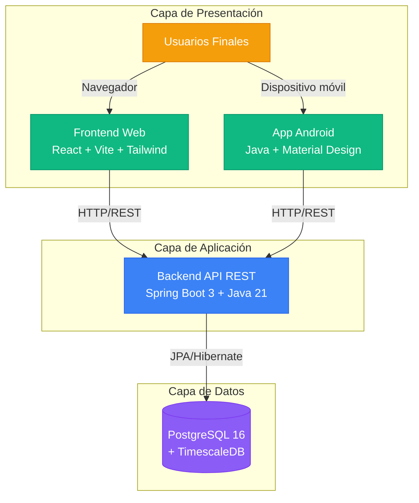

# Manual de Instalación - Proyecto Árboles (Proyecto Árboles)

**Última actualización**: 2025-12-07

---

## Introducción

Este manual describe el proceso de instalación completo del sistema **Proyecto Árboles** (Proyecto Árboles), un sistema de monitorización IoT para árboles en centros educativos.

### Descripción del Sistema

Proyecto Árboles permite:
- Monitorizar el estado de árboles mediante sensores IoT
- Gestionar centros educativos y sus árboles
- Visualizar datos en tiempo real desde aplicaciones web y móvil
- Almacenar histórico de datos ambientales

### Arquitectura del Sistema

El sistema está compuesto por 4 componentes principales:



### Componentes

1. **Base de Datos**: PostgreSQL 16 + TimescaleDB (almacenamiento)
2. **Backend**: API REST con Spring Boot (lógica de negocio)
3. **Frontend**: Aplicación web con React (interfaz web)
4. **Android**: Aplicación móvil nativa (interfaz móvil)

---

## Requisitos Previos

### Hardware Recomendado

- **RAM**: 8 GB mínimo (16 GB recomendado)
- **Disco**: 20 GB libres mínimo
- **Procesador**: Multinúcleo (4 cores recomendado)

### Software Necesario

| Componente | Versión Requerida | Verificación |
|------------|------------------|--------------|
| Java JDK | 21 | `java -version` |
| Node.js | 18+ | `node -v` |
| npm | 9+ | `npm -v` |
| PostgreSQL | 16+ | `psql --version` |
| Git | 2.0+ | `git --version` |
| Android Studio | Última estable | (Opcional, solo para Android) |

### Verificación de Requisitos

```bash
# Verificar todas las versiones
java -version      # Debe mostrar Java 21
node -v            # Debe mostrar v18.x o superior
npm -v             # Debe mostrar 9.x o superior
psql --version     # Debe mostrar PostgreSQL 16.x
git --version      # Debe mostrar Git 2.x
```

---

## Orden de Instalación Recomendado

**IMPORTANTE**: Sigue este orden para evitar problemas de dependencias:

1. Clonar Repositorio
2. Instalar PostgreSQL + TimescaleDB
3. Configurar Base de Datos
4. Configurar y ejecutar Backend
5. Configurar y ejecutar Frontend
6. Configurar y ejecutar Android (Opcional)

---

## 1. Clonar el Repositorio

**IMPORTANTE**: Este debe ser el primer paso, ya que necesitarás los archivos del proyecto para los siguientes pasos.

```bash
git clone https://github.com/riordi80/vocational-training-final-project
cd vocational-training-final-project
```

---

## 2. Instalación de PostgreSQL + TimescaleDB

### 2.1 Instalar PostgreSQL 16

Si no tienes PostgreSQL 16 instalado, consulta la [Guía de Instalación de PostgreSQL](./04b.%20CONFIGURACION_POSTGRESQL.md) para instrucciones detalladas de instalación.

**Resumen** (para sistemas basados en Debian/Ubuntu):

```bash
# Actualizar repositorios
sudo apt update

# Instalar PostgreSQL 16
sudo apt install postgresql-16 postgresql-contrib-16

# Verificar instalación
psql --version  # Debe mostrar PostgreSQL 16.x

# Verificar que el servicio está corriendo
sudo systemctl status postgresql
```

### 2.2 Instalar TimescaleDB

**Opción 1: Script automatizado (Recomendado para Linux/Ubuntu)**

El proyecto incluye un script de instalación automatizada:

```bash
# Desde la raíz del proyecto
cd docs/
chmod +x install-timescaledb.sh
sudo ./install-timescaledb.sh
```

**Opción 2: Instalación manual**

```bash
# Añadir repositorio de TimescaleDB
sudo sh -c "echo 'deb https://packagecloud.io/timescale/timescaledb/ubuntu/ $(lsb_release -c -s) main' > /etc/apt/sources.list.d/timescaledb.list"

# Importar clave GPG
wget --quiet -O - https://packagecloud.io/timescale/timescaledb/gpgkey | sudo gpg --dearmor -o /etc/apt/trusted.gpg.d/timescaledb.gpg

# Actualizar e instalar
sudo apt update
sudo apt install timescaledb-2-postgresql-16

# Configurar TimescaleDB
sudo timescaledb-tune --quiet --yes

# Reiniciar PostgreSQL
sudo systemctl restart postgresql
```

**Para otros sistemas operativos**, consulta la [Guía de Instalación de PostgreSQL](./04b.%20CONFIGURACION_POSTGRESQL.md).

---

## 3. Configuración de la Base de Datos

### 3.1 Crear Usuario de PostgreSQL

```bash
# Acceder a PostgreSQL como superusuario
sudo -i -u postgres
psql
```

Dentro de la consola de PostgreSQL:

```sql
-- Crear usuario con contraseña
CREATE USER arboles_user WITH PASSWORD 'TU_PASSWORD_SEGURA';

-- Dar privilegios de creación de bases de datos
ALTER USER arboles_user CREATEDB;

-- Verificar que se creó
\du
```

### 3.2 Crear la Base de Datos

Continuando en la consola de PostgreSQL:

```sql
-- Crear la base de datos
CREATE DATABASE proyecto_arboles;

-- Dar permisos al usuario
GRANT ALL PRIVILEGES ON DATABASE proyecto_arboles TO arboles_user;

-- Conectar a la nueva base de datos
\c proyecto_arboles

-- Habilitar extensión TimescaleDB
CREATE EXTENSION IF NOT EXISTS timescaledb;

-- Dar permisos en el schema public
GRANT ALL ON SCHEMA public TO arboles_user;

-- Salir de PostgreSQL
\q
```

```bash
# Salir del usuario postgres
exit
```

### 3.3 Ejecutar Scripts de Creación de Tablas

**Opción 1: Usar el script completo (Recomendado)**

Desde la raíz del proyecto:

```bash
# Ejecutar script de creación de tablas
psql -U arboles_user -d proyecto_arboles -f backend/create_database.sql -h localhost
```

**NOTA**: El script puede pedir la contraseña que configuraste para `arboles_user`.

**Opción 2: Dejar que Spring Boot cree las tablas**

Si prefieres que Spring Boot cree automáticamente las tablas mediante JPA:
- Asegúrate de que `spring.jpa.hibernate.ddl-auto=update` esté configurado (ya viene por defecto)
- Las tablas se crearán la primera vez que ejecutes el backend

### 3.4 Verificar la Configuración

```bash
# Conectarse a la BD
psql -U arboles_user -d proyecto_arboles

# Verificar tablas (debería mostrar: arboles, centros_educativos, etc.)
\dt

# Salir
\q
```

---

## 4. Configuración y Ejecución del Backend

### 4.1 Navegar al directorio del backend

```bash
# Desde la raíz del proyecto
cd backend
```

### 4.2 Configurar `application-local.properties`

El proyecto usa un sistema de perfiles de Spring Boot para separar configuración local de producción:

- `application.properties` (commiteado): Configuración base **SIN credenciales**
- `application-local.properties` (NO commiteado): Credenciales locales **CON tu password**

**Crear el archivo** `backend/src/main/resources/application-local.properties`:

```properties
# Configuración de Base de Datos LOCAL
spring.datasource.url=jdbc:postgresql://localhost:5432/proyecto_arboles
spring.datasource.username=arboles_user
spring.datasource.password=TU_PASSWORD_AQUI

# Configuración JPA (opcional, ya viene en application.properties)
spring.jpa.hibernate.ddl-auto=update
spring.jpa.show-sql=true
```

**IMPORTANTE**:
- Reemplaza `TU_PASSWORD_AQUI` con la contraseña que configuraste en el Paso 3.1
- Este archivo **ya está en `.gitignore`** y NO se debe commitear
- Para más detalles de configuración segura: [backend/src/main/resources/README_CONFIG.md](../backend/src/main/resources/README_CONFIG.md)

### 4.3 Compilar el Proyecto

**Linux/Mac**:
```bash
./mvnw clean install
```

**Windows**:
```cmd
mvnw.cmd clean install
```

### 4.4 Ejecutar el Backend

**Linux/Mac**:
```bash
./mvnw spring-boot:run
```

**Windows**:
```cmd
mvnw.cmd spring-boot:run
```

### 4.5 Verificar que el Backend Funciona

El backend estará disponible en: `http://localhost:8080`

```bash
# Verificar que responde
curl http://localhost:8080/api/centros

# Debería devolver un array JSON (puede estar vacío: [])
```

**Para más detalles técnicos**: Ver [backend/README.md](../backend/README.md)

---

## 5. Configuración y Ejecución del Frontend

### 5.1 Navegar al directorio del frontend

```bash
# Desde la raíz del proyecto
cd frontend
```

### 5.2 Instalar Dependencias

```bash
npm install
```

### 5.3 Configurar Variables de Entorno

Crear archivo `.env` en la raíz de `frontend/`:

```env
VITE_API_BASE_URL=http://localhost:8080/api
```

**IMPORTANTE**:
- Existe un archivo `.env.example` como referencia
- Este archivo NO se commitea (ya está en `.gitignore`)

### 5.4 Ejecutar el Frontend

```bash
npm run dev
```

La aplicación estará disponible en: `http://localhost:5173`

### 5.5 Verificar que el Frontend Funciona

1. Abre el navegador en `http://localhost:5173`
2. Deberías ver la pantalla de Login
3. Intenta registrarte y hacer login (cualquier email/password funciona - auth mock)
4. Navega a "Árboles" (debería mostrar lista vacía o con datos)

**Para más detalles técnicos**: Ver [frontend/README.md](../frontend/README.md)

---

## 6. Instalación de Android (Opcional)

La aplicación Android es opcional y requiere Android Studio.

### 6.1 Requisitos Previos

- Android Studio (Arctic Fox o superior)
- JDK 21
- Android SDK (API Level 24+)

### 6.2 Proceso de Instalación

**Para instrucciones completas de instalación Android**, consulta:
- [MANUAL_DE_INSTALACION_ANDROID.md](./MANUAL_DE_INSTALACION_ANDROID.md)

**Pasos resumidos**:

1. Abrir Android Studio
2. File → Open → Seleccionar carpeta `android/` del proyecto clonado
3. Esperar sincronización de Gradle
4. Configurar URL del backend en `RetrofitClient.java`:
   ```java
   // Para emulador Android
   private static final String BASE_URL = "http://10.0.2.2:8080/";

   // Para dispositivo físico (usar tu IP local)
   private static final String BASE_URL = "http://192.168.1.X:8080/";
   ```
5. Run → Run 'app'

**Documentación técnica**: Ver [android/README.md](../android/README.md)

---

## 7. Verificación del Sistema Completo

### 7.1 Verificar Integración Backend ↔ Base de Datos

```bash
# Crear un centro educativo desde el backend
curl -X POST http://localhost:8080/api/centros \
  -H "Content-Type: application/json" \
  -d '{"nombre":"IES Test","direccion":"Calle Test 123","ciudad":"Madrid"}'

# Verificar que se creó
curl http://localhost:8080/api/centros
```

### 7.2 Verificar Integración Frontend ↔ Backend

1. Abrir navegador en `http://localhost:5173`
2. Login/Register (cualquier email/password funciona)
3. Ir a sección "Árboles"
4. Intentar crear un nuevo árbol
5. Verificar que aparece en la lista

### 7.3 Verificar Integración Android ↔ Backend (si aplica)

1. Ejecutar app Android
2. Login (cualquier email/password funciona)
3. Ver lista de árboles (deberían aparecer los mismos que en web)
4. Intentar editar o eliminar un árbol
5. Verificar cambios en la web

---

## 8. Solución de Problemas Comunes

### Problema: Backend no arranca

**Error**: `Cannot connect to database`

**Solución**:
1. Verificar que PostgreSQL está corriendo: `sudo systemctl status postgresql`
2. Verificar credenciales en `application-local.properties`
3. Verificar que la BD existe: `psql -U arboles_user -d proyecto_arboles`

---

**Error**: `Port 8080 already in use`

**Solución**:
1. Matar proceso en puerto 8080: `sudo lsof -t -i:8080 | xargs kill -9`
2. O cambiar puerto en `application.properties`: `server.port=8081`

---

### Problema: Frontend no conecta con Backend

**Error**: `Network Error` o `CORS Error`

**Solución**:
1. Verificar que backend está corriendo en `http://localhost:8080`
2. Verificar variable `VITE_API_BASE_URL` en `.env`
3. Reiniciar servidor de desarrollo: `npm run dev`
4. Verificar CORS en backend (ver `backend/src/main/java/com/example/gardenmonitor/config/CorsConfig.java`)

---

### Problema: Android no conecta con Backend

**Error**: `Connection refused` o `Timeout`

**Solución**:

**Para emulador**:
- Usar `http://10.0.2.2:8080/` (NO `localhost`)

**Para dispositivo físico**:
1. Verificar que ordenador y dispositivo están en la misma WiFi
2. Obtener IP local del ordenador: `ip addr` (Linux) o `ipconfig` (Windows)
3. Usar `http://TU_IP_LOCAL:8080/` en `RetrofitClient.java`
4. Desactivar firewall temporalmente para probar

---

### Problema: Dependencias no se instalan

**Maven (Backend)**:
```bash
# Limpiar caché de Maven
./mvnw clean
rm -rf ~/.m2/repository
./mvnw install
```

**npm (Frontend)**:
```bash
# Limpiar caché de npm
npm cache clean --force
rm -rf node_modules package-lock.json
npm install
```

**Gradle (Android)**:
```
Android Studio → File → Invalidate Caches / Restart
Build → Clean Project
Build → Rebuild Project
```

---

## 9. Configuración: Desarrollo Local vs Producción

### Introducción

El sistema está diseñado para funcionar tanto en **desarrollo local** como en **producción** con mínimos cambios de configuración. Esta sección explica cómo está configurado cada componente y qué necesitas modificar si alternas entre entornos.

### Frontend (React + Vite)

El frontend usa **variables de entorno** mediante el archivo `.env`:

**Configuración actual** (`frontend/.env`):
```env
VITE_API_BASE_URL=http://localhost:8080/api
```

**Para desarrollo local**:
- El archivo `.env` ya apunta a `localhost:8080`
- No requiere cambios
- Ejecutar: `npm run dev`

**Para producción (Vercel)**:
- Vercel lee la variable `VITE_API_BASE_URL` de su dashboard
- Configurada como: `https://proyecto-arboles-backend.onrender.com/api`
- Deploy automático desde GitHub

### Backend (Spring Boot)

El backend usa **Spring Profiles** para gestionar diferentes entornos:

**Configuración actual** (`backend/src/main/resources/application.properties`):
```properties
spring.profiles.active=local
```

**Para desarrollo local**:
- Perfil `local` activo por defecto
- Lee configuración de `application-local.properties`
- Se conecta a PostgreSQL local
- No requiere cambios
- Ejecutar: `./mvnw spring-boot:run`

**Para producción (Render)**:
- Render establece `SPRING_PROFILES_ACTIVE=prod` mediante variable de entorno
- Lee configuración de `application-prod.properties`
- Se conecta a PostgreSQL de Render
- Deploy automático desde GitHub

### Resumen

Para trabajar en **desarrollo local** después del despliegue:

| Componente | Cambios Necesarios |
|------------|-------------------|
| **Frontend** | Ninguno (ya configurado para local) |
| **Backend** | Ninguno (perfil local por defecto) |
| **Android** | Ver [MANUAL_DE_INSTALACION_ANDROID.md](./MANUAL_DE_INSTALACION_ANDROID.md) |

Ambos componentes principales (Frontend y Backend) están configurados por defecto para desarrollo local. Solo necesitas iniciar los servidores con `npm run dev` y `./mvnw spring-boot:run` respectivamente.

Para información sobre configuración de la aplicación Android entre local y producción, consulta el manual específico de Android.

---

## 10. Siguientes Pasos

Una vez instalado el sistema:

1. **Lee el Manual de Usuario**: Ver [MANUAL_DE_USUARIO.md](./MANUAL_DE_USUARIO.md)
2. **Explora la documentación técnica**:
   - [Hoja de Ruta](./02.%20HOJA_DE_RUTA.md)
   - [Especificación Técnica](./03.%20ESPECIFICACION_TECNICA.md)
   - [Modelo de Datos](./04.%20MODELO_DATOS.md)
3. **Prueba el sistema**:
   - Crea centros educativos
   - Añade árboles
   - Edita y elimina datos
   - Prueba desde web y móvil

---

## 11. Despliegue en Producción (Información)

El sistema ya está desplegado en producción:

- **Frontend**: https://vocational-training-final-project.vercel.app/
- **Backend**: https://proyecto-arboles-backend.onrender.com
- **Base de Datos**: PostgreSQL en Render

### Importante: Limitaciones del Free Tier de Render

El backend está desplegado en Render con el plan gratuito, que tiene las siguientes características:

**Suspensión automática (Cold Start)**:
- El servicio se suspende tras **15 minutos de inactividad**
- Al primer acceso después de suspensión, el backend tarda **30-60 segundos** en reactivarse
- Durante este tiempo, el frontend mostrará: "No se pudo conectar con el servidor. Si es la primera carga, puede estar iniciándose (30-60 seg). Recarga la página en unos momentos."
- **Solución**: Esperar 1 minuto y recargar la página (F5)
- Una vez activo, el sistema funciona normalmente

**Esto es comportamiento normal y esperado** del free tier de Render. No indica un problema en la aplicación.

**Recomendaciones**:
- Para entornos de producción real, considerar plan de pago de Render
- Para desarrollo local, seguir las instrucciones de la Sección 7

Para detalles técnicos de despliegue, consulta:
- [backend/README.md - Sección "Despliegue en Render"](../backend/README.md#despliegue-en-render)
- [frontend/README.md - Sección "Despliegue en Vercel"](../frontend/README.md#despliegue-en-vercel-requisito-dad---completado)

---

## Recursos Adicionales

### Documentación del Proyecto

- [Índice de Documentación](./00.%20INDICE.md)
- [Git Workflow](./01.%20GIT_WORKFLOW.md)
- [Requisitos Académicos](./REQUISITOS.md)
- [Testing Postman](./TESTING_POSTMAN_RESULTS.md)

### Manuales

- [Manual de Usuario](./MANUAL_DE_USUARIO.md)
- [Manual de Instalación Android](./MANUAL_DE_INSTALACION_ANDROID.md)
- [Manual de Usuario Android](./MANUAL_DE_USUARIO_ANDROID.md)

### README por Componente

- [Backend README](../backend/README.md)
- [Frontend README](../frontend/README.md)
- [Android README](../android/README.md)

---

## Soporte

Para problemas o preguntas:

1. Revisar sección "Solución de Problemas" de este manual
2. Consultar README específico del componente
3. Revisar logs de la aplicación
4. Contactar al equipo de desarrollo

---

## Información del Proyecto

**Nombre**: Proyecto Árboles - Sistema de Monitorización de Árboles

**Institución**: IES El Rincón

**Curso**: Desarrollo de Aplicaciones Multiplataforma (DAM) 2025-2026

**Repositorio**: [github.com/riordi80/vocational-training-final-project](https://github.com/riordi80/vocational-training-final-project)

**Última actualización**: 2025-12-08

### Colaboradores

[](https://github.com/riordi80) [](https://github.com/Enrique36247)

---

**Proyecto Final DAM 2025-2026** | Desarrollado con Spring Boot, React, Android y ESP32
