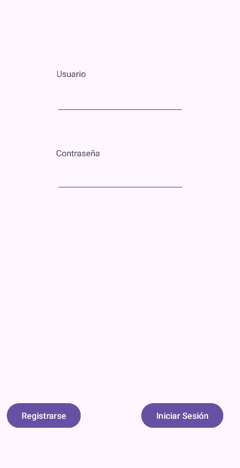
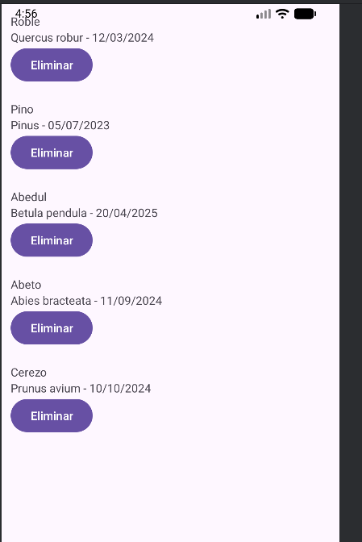
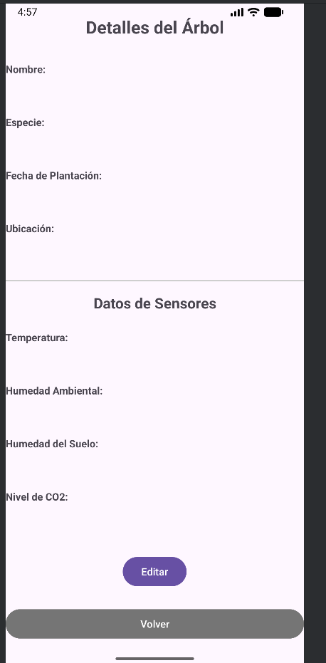
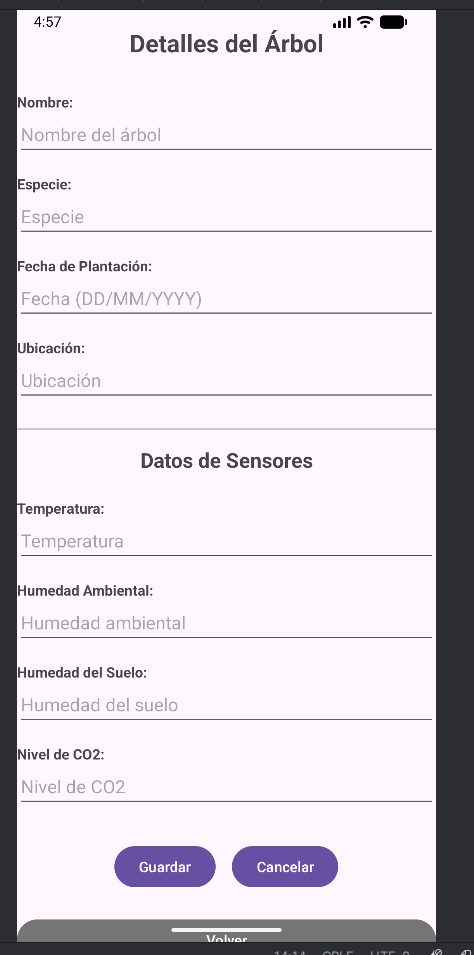

# Manual de Usuario - Proyecto Árboles

## Introducción

Bienvenido al sistema de gestión de árboles. Esta aplicación te permite registrar, visualizar y gestionar información sobre árboles, incluyendo datos de sensores ambientales en tiempo real.

## Índice

1. [Inicio de Sesión y Registro](#1-inicio-de-sesión-y-registro)
2. [Lista de Árboles](#2-lista-de-árboles)
3. [Detalles del Árbol](#3-detalles-del-árbol)
4. [Editar Información del Árbol](#4-editar-información-del-árbol)
5. [Eliminar un Árbol](#5-eliminar-un-árbol)

---

## 1. Inicio de Sesión y Registro

### Pantalla de Login

Al abrir la aplicación por primera vez, verás la pantalla de inicio de sesión:

#### Componentes de la pantalla:

- **Campo Usuario**: Ingresa tu nombre de usuario
- **Campo Contraseña**: Ingresa tu contraseña
- **Botón "Iniciar Sesión"**: Accede a la aplicación con tus credenciales
- **Botón "Registrarse"**: Si no tienes cuenta, regístrate aquí

#### Cómo iniciar sesión:

1. Ingresa tu **nombre de usuario** en el primer campo
2. Ingresa tu **contraseña** en el segundo campo
3. Presiona el botón **"Iniciar Sesión"**

> **Nota**: Si dejas algún campo en blanco, aparecerá un mensaje de error indicando que el campo no puede estar vacío.

#### Cómo registrarse:

1. Presiona el botón **"Registrarse"**
2. Se abrirá la pantalla de registro
3. Completa los campos de usuario y contraseña
4. Presiona **"Registrarse"** para crear tu cuenta
5. Serás redirigido automáticamente a la lista de árboles

---

## 2. Lista de Árboles

Una vez iniciada la sesión, verás la pantalla principal con el listado de todos los árboles registrados:

### Información Mostrada

Cada elemento de la lista muestra:
- **Nombre del árbol** (ej: "Roble", "Pino", "Abedul")
- **Especie y fecha de plantación** (ej: "Quercus robur - 12/03/2024")
- **Botón "Eliminar"**: Para eliminar el árbol de la base de datos

### Ejemplos de Árboles en la Lista

La imagen muestra varios árboles registrados:
- **Roble** - Quercus robur - 12/03/2024
- **Pino** - Pinus - 05/07/2023
- **Abedul** - Betula pendula - 20/04/2025
- **Abeto** - Abies bracteata - 11/09/2024
- **Cerezo** - Prunus avium - 10/10/2024

### Acciones Disponibles

#### Ver Detalles de un Árbol
1. **Toca sobre cualquier árbol** de la lista
2. Se abrirá la pantalla de detalles con toda la información

#### Eliminar un Árbol
1. Presiona el botón **"Eliminar"** (morado) junto al árbol que deseas eliminar
2. Aparecerá un cuadro de confirmación
3. Confirma la eliminación
4. El árbol se eliminará de la lista y de la base de datos

---

## 3. Detalles del Árbol

Al tocar sobre un árbol en la lista, accederás a su pantalla de detalles:

### Información General del Árbol

La pantalla muestra dos secciones principales:

#### Sección 1: Información Básica
- **Nombre**: Nombre común del árbol
- **Especie**: Nombre científico
- **Fecha de Plantación**: Cuándo fue plantado el árbol
- **Ubicación**: Ubicación específica donde se encuentra

#### Sección 2: Datos de Sensores

Esta sección muestra información en tiempo real de los sensores instalados en el árbol:

- **Temperatura**: Temperatura ambiente en grados Celsius (°C)
- **Humedad Ambiental**: Porcentaje de humedad en el aire (%)
- **Humedad del Suelo**: Porcentaje de humedad en el suelo (%)
- **Nivel de CO2**: Concentración de CO2 en partes por millón (ppm)

> **Nota**: Si el servidor no proporciona datos de sensores, la aplicación generará valores aleatorios para demostración.

### Botones Disponibles

- **Botón "Editar"** (morado): Permite modificar la información del árbol
- **Botón "Volver"** (gris): Regresa a la lista de árboles

---

## 4. Editar Información del Árbol

Para modificar los datos de un árbol, sigue estos pasos:

### Paso 1: Activar Modo Edición

1. En la pantalla de detalles, presiona el botón **"Editar"**
2. Los campos de texto se convertirán en editables

### Paso 2: Modificar los Datos

Ahora puedes editar cualquiera de los siguientes campos:

#### Información General:
- **Nombre del árbol**: Cambia el nombre común
- **Especie**: Modifica el nombre científico
- **Fecha de Plantación**: Actualiza la fecha (formato: DD/MM/YYYY)
- **Ubicación**: Cambia la ubicación específica

#### Datos de Sensores:
- **Temperatura**: Actualiza el valor de temperatura
- **Humedad ambiental**: Modifica el porcentaje de humedad
- **Humedad del suelo**: Cambia el nivel de humedad del suelo
- **Nivel de CO2**: Actualiza la concentración de CO2

### Paso 3: Guardar o Cancelar

Una vez realizados los cambios, tienes dos opciones:

#### Guardar Cambios
1. Presiona el botón **"Guardar"** (morado)
2. Los datos se actualizarán en el servidor
3. Verás un mensaje de confirmación: "Cambios guardados"
4. La pantalla volverá al modo de visualización

#### Cancelar Edición
1. Presiona el botón **"Cancelar"** (morado)
2. Todos los cambios se descartarán
3. Los datos volverán a su estado original
4. Verás un mensaje: "Edición cancelada"

> **Importante**: Los cambios solo se guardan si presionas "Guardar". Si presionas "Cancelar" o "Volver", los cambios se perderán.

---

## 5. Eliminar un Árbol

Existen dos formas de eliminar un árbol del sistema:

### Método 1: Desde la Lista de Árboles

1. En la pantalla principal, localiza el árbol que deseas eliminar
2. Presiona el botón **"Eliminar"** junto al árbol
3. Aparecerá un cuadro de diálogo de confirmación:
   - **Título**: "Eliminar árbol"
   - **Mensaje**: "¿Seguro que quieres eliminar este árbol?"
4. Presiona **"Eliminar"** para confirmar
5. El árbol se eliminará permanentemente de la base de datos
6. La lista se actualizará automáticamente

### Método 2: Desde los Detalles

> **Nota**: Actualmente la eliminación solo está disponible desde la lista principal.

---

## Funcionalidades Adicionales

### Sistema de Fallback (Respaldo)

La aplicación cuenta con un sistema de respaldo que se activa automáticamente:

- **Si no hay conexión al servidor**: La app cargará datos de ejemplo desde archivos XML locales
- **Si faltan datos de sensores**: Se generarán valores aleatorios para demostración
- **Si la ubicación no está disponible**: Se mostrará "Ubicación no disponible"

Esto garantiza que siempre puedas usar la aplicación, incluso sin conexión.

### Validaciones

La aplicación incluye validaciones para garantizar la integridad de los datos:

#### En Login y Registro:
- Los campos de usuario y contraseña **no pueden estar vacíos**
- Si dejas un campo en blanco, aparecerá un mensaje de error en rojo

#### En Edición:
- Aunque no hay restricciones estrictas, se recomienda:
  - Usar fechas en formato DD/MM/YYYY
  - Ingresar valores numéricos para los sensores
  - No dejar campos importantes en blanco

---

## Preguntas Frecuentes (FAQ)

### ¿Qué pasa si pierdo conexión mientras edito?

Si pierdes la conexión mientras editas un árbol, los cambios se guardarán localmente pero no se sincronizarán con el servidor hasta que recuperes la conexión.

### ¿Puedo recuperar un árbol eliminado?

No, la eliminación es permanente. Siempre aparecerá un cuadro de confirmación antes de eliminar.

### ¿Por qué los datos de sensores cambian?

Si el servidor no proporciona datos reales, la aplicación genera valores aleatorios cada vez que entras en los detalles.

### ¿Cómo sé si estoy conectado al servidor?

- **Conexión exitosa**: Verás un mensaje "Árboles cargados: X" al abrir la lista
- **Sin conexión**: Verás "Error de conexión" y se cargarán datos de ejemplo

---

## Consejos de Uso

1. **Verifica la conexión**: Asegúrate de tener conexión a Internet antes de realizar cambios importantes
2. **Doble confirmación**: Siempre confirma los datos antes de guardar cambios
3. **No elimines por accidente**: Lee cuidadosamente el mensaje de confirmación antes de eliminar un árbol
4. **Mantén actualizada la información**: Actualiza regularmente los datos de los sensores para un mejor seguimiento

---

## Soporte

Si experimentas problemas con la aplicación:

1. Verifica tu conexión a Internet
2. Asegúrate de que el servidor esté funcionando
3. Cierra y vuelve a abrir la aplicación
4. Contacta al administrador del sistema si el problema persiste