# Manual de Usuario - Proyecto Árboles (Android)

## Introducción

Este manual está actualizado al estado actual de la app Android (single-activity + fragments) y pensado para usuarios nuevos.

- **Versión del manual**: 2026-05-05  
- **Plataforma**: Android 7.0+ (API 24 o superior)  
- **Referencia técnica**: [Manual de Instalación Android](./MANUAL_DE_INSTALACION_ANDROID.md)

## Índice

1. [Antes de empezar](#1-antes-de-empezar)
2. [Inicio de sesión y registro](#2-inicio-de-sesión-y-registro)
3. [Navegación principal](#3-navegación-principal)
4. [Pantalla Inicio (Dashboard)](#4-pantalla-inicio-dashboard)
5. [Centros educativos](#5-centros-educativos)
6. [Detalle de centro](#6-detalle-de-centro)
7. [Gestión de árboles](#7-gestión-de-árboles)
8. [Gestión de dispositivos ESP32](#8-gestión-de-dispositivos-esp32)
9. [Histórico de lecturas](#9-histórico-de-lecturas)
10. [Administración de usuarios (solo ADMIN)](#10-administración-de-usuarios-solo-admin)
11. [Permisos por rol](#11-permisos-por-rol)
12. [Validaciones y mensajes frecuentes](#12-validaciones-y-mensajes-frecuentes)
13. [Resolución de problemas](#13-resolución-de-problemas)
14. [Soporte](#14-soporte)

---

## 1. Antes de empezar

Para que la app funcione correctamente:

1. Debe estar instalada y compilada con un **Build Variant** válido.
2. El backend debe estar accesible (local o producción).
3. Debes tener conexión a Internet.

Si la app no carga datos, revisa primero la sección de Build Variants del manual de instalación.

---

## 2. Inicio de sesión y registro

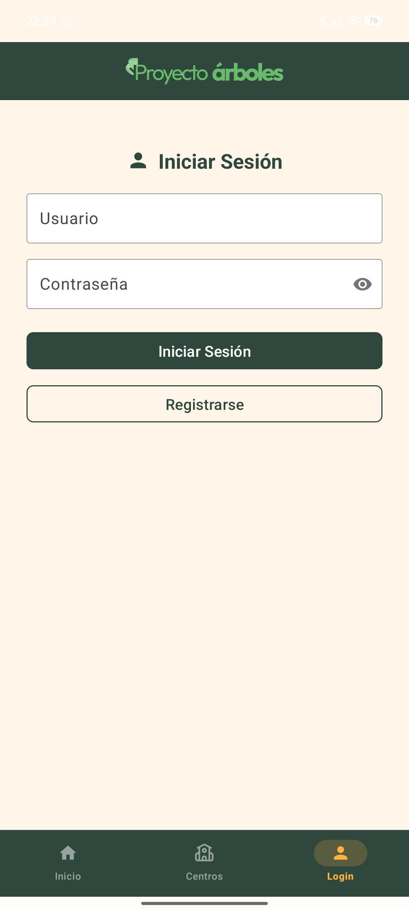

Desde **Login**:

- Introduce **email** y **contraseña**.
- Pulsa **Iniciar Sesión**.
- Si las credenciales son correctas, accedes a Inicio (Dashboard).

Mensajes típicos:

- `Email y contraseña son requeridos`
- `Credenciales incorrectas`
- `Error de conexión. Inténtalo de nuevo.`

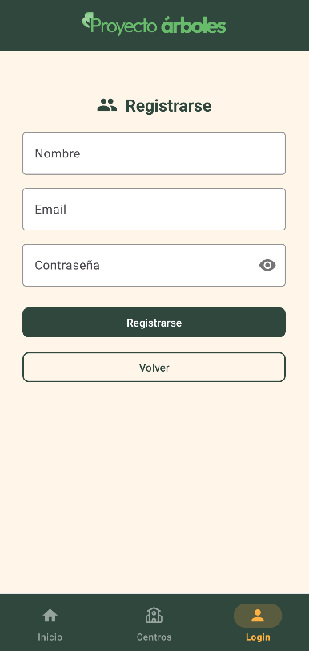

Desde **Registrarse**:

1. Completa nombre, email y contraseña.
2. Pulsa **Registrarse**.
3. Si el registro es correcto, la app inicia sesión automáticamente.

Mensajes típicos:

- `El email ya está registrado` (409)
- `Datos inválidos. Verifica los campos.` (400)

---

## 3. Navegación principal

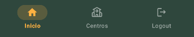

En vertical (portrait) se usa **Bottom Navigation**:

- **Inicio**
- **Centros**
- **Login** (o **Logout** cuando hay sesión)
- **Usuarios** (solo visible para ADMIN)

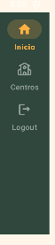

En horizontal (landscape) la navegación pasa a **Navigation Rail** lateral con las mismas opciones.

---

## 4. Pantalla Inicio (Dashboard)

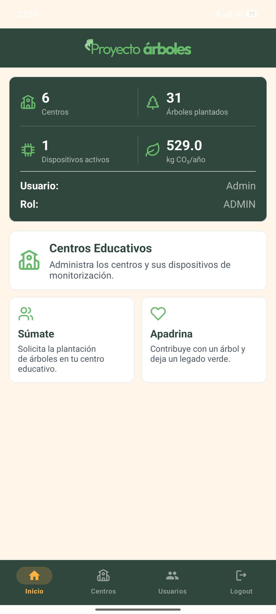

La pantalla Inicio muestra:

- Número de **centros**.
- Total de **árboles plantados** (suma de cantidad).
- Número de **dispositivos activos**.
- **CO₂ total anual** estimado.

Además:

- Si hay sesión activa, se ve **usuario y rol**.
- Botón/tarjeta **Centros Educativos** para ir al listado.
- Tarjetas **Súmate** y **Apadrina** que abren enlace externo en navegador.

---

## 5. Centros educativos

 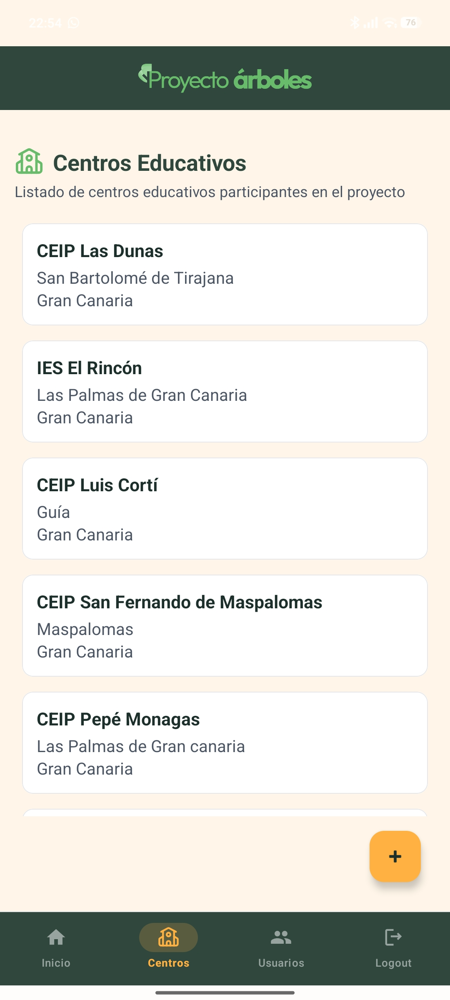

En **Centros** se muestra el listado con:

- Nombre del centro
- Población
- Isla

Acciones:

- Tocar una tarjeta para abrir el detalle del centro.
- **+ Añadir** (FAB o botón de cabecera según orientación) solo si tienes permisos.

---

## 6. Detalle de centro

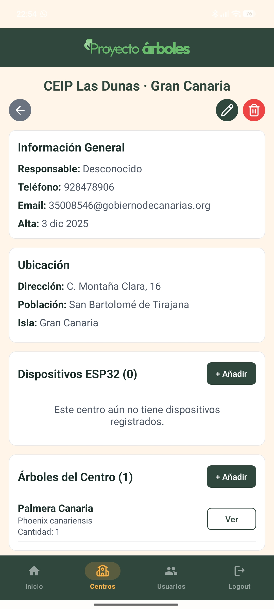

Incluye:

- Información general (responsable, teléfono, email, alta).
- Ubicación (dirección, población, isla).

Botones según rol:

- **Editar centro**
- **Eliminar centro**
- **Añadir dispositivo**
- **Añadir árbol**

En la misma pantalla aparecen:

- Lista de dispositivos ESP32 del centro.
- Lista de árboles del centro.

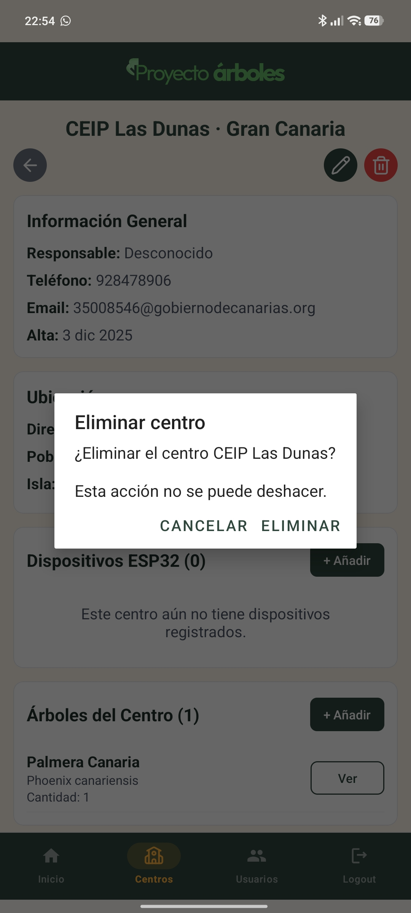

Al eliminar centro se solicita confirmación (acción irreversible).

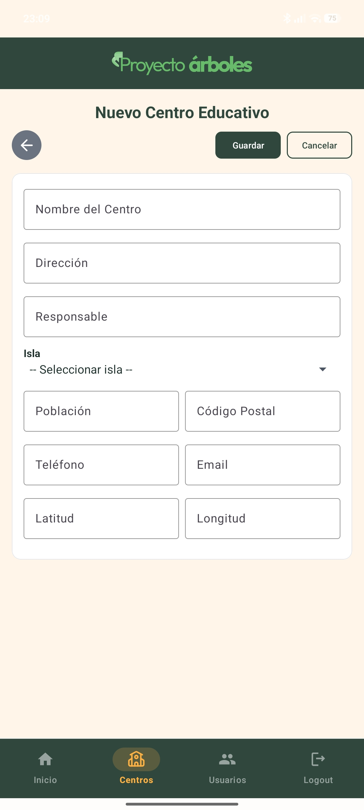

Formulario de centro (crear/editar):

- Requeridos: nombre, dirección, responsable, latitud, longitud.
- Opcionales: población, código postal, teléfono, email, isla.
- Validaciones: latitud `-90..90`, longitud `-180..180`.

---

## 7. Gestión de árboles

La app gestiona árboles dentro de cada centro.

### 7.1 Crear árbol

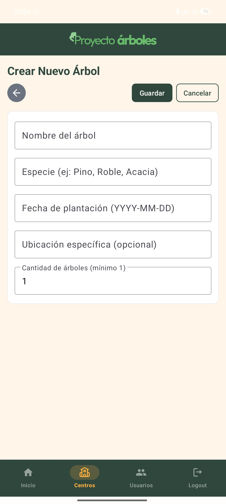

Campos del formulario:

- Nombre (requerido)
- Especie (requerido)
- Fecha de plantación (requerido, con selector de fecha)
- Ubicación (opcional)
- Cantidad (mínimo 1)
- Absorción CO₂ anual (opcional)

### 7.2 Ver detalle del árbol

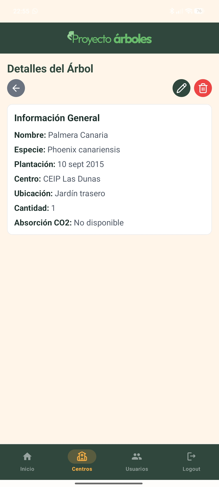

Se muestra:

- Nombre, especie y fecha
- Centro educativo
- Ubicación
- Cantidad
- Absorción CO₂

### 7.3 Editar árbol

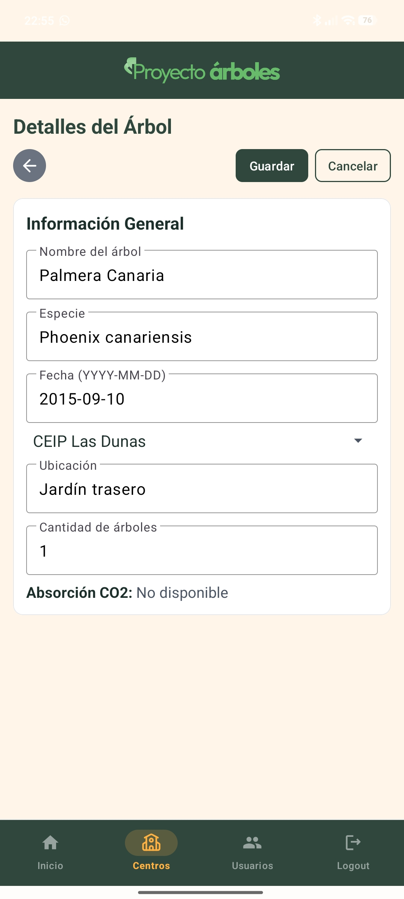

En modo edición:

- Se habilitan campos y selector de centro.
- Se guarda con **Guardar** o se descarta con **Cancelar**.

### 7.4 Eliminar árbol

La app solicita confirmación antes de borrar.

---

## 8. Gestión de dispositivos ESP32

Los dispositivos se crean/editan desde el detalle del centro.

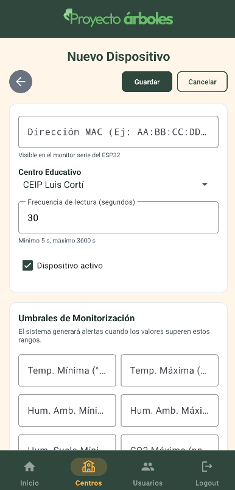

Campos:

- MAC Address (obligatoria, formato `XX:XX:XX:XX:XX:XX`)
- Centro educativo
- Frecuencia de lectura (5 a 3600 segundos)
- Activo (sí/no)
- Umbrales: temperatura, humedad ambiente/suelo y CO₂

 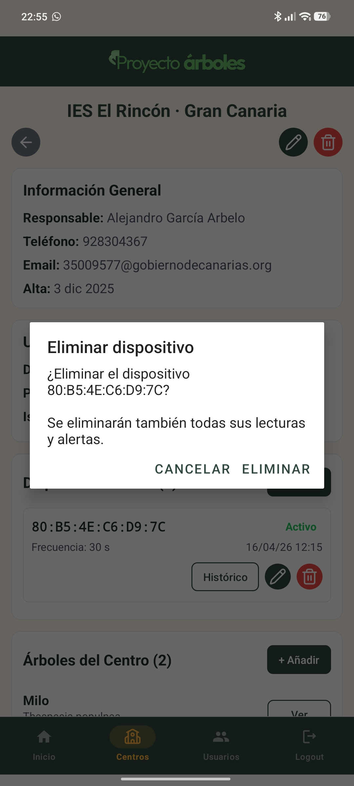

Al eliminar dispositivo se confirma y se avisa que se eliminan lecturas/alertas asociadas.

---

## 9. Histórico de lecturas

Se accede desde el botón **Histórico** de cada dispositivo.

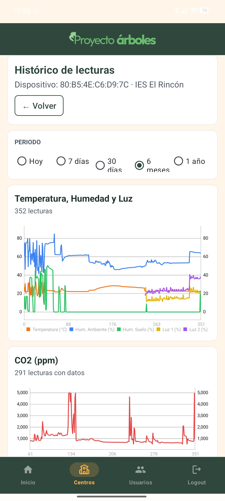

Incluye:

- Selector de periodo: **Hoy**, **7 días**, **30 días**, **6 meses**, **1 año**.
- Gráfica 1: temperatura, humedad ambiente, humedad suelo y luz.
- Gráfica 2: CO₂.

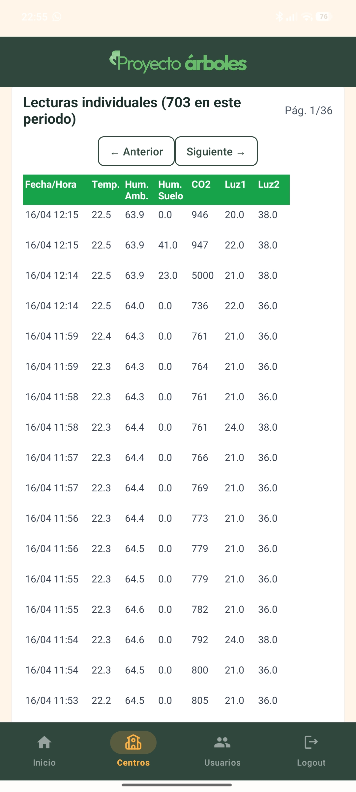

Tabla de lecturas:

- Columnas: fecha/hora, temp., hum. ambiente, hum. suelo, CO₂, luz1, luz2.
- Paginación con botones **Anterior** y **Siguiente**.

---

## 10. Administración de usuarios (solo ADMIN)

El menú **Usuarios** solo aparece para usuarios ADMIN.

### 10.1 Lista de usuarios

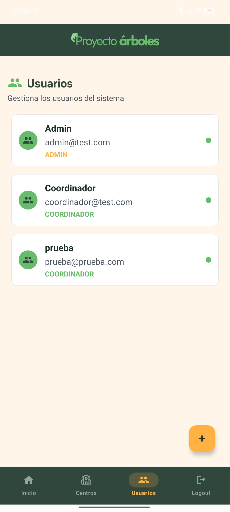

Muestra en cada tarjeta:

- Nombre
- Email
- Rol (ADMIN o COORDINADOR)
- Indicador de activo/inactivo

### 10.2 Detalle de usuario

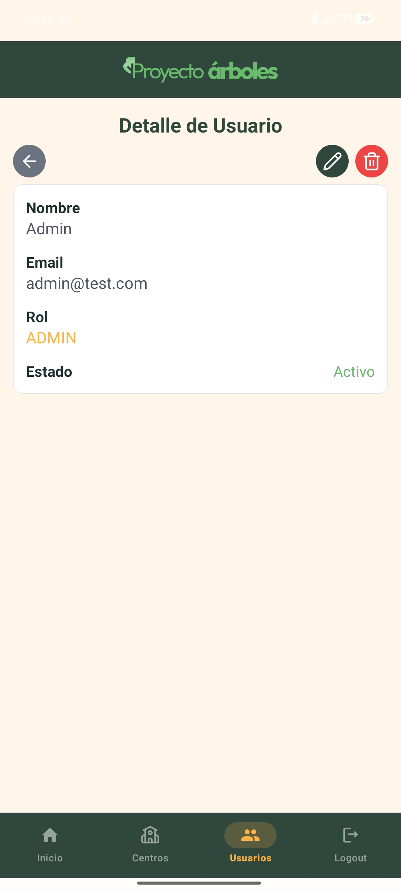

Permite:

- Ver datos completos
- Editar usuario
- Eliminar usuario (con confirmación)

### 10.3 Editar usuario

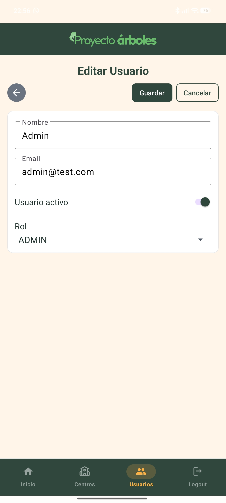

En edición:

- Se modifican nombre, email, rol y activo.
- La contraseña no se edita en este formulario.

---

## 11. Permisos por rol

### Público (sin iniciar sesión)
- Puede ver Inicio y Centros.
- Puede consultar detalles y lecturas históricas.
- No puede crear/editar/eliminar.

### COORDINADOR
- Puede operar en sus centros asignados:
  - Editar centro asignado
  - Crear/editar/eliminar árboles en sus centros
  - Crear/editar dispositivos de sus centros
- No puede eliminar centros.
- No tiene acceso a menú Usuarios.

### ADMIN
- Acceso completo:
  - Gestión total de centros, árboles y dispositivos
  - Gestión de usuarios (crear, editar, eliminar)

---

## 12. Validaciones y mensajes frecuentes

### Login / Registro
- `Email y contraseña son requeridos`
- `Credenciales incorrectas`
- `El email ya está registrado`

### Centro
- `El nombre es obligatorio`
- `La direccion es obligatoria`
- `La latitud debe estar entre -90 y 90`
- `La longitud debe estar entre -180 y 180`

### Árbol
- `El nombre es requerido`
- `La especie es requerida`
- `La fecha de plantación es requerida`
- `La cantidad debe ser al menos 1`

### Dispositivo
- `La direccion MAC es obligatoria`
- `Formato incorrecto. Usa XX:XX:XX:XX:XX:XX`
- `La frecuencia debe estar entre 5 y 3600`

---

## 13. Resolución de problemas

1. **No carga datos**  
   Verifica conexión y backend activo. Si estás en local, revisa el flavor (`localEmulator` o `localDevice`) y la IP.

2. **Tarda en responder en producción**  
   El backend en Render puede tardar por cold start. Espera y reintenta.

3. **No aparece el menú Usuarios**  
   Solo se muestra a rol ADMIN.

4. **No puedes editar un centro/árbol**  
   Revisa si tu rol tiene permisos sobre ese centro.

---

## 14. Soporte

Si necesitas ayuda:

1. Adjunta captura de pantalla del error.
2. Indica rol de usuario (Público, COORDINADOR, ADMIN).
3. Indica si usas backend local o producción.
4. Comparte pasos exactos para reproducir el problema.

---

## Información del Proyecto

**Nombre**: Proyecto Árboles - Sistema de Monitorización de Árboles  
**Institución**: IES El Rincón  
**Curso**: DAM 2025-2026  
**Repositorio**: [github.com/riordi80/vocational-training-final-project](https://github.com/riordi80/vocational-training-final-project)  
**Última actualización**: 2026-05-05

### Colaboradores

 

---

**Proyecto Final DAM 2025-2026** | Desarrollado con Spring Boot, React, Android y ESP32