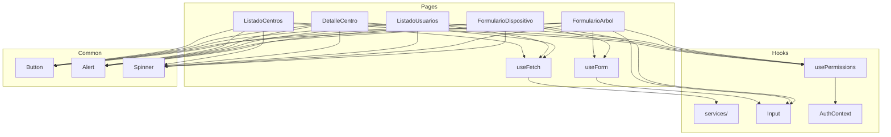

# Frontend - Proyecto Árboles

Aplicación web desarrollada con React para el sistema de monitorización de árboles.

## Aplicación Desplegada

**URL en producción**: [https://vocational-training-final-project.vercel.app/](https://vocational-training-final-project.vercel.app/)

**Plataforma**: Vercel (deployment automático desde GitHub)

## Tecnologías

- **Framework**: React 19.2.0
- **Lenguaje**: JavaScript
- **Build Tool**: Vite
- **Routing**: React Router DOM 7.x
- **Estilización**: Tailwind CSS 3.x
- **HTTP Client**: Axios
- **State Management**: Context API
- **Gráficas**: Recharts 3.x — Series temporales de lecturas IoT
- **Mapas**: Leaflet 1.9.x + React Leaflet — Mapas interactivos
- **Iconos**: Lucide React

## Estructura del Proyecto

```
frontend/
├── public/                              # Recursos estáticos
│   ├── Logotipo-Proy-arboles_color_v2.png
│   ├── pa-acuorum-blanco.png
│   ├── pa-foresta-blanco.png
│   ├── pa-fsa-blanco.png
│   ├── pa-logotipo-footer.png
│   ├── proyecto-arboles-icon.png
│   └── vite.svg
├── src/
│   ├── assets/
│   │   └── react.svg
│   ├── components/
│   │   ├── auth/
│   │   │   └── RoleGate.jsx
│   │   └── common/              # Button, Input, Alert, Spinner
│   │       ├── Alert.jsx
│   │       ├── Button.jsx
│   │       ├── Input.jsx
│   │       └── Spinner.jsx
│   ├── constants/
│   │   ├── islas.js
│   │   └── roles.js
│   ├── context/
│   │   └── AuthContext.jsx
│   ├── hooks/
│   │   ├── useFetch.js
│   │   ├── useForm.js
│   │   └── usePermissions.js
│   ├── layout/
│   │   ├── Footer.jsx
│   │   ├── Header.jsx
│   │   └── MainLayout.jsx
│   ├── pages/
│   │   ├── access-denied/
│   │   │   └── AccessDenied.jsx
│   │   ├── arboles/
│   │   │   ├── DetalleArbol.jsx       # Info general y absorción CO2; sin sección IoT
│   │   │   └── FormularioArbol.jsx
│   │   ├── ayuda/
│   │   │   └── Ayuda.jsx
│   │   ├── centros/
│   │   │   ├── DetalleCentro.jsx
│   │   │   ├── FormularioCentro.jsx
│   │   │   └── ListadoCentros.jsx
│   │   ├── component-library/
│   │   │   └── ComponentLibrary.jsx
│   │   ├── dashboard/
│   │   │   └── Dashboard.jsx
│   │   ├── dispositivos/
│   │   │   ├── FormularioDispositivo.jsx  # Crear/editar dispositivo (MAC, centro, frecuencia, umbrales)
│   │   │   └── HistoricoDispositivo.jsx   # Gráfica Recharts + tabla paginada por dispositivoId
│   │   ├── login/
│   │   │   └── Login.jsx
│   │   ├── register/
│   │   │   └── Register.jsx
│   │   └── usuarios/                  # Gestión de usuarios (solo ADMIN)
│   │       ├── DetalleUsuario.jsx
│   │       ├── FormularioUsuario.jsx
│   │       └── ListadoUsuarios.jsx
│   ├── routes/
│   │   └── ProtectedRoute.jsx
│   ├── services/                      # Llamadas a API
│   │   ├── api.js                     # Configuración axios
│   │   ├── arbolesService.js
│   │   ├── centrosService.js
│   │   ├── dispositivosService.js     # CRUD dispositivos ESP32
│   │   ├── lecturasService.js         # Lecturas IoT (endpoints /dispositivo/)
│   │   ├── usuarioCentroService.js
│   │   └── usuariosService.js
│   ├── tests/
│   │   ├── arbolesService.test.js
│   │   ├── AuthContext.test.jsx
│   │   ├── FormularioArbol.test.jsx
│   │   ├── lecturasService.test.js
│   │   ├── Login.test.jsx
│   │   ├── permissions.test.js
│   │   └── ProtectedRoute.test.jsx
│   ├── utils/
│   │   └── permissions.js
│   ├── App.css
│   ├── App.jsx
│   ├── index.css
│   ├── main.jsx
│   └── setupTests.js
├── .env.example                         # Plantilla de variables de entorno
├── eslint.config.js
├── index.html
├── jsconfig.json
├── lighthouse-inicial_v1.html           # Informe Lighthouse (Fase 13)
├── lighthouse-inicial_v2.html           # Informe Lighthouse (Fase 13)
├── package.json
├── postcss.config.js
├── tailwind.config.js
├── vercel.json
└── vite.config.js
```

## Requisitos Previos

- Node.js 18+
- npm o yarn

## Instalación y Configuración

### 1. Clonar el repositorio

```bash
git clone https://github.com/riordi80/vocational-training-final-project
cd frontend
```

### 2. Instalar dependencias

```bash
npm install
```

### 3. Configurar variables de entorno

Copiar la plantilla incluida y editar los valores:

```bash
cp .env.example .env
```

O crear el archivo `.env` manualmente en la raíz de `frontend/`:

```env
VITE_API_BASE_URL=http://localhost:8080/api
```

Para producción:
```env
VITE_API_BASE_URL=https://tu-dominio.com/api
```

**IMPORTANTE**: No commitear archivos `.env` con credenciales reales.

### 4. Ejecutar en modo desarrollo

```bash
npm run dev
```

La aplicación estará disponible en: `http://localhost:5173`

## Scripts Disponibles

```bash
# Desarrollo
npm run dev              # Inicia servidor de desarrollo con HMR

# Build
npm run build            # Genera build de producción en dist/
npm run preview          # Preview del build de producción

# Linting
npm run lint             # Ejecuta ESLint para verificar código

# Tests
npm run test             # Vitest en modo watch
npm run test:coverage    # Tests + informe de cobertura en coverage/
npm run test:ui          # Interfaz gráfica interactiva de Vitest
npm run test:watch       # Re-ejecuta al guardar
```

## Páginas/Vistas (Requisito DAD)

### 1. Login (`/login`)
- Formulario con email y contraseña
- Autenticación real contra BD via `POST /api/auth/login`
- Sesión y JWT guardados en localStorage
- Validación básica

### 2. Register (`/register`)
- Formulario de registro
- Registro real via `POST /api/auth/register` (rol COORDINADOR por defecto)
- Validación (email válido, contraseñas coinciden)

### 3. Dashboard (`/dashboard`)
- Métricas globales: total de centros, árboles, dispositivos y CO2 absorbido
- Acceso rápido a las secciones principales
- Navegación dinámica según rol

### 4. Listado de Centros (`/centros`)
- Tabla responsive con todos los centros educativos
- Columna "Dispositivos" con recuento `numDispositivos` de ESP32 por centro (icono Cpu)
- Acceso al detalle de cada centro
- Botón "Nuevo Centro" (solo ADMIN)

### 5. Detalle Centro (`/centros/:id`)
- Información general + mapa Leaflet con ubicación
- Tabla de árboles del centro con acciones (detalle, editar, eliminar)
- Tabla de dispositivos ESP32: MAC, estado, frecuencia, última conexión
- Acciones por dispositivo: Ver Histórico, Editar, Eliminar (con modal de confirmación)

### 6. Formulario Centro (`/centros/nuevo` y `/centros/:id/editar`)
- Campos: nombre, dirección, isla, coordinador asignado
- Accesible solo para ADMIN (crear) y ADMIN/COORDINADOR (editar)

### 7. Detalle de Árbol (`/arboles/:id`)
- Vista con información general y absorción CO2 anual
- Botones: Volver, Editar, Eliminar
- Modal de confirmación antes de eliminar
- Sin sección IoT (lecturas e histórico se acceden desde el dispositivo)

### 8. Formulario Árbol (`/arboles/nuevo` y `/arboles/:id/editar`)
- Campos: nombre, especie, fecha plantación, centro educativo, ubicación, absorción CO2
- Validaciones client-side (campos requeridos, fecha no futura)

### 9. Histórico de Lecturas por Dispositivo (`/dispositivos/:id/lecturas`)
- Selector de período: Hoy / 7 días / 30 días / 6 meses / 1 año
- Gráfica 1: temperatura, humedad ambiente, humedad suelo, luz1, luz2 (Recharts)
- Gráfica 2: CO2 en ppm (escala separada)
- Tabla de lecturas paginada server-side (stride sampling, máx. 400 puntos reales)
- Polling automático según frecuenciaLecturaSeg del dispositivo
- Muestra MAC address y centro del dispositivo en la cabecera

### 10. Formulario Dispositivo (`/dispositivos/nuevo` y `/dispositivos/:id/editar`)
- Campos obligatorios: MAC address (formato XX:XX:XX:XX:XX:XX), centro educativo
- Campos: frecuencia de lectura (seg), activo
- Sección de umbrales de monitorización: temp min/max, humedad amb min/max, humedad suelo min, CO2 max
- Validación de formato MAC
- Accesible desde DetalleCentro

### 11. Gestión de Usuarios (`/usuarios`) — solo ADMIN
- Listado de usuarios con roles
- Detalle (`/usuarios/:id`): info del usuario y centros asignados
- Formulario (`/usuarios/nuevo` y `/usuarios/:id/editar`): crear y editar usuarios

### 12. Ayuda (`/ayuda`)
- Preguntas frecuentes organizadas por sección
- Accesible desde el menú de navegación

### 13. Acceso Denegado (`/access-denied`)
- Pantalla mostrada cuando un usuario intenta acceder a una ruta sin permisos suficientes

## Requisitos Funcionales Adicionales

### Responsive Design
- Diseño adaptable a móvil, tablet y desktop
- Mobile-first approach con Tailwind CSS
- Menú hamburguesa en móvil (implementado con iconos SVG)
- Todas las páginas optimizadas para móvil (Login, Register, Dashboard, CRUD Árboles)

### Persistencia de Datos
- Login/Register guardan en localStorage
- Sesión persiste al recargar página
- Logout limpia localStorage

### Sistema de Roles
- 2 roles: ADMIN (acceso total), COORDINADOR (gestiona centros asignados)
- Acceso público sin login para lectura
- Login requerido solo para operaciones de escritura
- Gestión de usuarios solo para ADMIN

### Feedback al Usuario
- Mensajes de éxito (Alert verde)
- Mensajes de error (Alert rojo)
- Loading spinners durante peticiones
- Confirmaciones antes de acciones destructivas (modales)

### Navegación Dinámica
- Menú cambia según rol (ADMIN ve Usuarios, COORDINADOR no)
- Enlace activo resaltado en el menú según la ruta actual

### Despliegue
- Configurado para Vercel
- Variables de entorno para API
- Build optimizado

## Autenticación

Login y registro reales contra la API del backend:

```javascript
// AuthContext.jsx
const response = await api.post('/auth/login', { email, password });
localStorage.setItem('user', JSON.stringify(response.data));
localStorage.setItem('token', response.data.token);
```

El backend devuelve un objeto `AuthResponse` con `{ id, nombre, email, rol, token, centros }`. El token JWT se persiste en localStorage y se inyecta automáticamente en cada petición mediante un interceptor de Axios:

```javascript
// api.js — interceptor de request
api.interceptors.request.use((config) => {
  const token = localStorage.getItem('token');
  if (token) config.headers.Authorization = `Bearer ${token}`;
  return config;
});
```

## Consumo de API REST

Ejemplo de servicio (`src/services/arbolesService.js`):

```javascript
import api from './api';

export const getArboles = async () => {
  const response = await api.get('/arboles');
  return response.data;
};

export const getArbolById = async (id) => {
  const response = await api.get(`/arboles/${id}`);
  return response.data;
};

export const createArbol = async (arbol) => {
  const response = await api.post('/arboles', arbol);
  return response.data;
};

export const updateArbol = async (id, arbol) => {
  const response = await api.put(`/arboles/${id}`, arbol);
  return response.data;
};

export const deleteArbol = async (id) => {
  const response = await api.delete(`/arboles/${id}`);
  return response.data;
};
```

## Validación de Formularios

Todos los formularios incluyen validación client-side:

- Email válido
- Campos requeridos
- Fechas coherentes
- Confirmación de contraseña
- Rangos numéricos (umbrales) — en FormularioDispositivo

## Decisiones Técnicas

### Context API vs Redux
Se optó por **Context API** para la gestión de estado porque la aplicación solo requiere compartir el estado de autenticación (`AuthContext`) a nivel global. Redux introduce complejidad innecesaria (actions, reducers, store) para un único store de usuario. Si el proyecto creciera con múltiples fuentes de estado global (carrito, notificaciones en tiempo real, etc.), se replantearía Zustand o Redux Toolkit.

### Polling vs WebSocket
El histórico de lecturas IoT usa **polling** (`setInterval` según `frecuenciaLecturaSeg` del dispositivo) en lugar de WebSocket porque:
- El ESP32 envía datos por HTTP REST (push unidireccional): no existe conexión persistente en el servidor.
- La frecuencia de actualización es configurable por dispositivo (5–3600 s) y no requiere tiempo real estricto.
- Simplifica el backend (sin servidor WebSocket) y reduce costes en Render (free tier).

### Recharts vs Chart.js
Se eligió **Recharts** 3.x porque está construido sobre composición de componentes React (más idiomático), tiene soporte nativo de TypeScript y se integra mejor con el ciclo de vida de React que Chart.js (basado en canvas imperativo). Chart.js requiere más código imperativo (`useRef` + `chart.destroy()`) para gestionar correctamente el ciclo de vida.

### Leaflet (React Leaflet)
Para los mapas en `DetalleCentro` se usa **Leaflet + React Leaflet** en lugar de Google Maps porque es gratuito sin cuotas de API, usa tiles de OpenStreetMap sin dependencia de terceros, y su bundle size es razonable para el tipo de mapa requerido.

### Axios vs Fetch nativo
Axios centraliza la configuración base (`baseURL`, interceptores de error) en `api.js`. El Fetch nativo requeriría más boilerplate para manejar errores HTTP y serialización JSON. El interceptor de Axios redirige automáticamente al login cuando el servidor devuelve 401.

### Custom hooks: `useFetch` y `useForm`
Para eliminar la duplicación de lógica `loading/error` en los tres listados se creó `useFetch`. Para reutilizar la gestión de estado de formulario (values, errors, touched, validación en tiempo real tras primer blur) se creó `useForm`. Siguiendo el principio de separación de responsabilidades: las páginas describen la UI, los hooks encapsulan el comportamiento.

---

## Arquitectura de Componentes

### Capas de la aplicación

```
src/
├── pages/          → Vistas: orquestan hooks, servicios y componentes comunes
├── components/
│   ├── common/     → UI reutilizable sin lógica de negocio (Button, Input, Alert, Spinner)
│   └── auth/       → Control de acceso por rol (RoleGate)
├── hooks/          → Lógica reutilizable: useFetch, useForm, usePermissions
├── routes/         → Protección de rutas (ProtectedRoute)
├── services/       → Llamadas HTTP con Axios (una función = un endpoint)
├── context/        → Estado global compartido (AuthContext)
├── utils/          → Funciones puras de negocio (permissions.js)
└── constants/      → Datos estáticos (islas.js, roles.js)
```

### Diagrama de dependencias



### Flujo de datos de un listado

```
Page mount
  └─ useFetch(serviceFn)
       ├─ loading = true
       ├─ await serviceFn()   ← Axios → REST API
       ├─ data = result
       └─ loading = false
            └─ Page renders table/cards with data
```

### Flujo de validación en tiempo real (formularios)

```
User types in Input
  └─ onChange → useForm.handleChange
       ├─ if field is touched: validate(values) → set field error
       └─ else: clear field error

User leaves Input (blur)
  └─ Input.handleBlur → setTouched(true) → useForm.handleBlur
       └─ validate(values) → set field error (if any)

User submits form
  └─ useForm.validateAll() → validate all fields → show all errors
```

---

## Guía de Desarrollo: Añadir una nueva página CRUD

Ejemplo completo: añadir gestión de **Parcelas**.

### Paso 1 — Servicio (`src/services/parcelasService.js`)

```javascript
import api from './api';

export const getParcelas    = ()       => api.get('/parcelas').then(r => r.data);
export const getParcelaById = (id)     => api.get(`/parcelas/${id}`).then(r => r.data);
export const createParcela  = (data)   => api.post('/parcelas', data).then(r => r.data);
export const updateParcela  = (id, d)  => api.put(`/parcelas/${id}`, d).then(r => r.data);
export const deleteParcela  = (id)     => api.delete(`/parcelas/${id}`);
```

### Paso 2 — Listado (`src/pages/parcelas/ListadoParcelas.jsx`)

```javascript
import { useFetch } from '../../hooks/useFetch';
import { getParcelas } from '../../services/parcelasService';

function ListadoParcelas() {
  const { data, loading, error, setError } = useFetch(getParcelas);
  const parcelas = data ?? [];
  // ...render table + spinner + alert
}
```

### Paso 3 — Formulario (`src/pages/parcelas/FormularioParcela.jsx`)

```javascript
import { useForm } from '../../hooks/useForm';

const validate = (values) => {
  const errors = {};
  if (!values.nombre.trim()) errors.nombre = 'El nombre es obligatorio';
  return errors;
};

function FormularioParcela() {
  const { values, errors, handleChange, handleBlur, validateAll } =
    useForm({ nombre: '', superficie: '' }, validate);

  // Usar <Input onBlur={handleBlur} /> para validación en tiempo real
}
```

### Paso 4 — Rutas (`src/App.jsx`)

```javascript
<Route path="/parcelas"             element={<ListadoParcelas />} />
<Route path="/parcelas/nuevo"       element={<FormularioParcela />} />
<Route path="/parcelas/:id/editar"  element={<FormularioParcela />} />
```

### Paso 5 — Menú (`src/layout/Header.jsx`)

Añadir un nuevo `<NavLink to="/parcelas">` en el array de ítems de navegación del Header.

---

## Tests

El proyecto incluye una suite de tests automatizados en `src/tests/` con **Vitest** y **React Testing Library**:

| Archivo | Qué cubre |
|---|---|
| `arbolesService.test.js` | `getArboles` y `deleteArbol` (mock de axios) |
| `lecturasService.test.js` | Servicio de lecturas IoT |
| `AuthContext.test.jsx` | Login, logout, persistencia en localStorage |
| `FormularioArbol.test.jsx` | Validaciones del formulario de árbol |
| `Login.test.jsx` | Renderizado y submit del formulario de login |
| `permissions.test.js` | Lógica de permisos por rol |
| `ProtectedRoute.test.jsx` | Redirección de rutas protegidas |

Para ejecutar los tests:

```bash
npm run test            # Ejecuta todos los tests en modo watch
npm run test -- --run   # Ejecución única (CI)
```

Los tests usan **mocks de Axios** para aislar la capa de servicios del backend real. Los tests de componentes simulan interacciones reales del usuario con `@testing-library/user-event`.

---

## Estilos y Componentes

- **Tailwind CSS**: Para estilos utilitarios
- **Componentes reutilizables**: Button, Input, Alert, Spinner (usados en todas las páginas)
- **Responsive Design**: Adaptable a móvil, tablet y desktop con menú hamburguesa
- **Feedback visual**: Loading states (Spinner), mensajes de error/éxito (Alert), confirmaciones (modales)
- **Consistencia**: Login, Register y Header refactorizados para usar componentes comunes

## Build para Producción

```bash
npm run build
```

Los archivos optimizados se generan en `dist/`

### Servir build con servidor estático

```bash
npm install -g serve
serve -s dist -p 3000
```

## Despliegue en Vercel (Requisito DAD)

### Aplicación Desplegada

- **URL**: https://vocational-training-final-project.vercel.app/
- **Plataforma**: Vercel
- **Deploy**: Automático desde rama `main`
- **Backend**: https://proyecto-arboles-backend.onrender.com

### Configuración Implementada

#### 1. Archivo vercel.json

Para monorepo con frontend en subcarpeta, se configuraron DOS archivos `vercel.json`:

**Raíz del proyecto** (`vercel.json`):
```json
{
  "buildCommand": "cd frontend && npm install && npm run build",
  "outputDirectory": "frontend/dist",
  "installCommand": "cd frontend && npm install"
}
```

**Dentro de frontend** (`frontend/vercel.json`):
```json
{
  "rewrites": [
    {
      "source": "/(.*)",
      "destination": "/index.html"
    }
  ]
}
```

El segundo archivo es necesario para que React Router funcione correctamente (SPA routing).

#### 2. Configuración en Vercel Dashboard

**Settings → General:**
- **Framework Preset**: Vite
- **Root Directory**: (dejar vacío, se maneja con vercel.json)
- **Build Command**: Configurado en vercel.json raíz
- **Output Directory**: Configurado en vercel.json raíz

**Settings → Git:**
- **Production Branch**: main
- **Auto-Deploy**: Enabled

#### 3. Variables de Entorno

**Settings → Environment Variables:**

```
Name: VITE_API_BASE_URL
Value: https://proyecto-arboles-backend.onrender.com/api
Environments: Production, Preview, Development (todos marcados)
```

**IMPORTANTE**: Las variables de entorno de Vite (prefijo `VITE_`) se bake durante el build, no en runtime. Después de cambiar variables, hacer redeploy con "Clear cache & deploy".

#### 4. Deployment Automático

- **Push a main**: Deploy automático a producción
- **Pull Requests**: Vercel crea URLs de preview únicas
- **Rollbacks**: Disponibles desde Deployments tab

### Verificación del Despliegue

```bash
# Verificar que el frontend carga
curl https://vocational-training-final-project.vercel.app/

# Verificar que conecta con backend
# (abrir DevTools → Network mientras navegas por la app)
```

### Troubleshooting

**Error: "Page not found" en rutas**
- Verificar que `frontend/vercel.json` tiene los rewrites configurados
- El archivo debe estar en `frontend/vercel.json`, NO en la raíz

**Error: "Cannot GET /api/..."**
- Verificar variable `VITE_API_BASE_URL` en Vercel Dashboard
- Hacer redeploy con "Clear cache & deploy"
- Verificar que la variable está marcada para "Production"

**Error: CORS al llamar backend**
- Verificar que backend tiene configurado CORS para la URL de Vercel
- Ver `backend/src/main/java/com/example/gardenmonitor/config/SecurityConfig.java`

**Build falla**
- Verificar que `vercel.json` raíz apunta correctamente a `frontend/`
- Revisar logs de build en Vercel Dashboard → Deployments

## Requisitos Académicos

- **[DAD]**:

  **Estructura:**
  - [x] Componentes organizados y reutilizables
  - [x] React Router DOM
  - [x] Login + Register (refactorizados con componentes comunes)
  - [x] Mínimo 4 ventanas (Dashboard, ListadoCentros, DetalleCentro, DetalleArbol, FormularioArbol…)

  **Consumo API:**
  - [x] Servicios API implementados (arbolesService.js y centrosService.js)
  - [x] Integración completa en todas las páginas de árboles
  - [x] CRUD completo funcional

  **Diseño:**
  - [x] Estilización con Tailwind CSS
  - [x] Formularios funcionales con validaciones (Login/Register/Árboles)
  - [x] Navegación clara (Header con menú hamburguesa responsive)

  **Requisitos funcionales/no funcionales:**
  - [x] Responsive (todas las páginas optimizadas, menú hamburguesa)
  - [x] Login/Register con persistencia (LocalStorage)
  - [x] Desplegar en Vercel (COMPLETADO - https://vocational-training-final-project.vercel.app/)
  - [x] Navegación dinámica
  - [x] Gestión de CRUD establecidos (Árboles completo: crear, editar, eliminar, listar, detalle)
  - [x] Establecer roles (auth real contra BD, 2 roles: ADMIN y COORDINADOR)
  - [x] Feedback al usuario (componentes Alert, Spinner, modales de confirmación)

## Plugins de Vite

Este proyecto usa:

- [@vitejs/plugin-react](https://github.com/vitejs/vite-plugin-react) - Usa Babel para Fast Refresh

## Estado de la Aplicación Frontend

**Aplicación completada y desplegada en producción**

- [x] Servicios API implementados (arbolesService, centrosService, dispositivosService, lecturasService, usuariosService, usuarioCentroService)
- [x] Componentes comunes reutilizables (Button, Input, Alert, Spinner)
- [x] Autenticación real contra BD via AuthContext (login/register con API)
- [x] Sistema de roles y permisos (ADMIN, COORDINADOR, acceso público)
- [x] CRUD completo de árboles:
  - DetalleArbol (info general y CO2; sin sección IoT)
  - FormularioArbol (crear y editar)
- [x] CRUD completo de dispositivos ESP32:
  - FormularioDispositivo (crear y editar, con umbrales)
  - HistoricoDispositivo (gráficas + tabla paginada por dispositivoId)
- [x] Lecturas IoT asociadas a dispositivo (no a árbol): endpoints /dispositivo/
- [x] DetalleCentro muestra dispositivos del centro con acciones
- [x] Umbrales de monitorización configurables por dispositivo
- [x] Gestión de usuarios (solo ADMIN):
  - ListadoUsuarios, DetalleUsuario, FormularioUsuario
  - Asignación/desasignación de coordinadores a centros
- [x] Diseño responsive con Tailwind CSS
- [x] Menú hamburguesa para móvil
- [x] React Router configurado
- [x] Desplegado en Vercel

## Documentación Relacionada

### Manuales
- [Manual de Instalación](../docs/MANUAL_DE_INSTALACION.md) - Guía completa de instalación
- [Manual de Usuario](../docs/MANUAL_DE_USUARIO.md) - Guía de uso del sistema

### Documentación Técnica
- [Índice de Documentación](../docs/00.%20INDICE.md) - Índice completo
- [Hoja de Ruta](../docs/02.%20HOJA_DE_RUTA.md) - Planificación del proyecto
- [Especificación Técnica](../docs/03.%20ESPECIFICACION_TECNICA.md) - Requisitos y arquitectura
- [Backend README](../backend/README.md) - API REST con Spring Boot

---

## Información del Proyecto

**Nombre**: Proyecto Árboles - Sistema de Monitorización de Árboles

**Institución**: IES El Rincón

**Curso**: Desarrollo de Aplicaciones Multiplataforma (DAM) 2025-2026

**Repositorio**: [github.com/riordi80/vocational-training-final-project](https://github.com/riordi80/vocational-training-final-project)

**Última actualización**: 11-05-2026

### Colaboradores

[](https://github.com/riordi80) [](https://github.com/Enrique36247)

---

**Proyecto Final DAM 2025-2026** | Desarrollado con Spring Boot, React, Android y ESP32
